# 🔄 VOITHER Ecosystem Automation Pipeline Flow

## Fluxo Principal de Automação do Ecossistema VOITHER

Este diagrama mostra **exatamente** o que acontece quando você faz upload ou commit de arquivos no repositório VOITHER, incluindo integração com todos os componentes do ecossistema.

```mermaid
flowchart TD
    A[👤 User faz Upload/Commit] --> B{📁 Arquivos VOITHER Relevantes?}
    B -->|✅ .md/.py/.js/.ts/.json/.yml/.ee| C[🔍 Detectar Mudanças VOITHER]
    B -->|❌ Outros arquivos| Z[🚫 Nenhuma Ação]
    
    C --> D{📝 Tipos de Mudança VOITHER}
    D -->|📄 Novos Arquivos .ee DSL| E[🧠 Análise DSL .ee]
    D -->|🏥 MedicalScribe Updates| F[🏥 Análise MedicalScribe]
    D -->|🤖 AutoAgency Updates| G[🤖 Análise AutoAgency]
    D -->|💊 Apothecary Updates| H[💊 Análise Apothecary]
    D -->|🌐 Holofractor Updates| I[🌐 Análise Holofractor]
    D -->|📚 Documentação Geral| J[📚 Análise Documentação]
    
    E --> K[🏛️ Setup Four Axes Environment]
    F --> K
    G --> K
    H --> K
    I --> K
    J --> K
    
    K --> L[📦 Instalar Dependências VOITHER]
    L -->|✅ requirements.txt + .ee parser| M[pip install + ee_dsl_parser]
    L -->|❌ Fallback VOITHER| N[pip install voither-ecosystem-deps]
    
    M --> O[🔧 Executar Validação VOITHER]
    N --> O
    
    O --> P{🚨 Erros Críticos VOITHER?}
    P -->|✅ Sucesso| Q[📊 Gerar Estatísticas Ecosystem]
    P -->|❌ Erros| ERROR1[⚠️ Log de Erros VOITHER]
    
    Q --> R[🤖 Preparar Prompt para VOITHER Copilot]
    R --> S[🏷️ Adicionar Frontmatter VOITHER]
    
    S --> T{📝 Novos Arquivos VOITHER?}
    T -->|✅ Sim| U[📚 Atualizar VOITHER Documentation Index]
    T -->|❌ Não| V[🔄 Atualizar VOITHER Knowledge Graph]
    
    U --> V
    V --> W[🔗 Validar Links VOITHER Internos]
    
    W --> X{🔍 Links VOITHER Quebrados?}
    X -->|✅ Todos válidos| Y[📋 Criar Resumo VOITHER]
    X -->|❌ Links quebrados| ERROR2[⚠️ Log de Links VOITHER Quebrados]
    
    ERROR2 --> Y
    Y --> AA{💾 Mudanças VOITHER para Commit?}
    
    AA -->|✅ Sim| BB[📝 Commit Automático VOITHER]
    AA -->|❌ Não| CC[📝 Log: Nenhuma Mudança VOITHER]
    
    BB --> BRANCH{🌿 Branch VOITHER Principal?}
    BRANCH -->|✅ main| PUSH[🚀 Push para Repositório VOITHER]
    BRANCH -->|❌ outras| COMMIT_ONLY[📝 Apenas Commit Local VOITHER]
    
    PUSH --> DEPLOY{🚀 Deploy VOITHER Ecosystem?}
    DEPLOY -->|✅ Production| VOITHER_DEPLOY[🌐 Deploy All VOITHER Components]
    DEPLOY -->|❌ Dev/Test| SUCCESS[✅ Atualização VOITHER Completa]
    
    VOITHER_DEPLOY --> COMPONENTS[📦 Deploy Individual Components]
    COMPONENTS --> MEDICALSCRIBE[🏥 Deploy MedicalScribe]
    COMPONENTS --> AUTOAGENCY[🤖 Deploy AutoAgency]
    COMPONENTS --> APOTHECARY[💊 Deploy Apothecary]
    COMPONENTS --> HOLOFRACTOR[🌐 Deploy Holofractor]
    
    MEDICALSCRIBE --> VALIDATE_DEPLOY[✅ Validate VOITHER Deployment]
    AUTOAGENCY --> VALIDATE_DEPLOY
    APOTHECARY --> VALIDATE_DEPLOY
    HOLOFRACTOR --> VALIDATE_DEPLOY
    
    VALIDATE_DEPLOY --> SUCCESS
    COMMIT_ONLY --> SUCCESS
    CC --> SUCCESS
    
    ERROR1 --> NOTIFY[🔔 Notificar Erros VOITHER]
    NOTIFY --> END[🏁 Fim do Processo VOITHER]
    SUCCESS --> END
    
    %% Styling
    classDef user fill:#e1f5fe
    classDef voither fill:#f3e5f5,stroke:#9c27b0,stroke-width:3px
    classDef process fill:#f3e5f5
    classDef decision fill:#fff3e0
    classDef success fill:#e8f5e8
    classDef error fill:#ffebee
    classDef action fill:#e3f2fd
    classDef component fill:#fce4ec,stroke:#e91e63,stroke-width:2px
    
    class A user
    class E,F,G,H,I voither
    class K,L,O,Q,R,S,U,V,W,Y,BB process
    class B,D,P,T,X,AA,BRANCH,DEPLOY decision
    class SUCCESS,PUSH,VALIDATE_DEPLOY success
    class ERROR1,ERROR2,NOTIFY error
    class M,N,COMMIT_ONLY,CC action
    class VOITHER_DEPLOY,COMPONENTS,MEDICALSCRIBE,AUTOAGENCY,APOTHECARY,HOLOFRACTOR component
```



## 🎯 Detalhamento das Etapas VOITHER

### **🔍 1. Detecção de Mudanças VOITHER**
```bash
# Arquivos monitorados do ecossistema VOITHER
VOITHER_EXTENSIONS = ['.md', '.py', '.js', '.ts', '.json', '.yml', '.yaml', '.ee']
VOITHER_COMPONENTS = ['medicalscribe', 'autoagency', 'apothecary', 'holofractor']

# Comando de detecção VOITHER
git diff --name-only HEAD~1 HEAD | grep -E '\.(md|py|js|ts|json|yml|yaml|ee)$' | grep -E '(medicalscribe|autoagency|apothecary|holofractor|\.ee)'
```

### **🧠 2. Análise DSL .ee Automática**
```python
# Processamento automático de arquivos .ee DSL
class VoitherEEDSLProcessor:
    def process_ee_files(self, changed_files):
        ee_files = [f for f in changed_files if f.endswith('.ee')]
        
        for ee_file in ee_files:
            # Parse .ee DSL syntax
            ee_ast = self.parse_ee_dsl(ee_file)
            
            # Validate against Four Invariant Ontological Axes
            axes_validation = self.validate_four_axes(ee_ast)
            
            # Generate component integration code
            self.generate_component_integration(ee_ast)
            
            # Update ecosystem documentation
            self.update_ecosystem_docs(ee_file, ee_ast)
```

### **🏛️ 3. Four Invariant Ontological Axes Integration**
```yaml
# Four Axes automático aplicado
four_axes_config:
  temporal_ontology:
    bergsonian_duration: enabled
    chronesthetic_mapping: enabled
  spatial_ontology:
    dimensional_manifolds: 15d
    geometric_transformations: enabled
  emergenability_ontology:
    emergence_detection: enabled
    therapeutic_intelligence: enabled
  relational_ontology:
    entity_relationships: enabled
    network_topology: enabled
```

### **📊 4. Estatísticas do Ecossistema VOITHER**
```python
# Estatísticas calculadas automaticamente
voither_stats = {
    'total_md_files': count_markdown_files(),
    'total_ee_dsl_files': count_ee_dsl_files(),
    'medicalscribe_files': count_component_files('medicalscribe'),
    'autoagency_files': count_component_files('autoagency'),
    'apothecary_files': count_component_files('apothecary'),
    'holofractor_files': count_component_files('holofractor'),
    'four_axes_compliance': check_four_axes_compliance(),
    'ecosystem_coherence_score': calculate_ecosystem_coherence()
}
```

### **🔄 5. Atualização do VOITHER Knowledge Graph**
```python
# Entrada automática do ecossistema VOITHER
voither_kg_entry = f'''
### **VOITHER ECOSYSTEM AUTOMATED UPDATE** 🌐
*Atualização automática do ecossistema executada em {timestamp}*

#### **Componentes VOITHER Processados**
- MedicalScribe: {medicalscribe_updates}
- AutoAgency: {autoagency_updates}
- Apothecary: {apothecary_updates}
- Holofractor: {holofractor_updates}

#### **Análise Four Axes**
- Temporal Ontology: ✅ Validada
- Spatial Ontology: ✅ Validada
- Emergenability Ontology: ✅ Validada
- Relational Ontology: ✅ Validada

#### **Integração .ee DSL**
- Arquivos .ee processados: {ee_files_count}
- Validação sintática: ✅ Aprovada
- Integração componentes: ✅ Completa
'''
```

## 🚨 Tratamento de Erros VOITHER e Fallbacks

### **Erro: .ee DSL Parser não encontrado**
```bash
# Fallback automático para VOITHER ecosystem
if [ ! -f voither_ee_parser.py ]; then
    echo "Installing VOITHER ecosystem dependencies..."
    pip install voither-ecosystem antlr4-python3-runtime
    python -m voither.install_ee_parser
fi
```

### **Erro: Four Axes validation falhando**
```bash
# Continua mesmo com warnings dos Four Axes
python scripts/validate_four_axes.py || echo "Four Axes validation completed with warnings"
python scripts/validate_voither_ecosystem.py || echo "VOITHER ecosystem validation completed with warnings"
```

### **Erro: Component integration failing**
```bash
# Component-specific fallbacks
for component in medicalscribe autoagency apothecary holofractor; do
    python scripts/validate_${component}.py || echo "${component} validation completed with warnings"
done
```

## ⚡ Frequência de Execução VOITHER

| Trigger | Frequência | Ação VOITHER |
|---------|------------|--------------|
| **Push para main** | Imediato | Execução completa + Deploy ecosystem |
| **Push para feature/voither-*** | Imediato | Execução completa + Testes componentes |
| **Pull Request VOITHER** | Imediato | Validação ecosystem + Comentário PR |
| **Manual Dispatch VOITHER** | On-demand | Deploy seletivo de componentes |

## 🚀 Deploy do Ecossistema VOITHER

### **Pipeline de Deploy Automático**
```yaml
# VOITHER ecosystem deployment pipeline
voither_deploy:
  if: contains(github.event.head_commit.message, '[VOITHER]')
  steps:
    - name: Deploy MedicalScribe
      run: docker-compose -f docker-compose.voither.yml up -d medicalscribe
    
    - name: Deploy AutoAgency
      run: docker-compose -f docker-compose.voither.yml up -d autoagency
    
    - name: Deploy Apothecary
      run: docker-compose -f docker-compose.voither.yml up -d apothecary
    
    - name: Deploy Holofractor
      run: docker-compose -f docker-compose.voither.yml up -d holofractor
    
    - name: Validate VOITHER Ecosystem
      run: python scripts/validate_voither_deployment.py
```

## 📝 Logs e Monitoramento VOITHER

### **Exemplo de Log de Sucesso VOITHER**
```
✅ VOITHER Ecosystem automation workflow completed
🌐 VOITHER Components: 4 active (MedicalScribe, AutoAgency, Apothecary, Holofractor)
📊 Total Documents: 42
🧠 .ee DSL Files: 15
🏛️ Four Axes Compliance: 100%
📏 Total Lines: 127,118
🔗 Links Validated: 753 (0 broken)
⏱️ Execution Time: 4m 12s
🎯 Files Updated: 12
🚀 Ecosystem Coherence Score: 9.8/10
```

### **Exemplo de Log com Warnings VOITHER**
```
⚠️ VOITHER Ecosystem automation completed with warnings
🔍 Component Validation: 2 warnings found (AutoAgency, Holofractor)
🧠 .ee DSL Parsing: 1 syntax warning
🏛️ Four Axes Validation: 1 ontology consistency warning
🔗 Links: 3 broken VOITHER component links detected
📝 Frontmatter: 2 files missing VOITHER metadata
🔧 Action: Issues logged for VOITHER team review
```

---

**Resultado**: Toda vez que você faz upload/commit relacionado ao VOITHER, este fluxo **executa automaticamente** e mantém todo o ecossistema sempre atualizado, validado e pronto para deploy! ✨🌐