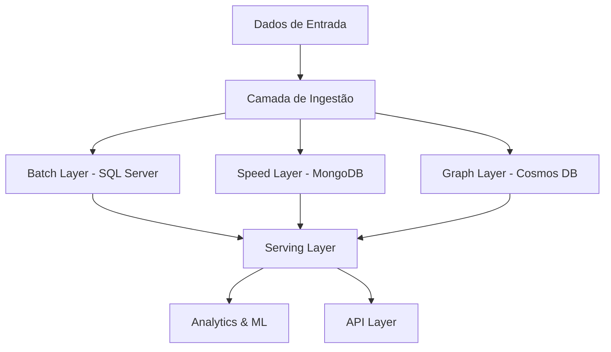

## 🏗️ ARQUITETURA DE DADOS VOITHER: DESIGN POLIGLOTA DIMENSIONAL
### 📋 VISÃO GERAL: ARQUITETURA LAMBDA ADAPTADA

## 1️⃣ **SQL SERVER AZURE (Dados Estruturados Core)**
### **Esquema Principal - Star Schema Dimensional**
```sql
-- FATO: Sessões Terapêuticas
CREATE TABLE fact_therapy_sessions (
session_id UNIQUEIDENTIFIER PRIMARY KEY,
patient_id UNIQUEIDENTIFIER,
therapist_id UNIQUEIDENTIFIER,
datetime_start DATETIME2,
datetime_end DATETIME2,
location_id INT,
session_type_id INT,
-- Métricas Dimensionais (snapshot)
valence_emotional DECIMAL(3,2),
arousal_emotional DECIMAL(3,2),
dominance_emotional DECIMAL(3,2),
narrative_coherence DECIMAL(3,2),
syntactic_complexity DECIMAL(3,2),
temporal_orientation_past DECIMAL(3,2),
temporal_orientation_present DECIMAL(3,2),
temporal_orientation_future DECIMAL(3,2),
self_reference_density DECIMAL(3,2),
social_language_score DECIMAL(3,2),
-- Agregados dos Frameworks
rdoc_negative_valence DECIMAL(3,2),
rdoc_cognitive_control DECIMAL(3,2),
hitop_internalizing DECIMAL(3,2),
bigfive_neuroticism DECIMAL(3,2),
perma_positive_emotions DECIMAL(3,2),
-- Metadados
audio_file_url NVARCHAR(500),
transcript_blob_url NVARCHAR(500),
created_at DATETIME2 DEFAULT GETDATE()
);
-- DIMENSÃO: Pacientes
CREATE TABLE dim_patients (
patient_id UNIQUEIDENTIFIER PRIMARY KEY,
patient_code NVARCHAR(50), -- Anonimizado
age_at_intake INT,
gender NVARCHAR(20),
education_level_id INT,
socioeconomic_score DECIMAL(3,2),
-- Diagnósticos
primary_diagnosis_dsm5 NVARCHAR(10),
primary_diagnosis_cid11 NVARCHAR(10),
comorbidities JSON, -- Array de códigos
-- Baseline dimensional (primeira avaliação)
baseline_date DATE,
baseline_dimensions JSON, -- Todas as 15 dimensões
-- Compliance LGPD
consent_date DATETIME2,
data_retention_until DATE,
is_active BIT DEFAULT 1
);
-- FATO: Evolução Dimensional (time-series)
CREATE TABLE fact_dimensional_evolution (
evolution_id BIGINT IDENTITY PRIMARY KEY,
patient_id UNIQUEIDENTIFIER,
measurement_datetime DATETIME2,
measurement_source NVARCHAR(50), -- 'session', 'app', 'homework'
-- Todas as 15 dimensões
dimension_values JSON, -- {"valence": -2.3, "arousal": 5.6, ...}
-- Deltas desde última medição
dimension_deltas JSON,
-- Contexto
context_event NVARCHAR(500),
medication_state JSON,
INDEX idx_patient_time (patient_id, measurement_datetime)
);
-- Otimizações
CREATE COLUMNSTORE INDEX cci_fact_sessions
ON fact_therapy_sessions;
CREATE COLUMNSTORE INDEX cci_fact_evolution
ON fact_dimensional_evolution;
```
### **Por que SQL Server:**
- Performance excelente para queries analíticas complexas
- Columnstore indexes para análise dimensional
- Integração nativa com Azure ML
- Compliance e auditoria built-in
## 2️⃣ **MONGODB ATLAS (Dados Não-Estruturados)**
### **Collections Principais**
```javascript
// Collection: therapy_transcripts
{
_id: ObjectId(),
session_id: UUID(),
patient_id: UUID(),
timestamp: ISODate(),
// Transcrição completa
full_transcript: {
segments: [
{
speaker: "patient",
start_time: 0.5,
end_time: 15.3,
text: "Eu tenho me sentido muito ansioso...",
// Análise por segmento
linguistic_features: {
pos_tags: ["PRON", "VERB", "VERB", "ADV", "ADJ"],
dependency_tree: {...},
entities: ["ansioso"],
sentiment: -0.6
}
}
]
},
// Análises processadas
nlp_analysis: {
key_themes: ["ansiedade", "trabalho", "família"],
emotional_trajectory: [
{time: 0, valence: -2.5},
{time: 300, valence: -2.1},
{time: 600, valence: -1.8}
],
// Grafos de conceitos
concept_graph: {
nodes: [
{id: 1, label: "ansiedade", weight: 0.8},
{id: 2, label: "trabalho", weight: 0.6}
],
edges: [
{source: 1, target: 2, relationship: "causada_por"}
]
}
},
// Extrações clínicas
clinical_extractions: {
symptoms_mentioned: ["insônia", "taquicardia", "preocupação excessiva"],
medication_references: ["rivotril", "sertralina"],
life_events: ["demissão", "separação"],
// NER médico
medical_entities: [
{text: "rivotril", type: "medication", cui: "C0524827"},
{text: "insônia", type: "symptom", cui: "C0917801"}
]
}
}
// Collection: patient_narratives
{
_id: ObjectId(),
patient_id: UUID(),
// Narrativa completa ao longo do tempo
life_story: {
chapters: [
{
period: "infância",
themes: ["abandono", "resiliência"],
key_events: [...],
narrative_coherence_score: 0.7
}
]
},
// Arquétipos identificados
narrative_archetypes: [
{
archetype: "hero_journey",
match_score: 0.8,
current_stage: "ordeal"
}
],
// Ontologia pessoal
personal_ontology: {
core_beliefs: [
{belief: "Não sou bom o suficiente", strength: 0.9}
],
values: ["família", "honestidade", "sucesso"],
identity_markers: ["pai", "engenheiro", "ansioso"]
}
}
// Collection: linguistic_patterns
{
_id: ObjectId(),
patient_id: UUID(),
pattern_type: "rumination",
examples: [
{
text: "Eu sempre penso que...",
context: "discussing_work",
frequency: 15
}
],
// Clusters de padrões similares
pattern_cluster: {
cluster_id: "RUM_001",
centroid_embedding: [0.23, -0.45, ...], // 768d
member_patterns: [...]
}
}
```
### **Por que MongoDB:**
- Flexibilidade para dados semi-estruturados
- Excelente para documentos complexos (transcrições)
- Aggregation pipeline poderoso
- Change streams para real-time
## 3️⃣ **COSMOS DB (Grafos e Relacionamentos)**
### **Estrutura de Grafos**
```javascript
// Vértices
{
id: "patient_123",
label: "patient",
properties: {
code: "P123",
current_state: "recovery_phase_2"
}
}
{
id: "concept_anxiety",
label: "concept",
properties: {
name: "ansiedade",
semantic_field: "emotional_distress"
}
}
{
id: "intervention_cbt",
label: "intervention",
properties: {
type: "CBT",
efficacy_score: 0.85
}
}
// Arestas
{
id: "edge_1",
label: "experiences",
from: "patient_123",
to: "concept_anxiety",
properties: {
intensity: 0.8,
frequency: "daily",
since: "2024-01-15"
}
}
{
id: "edge_2",
label: "responds_to",
from: "patient_123",
to: "intervention_cbt",
properties: {
response_rate: 0.7,
improvement_trajectory: [...]
}
}
```
### **Queries Úteis (Gremlin)**
```gremlin
// Encontrar pacientes similares
g.V('patient_123')
.out('experiences')
.in('experiences')
.where(neq('patient_123'))
.groupCount()
.order(local).by(values, desc)
// Trajetória de conceitos
g.V('patient_123')
.outE('experiences')
.order().by('timestamp')
.project('concept', 'intensity', 'time')
```
## 4️⃣ **AZURE BLOB STORAGE (Arquivos)**
```
/voither-data/
├── audio/
│ └── {year}/{month}/{day}/{session_id}.wav
├── transcripts/
│ └── {year}/{month}/{day}/{session_id}.json
├── analysis/
│ └── {patient_id}/{analysis_type}/{timestamp}.json
└── models/
└── embeddings/{model_version}/patient_{id}.pkl
```
## 5️⃣ **AZURE SYNAPSE ANALYTICS (Data Lake)**
### **Estrutura do Lake**
```
/bronze/ (raw data)
├── sessions/
├── app_events/
└── clinical_notes/
/silver/ (cleaned, conformed)
├── unified_sessions/
├── dimensional_metrics/
└── patient_timelines/
/gold/ (business-ready)
├── patient_360/
├── population_health/
└── ml_features/
```
## 6️⃣ **REDIS CACHE (Real-time)**
```javascript
// Cache de sessão ativa
{
key: "session:active:patient_123",
value: {
current_dimensions: {...},
last_5_utterances: [...],
risk_flags: [],
therapist_alerts: []
},
ttl: 7200 // 2 horas
}
// Cache de embeddings
{
key: "embedding:patient_123:latest",
value: Float32Array([...]), // 768 dimensões
ttl: 86400
}
```
## 🔄 **PIPELINE DE DADOS**
```python
# Ingestão em Tempo Real
class VoitherDataPipeline:
def __init__(self):
self.sql_server = SQLServerConnector()
self.mongodb = MongoDBConnector()
self.cosmos = CosmosDBConnector()
self.redis = RedisConnector()
async def process_session_segment(self, audio_chunk):
# 1. Transcrição
transcript = await transcribe_audio(audio_chunk)
# 2. Análise dimensional
dimensions = extract_dimensions(transcript)
# 3. Salvar em paralelo
await asyncio.gather(
# Hot path - Redis
self.redis.update_active_session(dimensions),
# Documento - MongoDB
self.mongodb.append_transcript(transcript),
# Métricas - SQL Server
self.sql_server.insert_dimensional_snapshot(dimensions),
# Grafo - Cosmos
self.cosmos.update_concept_graph(transcript)
)
# 4. Triggers de ML
if self.detect_anomaly(dimensions):
await self.trigger_ml_pipeline(dimensions)
```
## 📊 **MELHORES PRÁTICAS IMPLEMENTADAS**
### **1. Particionamento**
- SQL Server: Por mês (partition function por datetime)
- MongoDB: Sharding por patient_id
- Cosmos DB: Partition key = patient_id
### **2. Índices Otimizados**
```sql
-- SQL Server
CREATE INDEX idx_dimensional_search
ON fact_dimensional_evolution(patient_id, measurement_datetime)
INCLUDE (dimension_values);
-- MongoDB
db.therapy_transcripts.createIndex({
"patient_id": 1,
"timestamp": -1,
"nlp_analysis.key_themes": 1
});
```
### **3. Segurança e Compliance**
- Encryption at rest (TDE no SQL Server)
- Encryption in transit (TLS 1.3)
- Row-level security por CAPS/unidade
- Audit logs em tabela separada
- Anonimização via Azure Functions
### **4. Backup e DR**
- SQL Server: Geo-redundant backups
- MongoDB Atlas: Continuous backup
- Point-in-time recovery: 35 dias
- RPO: 5 minutos / RTO: 1 hora
## 🎯 **QUANDO USAR CADA BANCO**
|Tipo de Dado |Banco |Justificativa |
|---------------------|------------|------------------------|
|Métricas dimensionais|SQL Server |OLAP, agregações rápidas|
|Transcrições |MongoDB |Documentos flexíveis |
|Relacionamentos |Cosmos DB |Grafos nativos |
|Arquivos áudio |Blob Storage|Custo-efetivo |
|Cache real-time |Redis |Ultra-baixa latência |
|Analytics |Synapse |Big data processing |
## 💰 **OTIMIZAÇÃO DE CUSTOS**
1. **Use seus créditos MongoDB** para toda parte documental
1. **SQL Server gratuito** para dados core estruturados
1. **Cosmos DB** apenas para grafos (mais caro)
1. **Archive no Blob** após 90 dias (cool tier)
1. **Synapse on-demand** para queries analíticas
Esta arquitetura está alinhada com as **melhores práticas de 2024-2025** para sistemas de saúde mental baseados em IA, garantindo escalabilidade, performance e compliance.​​​​​​​​​​​​​​​​