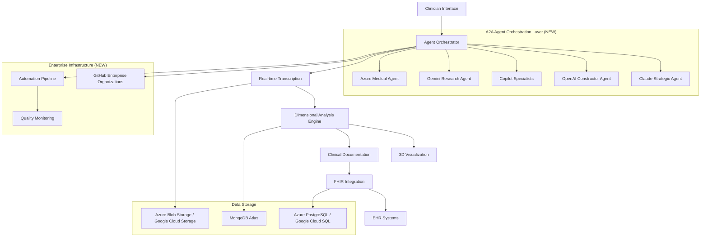

# VOITHER - AI-Powered Mental Health Analysis Platform

<div align="center">


**Geometry of Mental Spaces Through Dimensional AI Analysis**

[](.)
[](.)
[](.)

---

*Revolutionary AI system for real-time mental health analysis using 15-dimensional psychological space mapping and 3D visualization*

</div>

## 🧠 What is VOITHER?

VOITHER is a cutting-edge AI platform that transforms mental health practice through:

- **Real-time transcription** of therapeutic sessions with speaker diarization
- **15-dimensional analysis** of psychological states using advanced NLP
- **3D visualization** of mental spaces through the Holofractor Mental Renderer
- **Automated clinical documentation** with intelligent trigger detection
- **Interoperable FHIR integration** for seamless EHR connectivity

## 🚀 Quick Start

### 📖 **Start Here - Unified Manual**
- **🎯 Technical Compendium**: [Complete System Manual](docs/VOITHER_TECHNICAL_COMPENDIUM.md) - **NEW: Unified integration of all content**
- **📋 How Automations Work**: [Automation Status & Monitoring](docs/AUTOMATION_STATUS.md) - **NEW: Complete automation overview**

### For Clinicians
- **Getting Started**: [Clinical Quick Start Guide](guides/clinician-quickstart.md)
- **Core Concepts**: [Understanding the 15 Dimensions](core-concepts/15-dimensions.md)
- **System Architecture**: [How VOITHER Works](architecture/voither_system_architecture.md)

### For Developers
- **Technical Overview**: [System Architecture](architecture/voither_system_architecture.md)
- **Implementation Guide**: [Development Setup](guides/developer-guide.md)
- **A2A Agent Setup**: [Agent Orchestration Guide](guides/AI_AGENT_ORCHESTRATION.md) ⭐ **NEW**
- **Enterprise Setup**: [GitHub Enterprise Configuration](guides/GITHUB_ENTERPRISE_SETUP.md) ⭐ **NEW**
- **API Documentation**: [Technical Pipeline](architecture/voither_technical_pipeline.md)

### For Researchers
- **Research Background**: [Dimensional Psychology](research/geometria_afetos_cognicao.md)
- **Knowledge Graph**: [Complete System Overview](docs/VOITHER_Knowledge_Graph_Updated.md)
- **Academic Papers**: [Publications](research/)

## 📚 Documentation Structure

### 📁 **Repository Organization**
```
docs/
├── 📁 architecture/         # System design & technical architecture
├── 📁 assets/              # Media files, icons, videos
├── 📁 core-concepts/       # Core AI concepts & frameworks
├── 📁 database/            # Database design & ideas  
├── 📁 docs/                # Main documentation files
│   ├── 📁 architecture/    # Advanced architecture blueprints
│   ├── 📁 core-concepts/   # Enhanced core concepts
│   ├── 📁 database/        # Database implementation details
│   ├── 📁 dsl/            # Domain-specific language files
│   ├── 📁 pipelines/      # Data processing pipelines
│   ├── 📁 reengine/       # ReEngine framework sections
│   ├── 📁 visualflows_charts/ # 📊 Complete visual workflows (NEW)
│   └── 📁 voither-system/ # VOITHER system components
├── 📁 guides/              # User guides & tutorials
├── 📁 raw/                 # Unprocessed backup archive
├── 📁 research/            # Academic papers & research
├── 📁 scripts/             # 🤖 Enterprise orchestrator & automation (ENHANCED)
├── 📁 templates/           # Clinical templates & forms
└── 📁 workflows/           # 🔄 Automation workflow diagrams (NEW)
```

### 🏗️ **Architecture & System Design**
| Document | Description | Audience |
|----------|-------------|----------|
| [System Architecture](architecture/voither_system_architecture.md) | Complete technical architecture overview | Developers, Architects |
| [A2A Agent Orchestration Blueprint](docs/architecture/VOITHER_AGENT_ORCHESTRATION_TECHNICAL_BLUEPRINT.md) | 🤖 **NEW**: Sophisticated agent coordination with Eulerian flows | Technical Architects, AI Engineers |
| [AI-Native A2A Ecosystem](docs/architecture/AI_NATIVE_A2A_ECOSYSTEM_BLUEPRINT.md) | **NEW**: Agent-to-Agent protocols and enterprise setup | Enterprise Architects |
| [Implementation Plan](docs/voither-system/voither_implementation_plan.md) | Development roadmap and milestones | Project Managers, Developers |
| [Technical Pipeline](architecture/voither_technical_pipeline.md) | Data flow and processing pipeline | Technical Teams |

### 📊 **Visual Workflows & Charts (NEW)**
| Chart | Focus Area | Description |
|-------|------------|-------------|
| [Visual Flows Index](docs/visualflows_charts/README.md) | Complete visual documentation suite | All audiences |
| [System Architecture Chart](docs/visualflows_charts/01_voither_system_architecture.md) | Core foundation & .ee DSL integration | Technical Leadership |
| [Clinical Workflow Pipeline](docs/visualflows_charts/02_clinical_workflow_pipeline.md) | Healthcare processes & AI integration | Clinical Teams |
| [Development Lifecycle](docs/visualflows_charts/03_development_lifecycle.md) | DevOps, CI/CD, quality assurance | Development Teams |
| [AI Model Integration](docs/visualflows_charts/04_ai_model_integration.md) | ML pipeline & inference architecture | AI/ML Engineers |
| [Data Architecture](docs/visualflows_charts/05_data_architecture.md) | Knowledge graphs & data flow | Data Engineers |
| [Security & Compliance](docs/visualflows_charts/06_security_compliance.md) | Zero-trust security & regulatory compliance | Security Teams |
| [Deployment Infrastructure](docs/visualflows_charts/07_deployment_infrastructure.md) | Cloud-native deployment & scalability | Infrastructure Teams |

### 🧩 **Core Components**
| Component | Description | Status |
|-----------|-------------|--------|
| [MED Core](core-concepts/med_core.md) | Motor de Extração Dimensional (15 dimensions) | ✅ Implemented |
| [Apothecary Engine](core-concepts/apothecary_engine.md) | Automated medication analysis | 🔄 Development |
| [AutoAgency](core-concepts/autoagency.md) | Clinical automation system | 📋 Planned |
| [Holofractor](voither-system/voither_dimensional_holofractor.md) | 3D mental space visualization | 🔄 Development |

### 🔧 **Technical Implementation**
| Document | Focus Area | Complexity |
|----------|------------|------------|
| [MED Implementation](docs/voither-system/voither_med_implementation.md) | Dimensional extraction engine | Advanced |
| [Framework Integration](docs/core-concepts/med_frameworks.md) | RDoC, HiTOP, Big Five integration | Intermediate |
| [FHIR Integration](docs/voither-system/voither_orchestrator_doc.md) | Healthcare interoperability | Advanced |
| [Enterprise Orchestrator Script](scripts/voither_enterprise_orchestrator.py) | 🤖 **NEW**: A2A agent coordination & GitHub Enterprise setup | Advanced |
| [Agent A2A Initialization](scripts/initialize_agent_a2a.py) | **NEW**: Agent-to-Agent protocol setup | Intermediate |

### 🤖 **Enterprise & Automation Systems (NEW)**
| Document | Description | Status |
|----------|-------------|--------|
| [Automation Pipeline](docs/AUTOMATION_PIPELINE.md) | Complete automation system overview | ✅ Active |
| [Automation Status Monitor](docs/AUTOMATION_STATUS.md) | Real-time automation monitoring | ✅ Active |
| [GitHub Enterprise Setup](guides/GITHUB_ENTERPRISE_SETUP.md) | Enterprise organization configuration | 📋 Available |
| [AI Agent Orchestration Guide](guides/AI_AGENT_ORCHESTRATION.md) | Agent coordination implementation | 📋 Available |
| [Technical Compendium](docs/VOITHER_TECHNICAL_COMPENDIUM.md) | **Unified manual**: Complete system integration | ✅ Comprehensive |

### 🔬 **Research & Theory**
| Document | Topic | Type |
|----------|--------|------|
| [Mental Space Geometry](research/geometria_afetos_cognicao.md) | Theoretical foundation | Research Paper |
| [Emergence Enabled Systems](core-concepts/emergence_enabled_ee.md) | AI-native architecture | Technical Spec |
| [ReEngine Framework](reengine/ReEngine_Sec_01.md) | Bergsonian-Rhizomatic reasoning | Philosophical-Technical |

## 🌟 Key Features

### 🤖 **A2A Agent Orchestration System (NEW)**
- **Eulerian Flow Coordination**: Mathematical agent state management with runtime reversibility
- **Enterprise Multi-Agent Setup**: Strategic GitHub Enterprise organization with 7 Copilot licenses
- **Agent Specialization**: Claude Strategic, OpenAI Constructor, Copilot Specialists, Gemini Research, Azure Medical
- **Modern A2A Protocols**: Message passing with event sourcing and comprehensive audit trails
- **Composable Architecture**: Sequential, parallel, and hierarchical agent composition patterns

### 🎯 **Real-Time Analysis**
- Live transcription with Azure Speech Services / Google Cloud Speech-to-Text
- Instant dimensional analysis during sessions
- Real-time 3D visualization of mental states
- WebSocket-based streaming architecture

### 📊 **15-Dimensional Framework**
VOITHER analyzes mental states across 15 validated dimensions:

1. **Valência Emocional** - Emotional polarity (-5 to +5)
2. **Arousal/Ativação** - Energy level (0 to 10)
3. **Coerência Narrativa** - Logical organization (0 to 10)
4. **Complexidade Sintática** - Thought elaboration (0 to 10)
5. **Orientação Temporal** - Past/present/future focus
6. **Densidade Autoreferência** - Self-reference frequency
7. **Linguagem Social** - Social interaction references
8. **Flexibilidade Discursiva** - Perspective adaptability
9. **Dominância/Agência** - Sense of control
10. **Fragmentação do Discurso** - Speech disorganization
11. **Densidade Semântica** - Meaningful content richness
12. **Marcadores Certeza/Incerteza** - Confidence vs doubt
13. **Padrões de Conectividade** - Logical connector usage
14. **Comunicação Pragmática** - Social communication adequacy
15. **Prosódia Emocional** - Speech melody and rhythm

### 🏥 **Clinical Integration**
- Automated SOAP/DAP note generation
- FHIR-compliant data structures
- Integration with existing EHR systems
- Prescription and scheduling automation

## 🗺️ **System Versions & Roadmap**

| Version | Focus | Status | Key Features |
|---------|--------|---------|---------------|
| **v0.1** | [Geometry Visualization](voither-system/voither_implementation_plan.md#v01) | ✅ Complete | Three.js 3D rendering, simulated data |
| **v1.0** | [Medical Scribe](voither-system/voither_implementation_plan.md#v10) | 🔄 Development | Real-time transcription, dimensional analysis |
| **v1.5** | [AutoAgency](voither-system/voither_implementation_plan.md#v15) | 📋 Planned | Clinical automation, trigger detection |
| **v2.0** | [AI-Clinic](voither-system/voither_implementation_plan.md#v20) | 📋 Planned | Patient portal, continuous care |
| **v3.0** | [Holofractor Premium](voither-system/voither_implementation_plan.md#v30) | 🔮 Future | NVIDIA Omniverse integration |

## 🛠️ **Technology Stack**

### **Agent Orchestration & Enterprise (NEW)**
- **A2A Protocols**: Eulerian flow-based agent coordination with mathematical reversibility
- **GitHub Enterprise**: Multi-organization setup (voither-core, voither-medical, voither-development)
- **Enterprise Agents**: Claude Strategic, OpenAI Constructor, Copilot Specialists, Gemini Research, Azure Medical
- **Automation Pipeline**: Complete CI/CD with quality scoring and validation systems

### **Frontend**
- React/Next.js with TypeScript
- Three.js for 3D visualization
- Azure SignalR / Google Cloud Pub/Sub for real-time communication

### **Backend**
- Node.js/Python with Azure Functions / Google Cloud Functions
- MongoDB Atlas (dimensional data)
- Azure PostgreSQL / Google Cloud SQL (FHIR resources)
- Azure Blob Storage / Google Cloud Storage (audio files)

### **AI & Analytics**
- Azure AI Studio + Azure OpenAI / Google Cloud AI Platform + Vertex AI
- Custom dimensional extraction models
- Integration with Grok-3 and Claude-4

### **Healthcare Standards**
- FHIR R4 compliance
- HIPAA security standards
- EU AI Act compliance

## 🏗️ **Architecture Overview**



## 🤝 **Contributing**

We welcome contributions! Please see our [Contribution Guidelines](docs/CONTRIBUTING.md) for:
- Code standards and practices
- Documentation guidelines
- Pull request procedures
- Issue reporting

### **Documentation Maintenance**
Use our built-in tools for maintaining documentation quality:

```bash
# Quick validation
make validate-quick

# Full link checking
make validate

# Statistics
make stats

# Spell checking (if tools installed)
make spell-check
```

### **Development Setup**
```bash
# Install documentation tools
make dev-setup

# Install Git hooks for automatic validation
make install-hooks

# Enterprise orchestrator setup (NEW)
python scripts/voither_enterprise_orchestrator.py --setup-phase-1 --validate

# Initialize A2A agents (NEW)
python scripts/initialize_agent_a2a.py --agents=claude,openai,copilot_medical --full-test
```

## 📄 **License & Compliance**

- **Healthcare Compliance**: HIPAA, GDPR, LGPD compliant
- **Medical Device**: IEC 62304 Class B certification planned
- **AI Regulation**: EU AI Act compliance
- **Interoperability**: FHIR R4 standard implementation

## 🆘 **Support & Resources**

### **Documentation Index**
- 📖 [Complete Knowledge Graph](docs/VOITHER_Knowledge_Graph_Updated.md)
- 🎯 [Technical Compendium - Unified Manual](docs/VOITHER_TECHNICAL_COMPENDIUM.md) ⭐ **NEW**
- 📊 [Visual Workflows Charts](docs/visualflows_charts/README.md) ⭐ **NEW**
- 🤖 [A2A Agent Orchestration Blueprint](docs/architecture/VOITHER_AGENT_ORCHESTRATION_TECHNICAL_BLUEPRINT.md) ⭐ **NEW**
- 🔄 [Automation Pipeline Status](docs/AUTOMATION_STATUS.md) ⭐ **NEW**
- 🎯 [Implementation Templates](templates/voither_primeira_consulta_template.py)
- 🔗 [Pipeline Documentation](docs/voither-system/VOITHER_files_pipeline.md)

### **Quick Links**
- [System Requirements](guides/system-requirements.md)
- [Installation Guide](guides/installation.md)
- [GitHub Enterprise Setup](guides/GITHUB_ENTERPRISE_SETUP.md) ⭐ **NEW**
- [AI Agent Orchestration Guide](guides/AI_AGENT_ORCHESTRATION.md) ⭐ **NEW**
- [Troubleshooting](guides/troubleshooting.md)
- [FAQ](guides/faq.md)

### **Community**
- Issues: [GitHub Issues](https://github.com/myselfgus/docs/issues)
- Discussions: [GitHub Discussions](https://github.com/myselfgus/docs/discussions)

### **Documentation Tools**
- **Validation**: `make validate` - Check links and structure
- **Statistics**: `make stats` - Documentation metrics
- **Local Server**: `make serve` - Preview documentation locally
- **Help**: `make help` - See all available commands

---

<div align="center">

**Made with ❤️ for advancing mental health through AI**

*Transforming psychological care through computational intelligence*

[🚀 Get Started](#-quick-start) • [📚 Documentation](#-documentation-structure) • [🤝 Contribute](#-contributing)

</div>