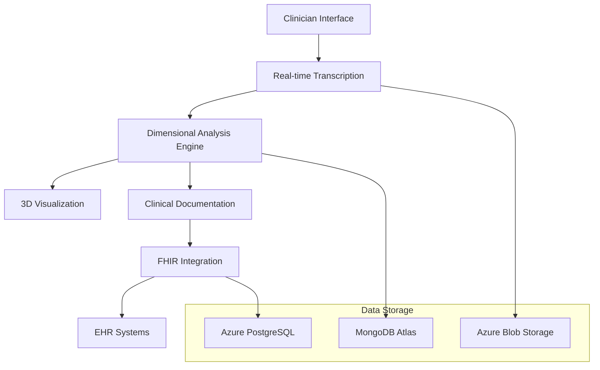

# VOITHER - AI-Powered Mental Health Analysis Platform

<div align="center">


**Geometry of Mental Spaces Through Dimensional AI Analysis**

[](.)
[](.)
[](.)

---

*Revolutionary AI system for real-time mental health analysis using 15-dimensional psychological space mapping and 3D visualization*

</div>

## 🧠 What is VOITHER?

VOITHER is a cutting-edge AI platform that transforms mental health practice through:

- **Real-time transcription** of therapeutic sessions with speaker diarization
- **15-dimensional analysis** of psychological states using advanced NLP
- **3D visualization** of mental spaces through the Holofractor Mental Renderer
- **Automated clinical documentation** with intelligent trigger detection
- **Interoperable FHIR integration** for seamless EHR connectivity

## 🚀 Quick Start

### For Clinicians
- **Getting Started**: [Clinical Quick Start Guide](guides/clinician-quickstart.md)
- **Core Concepts**: [Understanding the 15 Dimensions](core-concepts/15-dimensions.md)
- **System Architecture**: [How VOITHER Works](architecture/voither_system_architecture.md)

### For Developers
- **Technical Overview**: [System Architecture](architecture/voither_system_architecture.md)
- **Implementation Guide**: [Development Setup](guides/developer-guide.md)
- **API Documentation**: [Technical Pipeline](architecture/voither_technical_pipeline.md)

### For Researchers
- **Research Background**: [Dimensional Psychology](research/geometria_afetos_cognicao.md)
- **Knowledge Graph**: [Complete System Overview](VOITHER_Knowledge_Graph_Updated.md)
- **Academic Papers**: [Publications](research/)

## 📚 Documentation Structure

### 🏗️ **Architecture & System Design**
| Document | Description | Audience |
|----------|-------------|----------|
| [System Architecture](voither_system_architecture.md) | Complete technical architecture overview | Developers, Architects |
| [Implementation Plan](voither_implementation_plan.md) | Development roadmap and milestones | Project Managers, Developers |
| [Technical Pipeline](voither_technical_pipeline.md) | Data flow and processing pipeline | Technical Teams |

### 🧩 **Core Components**
| Component | Description | Status |
|-----------|-------------|--------|
| [MED Core](med_core.md) | Motor de Extração Dimensional (15 dimensions) | ✅ Implemented |
| [Apothecary Engine](apothecary_engine.md) | Automated medication analysis | 🔄 Development |
| [AutoAgency](autoagency(mustbeupdated).md) | Clinical automation system | 📋 Planned |
| [Holofractor](voither_dimensional_holofractor.md) | 3D mental space visualization | 🔄 Development |

### 🔧 **Technical Implementation**
| Document | Focus Area | Complexity |
|----------|------------|------------|
| [MED Implementation](voither_med_implementation.md) | Dimensional extraction engine | Advanced |
| [Framework Integration](med_frameworks.md) | RDoC, HiTOP, Big Five integration | Intermediate |
| [FHIR Integration](voither_orchestrator_doc.md) | Healthcare interoperability | Advanced |

### 🔬 **Research & Theory**
| Document | Topic | Type |
|----------|--------|------|
| [Mental Space Geometry](geometria_afetos_cognicao.md) | Theoretical foundation | Research Paper |
| [Emergence Enabled Systems](emergence_enabled_ee.md) | AI-native architecture | Technical Spec |
| [ReEngine Framework](ReEngine_Sec_01.md) | Bergsonian-Rhizomatic reasoning | Philosophical-Technical |

## 🌟 Key Features

### 🎯 **Real-Time Analysis**
- Live transcription with Azure Speech Services
- Instant dimensional analysis during sessions
- Real-time 3D visualization of mental states
- WebSocket-based streaming architecture

### 📊 **15-Dimensional Framework**
VOITHER analyzes mental states across 15 validated dimensions:

1. **Valência Emocional** - Emotional polarity (-5 to +5)
2. **Arousal/Ativação** - Energy level (0 to 10)
3. **Coerência Narrativa** - Logical organization (0 to 10)
4. **Complexidade Sintática** - Thought elaboration (0 to 10)
5. **Orientação Temporal** - Past/present/future focus
6. **Densidade Autoreferência** - Self-reference frequency
7. **Linguagem Social** - Social interaction references
8. **Flexibilidade Discursiva** - Perspective adaptability
9. **Dominância/Agência** - Sense of control
10. **Fragmentação do Discurso** - Speech disorganization
11. **Densidade Semântica** - Meaningful content richness
12. **Marcadores Certeza/Incerteza** - Confidence vs doubt
13. **Padrões de Conectividade** - Logical connector usage
14. **Comunicação Pragmática** - Social communication adequacy
15. **Prosódia Emocional** - Speech melody and rhythm

### 🏥 **Clinical Integration**
- Automated SOAP/DAP note generation
- FHIR-compliant data structures
- Integration with existing EHR systems
- Prescription and scheduling automation

## 🗺️ **System Versions & Roadmap**

| Version | Focus | Status | Key Features |
|---------|--------|---------|---------------|
| **v0.1** | [Geometry Visualization](voither_implementation_plan.md#v01) | ✅ Complete | Three.js 3D rendering, simulated data |
| **v1.0** | [Medical Scribe](voither_implementation_plan.md#v10) | 🔄 Development | Real-time transcription, dimensional analysis |
| **v1.5** | [AutoAgency](voither_implementation_plan.md#v15) | 📋 Planned | Clinical automation, trigger detection |
| **v2.0** | [AI-Clinic](voither_implementation_plan.md#v20) | 📋 Planned | Patient portal, continuous care |
| **v3.0** | [Holofractor Premium](voither_implementation_plan.md#v30) | 🔮 Future | NVIDIA Omniverse integration |

## 🛠️ **Technology Stack**

### **Frontend**
- React/Next.js with TypeScript
- Three.js for 3D visualization
- Azure SignalR for real-time communication

### **Backend**
- Node.js/Python with Azure Functions
- MongoDB Atlas (dimensional data)
- Azure PostgreSQL (FHIR resources)
- Azure Blob Storage (audio files)

### **AI & Analytics**
- Azure AI Studio + Azure OpenAI
- Custom dimensional extraction models
- Integration with Grok-3 and Claude-4

### **Healthcare Standards**
- FHIR R4 compliance
- HIPAA security standards
- EU AI Act compliance

## 🏗️ **Architecture Overview**



## 🤝 **Contributing**

We welcome contributions! Please see our [Contribution Guidelines](CONTRIBUTING.md) for:
- Code standards and practices
- Documentation guidelines
- Pull request procedures
- Issue reporting

### **Documentation Maintenance**
Use our built-in tools for maintaining documentation quality:

```bash
# Quick validation
make validate-quick

# Full link checking
make validate

# Statistics
make stats

# Spell checking (if tools installed)
make spell-check
```

### **Development Setup**
```bash
# Install documentation tools
make dev-setup

# Install Git hooks for automatic validation
make install-hooks
```

## 📄 **License & Compliance**

- **Healthcare Compliance**: HIPAA, GDPR, LGPD compliant
- **Medical Device**: IEC 62304 Class B certification planned
- **AI Regulation**: EU AI Act compliance
- **Interoperability**: FHIR R4 standard implementation

## 🆘 **Support & Resources**

### **Documentation Index**
- 📖 [Complete Knowledge Graph](VOITHER_Knowledge_Graph_Updated.md)
- 🎯 [Implementation Templates](voither_primeira_consulta_template.py)
- 🔗 [Pipeline Documentation](VOITHER_files_pipeline.md)

### **Quick Links**
- [System Requirements](guides/system-requirements.md)
- [Installation Guide](guides/installation.md)
- [Troubleshooting](guides/troubleshooting.md)
- [FAQ](guides/faq.md)

### **Community**
- Issues: [GitHub Issues](https://github.com/myselfgus/docs/issues)
- Discussions: [GitHub Discussions](https://github.com/myselfgus/docs/discussions)

### **Documentation Tools**
- **Validation**: `make validate` - Check links and structure
- **Statistics**: `make stats` - Documentation metrics
- **Local Server**: `make serve` - Preview documentation locally
- **Help**: `make help` - See all available commands

---

<div align="center">

**Made with ❤️ for advancing mental health through AI**

*Transforming psychological care through computational intelligence*

[🚀 Get Started](#-quick-start) • [📚 Documentation](#-documentation-structure) • [🤝 Contribute](#-contributing)

</div>