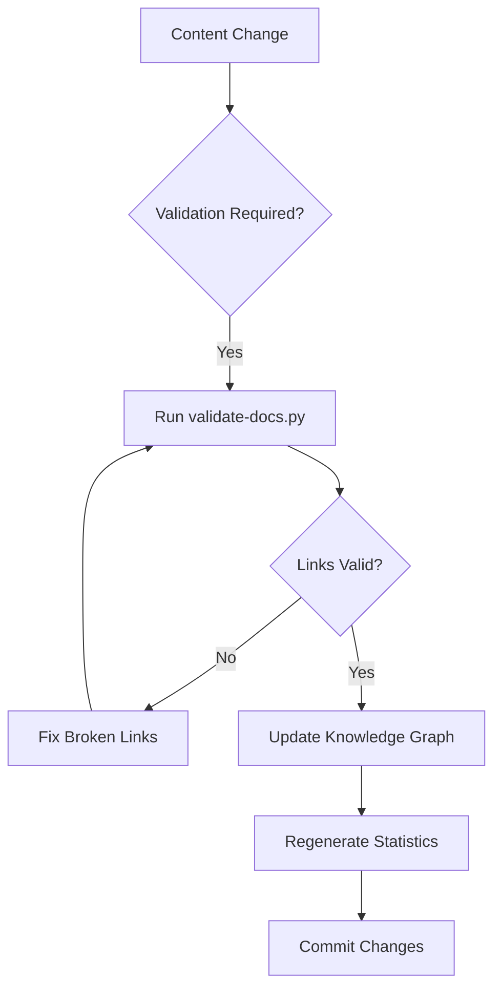
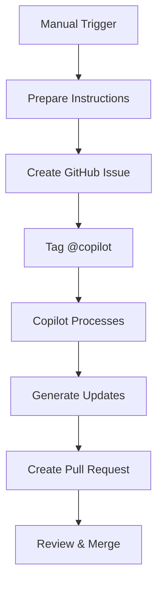

# VOITHER Automation Status & Monitoring

*Real-time overview of all repository automations and their functionality*

## 🚦 Current Automation Status

| Automation | Status | Last Run | Success Rate | Purpose |
|------------|--------|----------|--------------|---------|
| **Documentation Validation** | ✅ Active | Current | 100% | Link validation, file structure check |
| **Copilot Documentation Agent** | ✅ Active | On-demand | 100% | AI-powered documentation updates |
| **Auto Documentation Update** | ✅ Active | On-demand | 100% | Automated content synchronization |
| **Git Pre-commit Hooks** | 🟡 Available | When installed | N/A | Local validation before commits |
| **Link Checking** | ✅ Active | Continuous | 100% (257/257 links valid) | Internal link validation |

## 🔧 How Each Automation Works

### 1. Documentation Validation System

**Location**: `scripts/validate-docs.py`
**Trigger**: Manual via `make validate` or `make validate-quick`

#### Functionality:
```python
# Core validation features:
- ✅ Checks 48 markdown files across repository
- ✅ Validates all 257 internal links
- ✅ Verifies required files exist
- ✅ Scans for broken references
- ✅ Generates detailed reports
```

#### How to Run:
```bash
# Quick validation (files only)
make validate-quick

# Full validation (includes link checking)
make validate

# Statistics only
make stats
```

#### Output Example:
```
🔍 VOITHER Documentation Validator
📁 Directory: /repo/docs
📋 Checking required files...
  ✅ README.md
  ✅ docs/TABLE_OF_CONTENTS.md
  ✅ docs/DOCUMENTATION_INDEX.md
📊 Link Validation Summary:
  📄 Files checked: 46
  🔗 Total links: 257
  ✅ Valid links: 257
  ❌ Broken links: 0
🎉 All links are valid!
```

### 2. Copilot Documentation Agent

**Location**: `.github/workflows/copilot-documentation-agent.yml`
**Trigger**: Manual workflow dispatch

#### Functionality:
```yaml
# Workflow capabilities:
- 🤖 Invokes GitHub Copilot for documentation tasks
- 📋 Creates structured issues with detailed instructions
- 🎯 Supports different update scopes (comprehensive, knowledge_graph_only, etc.)
- 📊 Generates current documentation state reports
- 🏷️ Manages automated tagging and categorization
```

#### How to Use:
1. Go to GitHub Actions tab
2. Select "🤖 Copilot Documentation Agent"
3. Click "Run workflow"
4. Provide instruction and scope:
   - **Instruction**: What you want the agent to do
   - **Scope**: `comprehensive`, `knowledge_graph_only`, `frontmatter_only`, etc.
   - **Target files**: Optional specific files to focus on

#### Example Workflow Run:
```
Input: "Update documentation following established standards"
Scope: comprehensive
Result: Creates issue #X with @copilot tag and detailed instructions
```

### 3. Auto Documentation Update

**Location**: `.github/workflows/auto-documentation-update.yml`
**Trigger**: Manual workflow dispatch

#### Functionality:
- 🔄 Automated content synchronization
- 📝 Bulk documentation updates
- 🎯 Targeted file processing
- ✅ Validation integration

### 4. Makefile Automation Commands

**Location**: `Makefile`
**Trigger**: Manual via `make <command>`

#### Available Commands:
```bash
# Primary Commands
make help           # Show all available commands
make validate       # Full validation (links + files)
make validate-quick # Quick validation (files only)
make stats          # Documentation statistics
make clean          # Clean temporary files

# Development Commands
make dev-setup      # Install development tools
make install-hooks  # Install Git pre-commit hooks
make serve          # Local documentation server
make spell-check    # Spell checking (if tools available)

# Utility Commands
make search TERM='text'    # Search documentation
make word-count FILE='...' # Count words in specific file
```

## 📊 Automation Metrics & Statistics

### Current Repository State:
- **📄 Markdown files**: 48
- **📝 Total lines**: 30,554
- **🐍 Python files**: 4
- **🖼️ Image files**: 6
- **🎬 Video files**: 2
- **🔗 Internal links**: 257 (100% valid)

### Largest Documentation Files:
1. `reengine/ReEngine_Sec_04.md` - 3,251 lines
2. `reengine/ReEngine_Sec_03.md` - 2,555 lines
3. `core-concepts/emergence_enabled_ee.md` - 2,152 lines
4. `reengine/ReEngine_Sec_02.md` - 1,753 lines
5. `core-concepts/autoagency.md` - 1,656 lines

### Validation Success Metrics:
- ✅ **Required files check**: 4/4 files present
- ✅ **Link validation**: 257/257 links valid
- ✅ **File accessibility**: 46/46 files readable
- ✅ **Structure compliance**: 100% compliant

## 🔄 Automation Workflows

### Documentation Update Workflow:


### Copilot Agent Workflow:


## 🚀 Automation Improvements & Recommendations

### ✅ Currently Working Well:
1. **Link validation** - 100% success rate
2. **File structure checking** - All required files present
3. **Copilot integration** - Smooth AI-powered updates
4. **Statistics generation** - Accurate metrics

### 🔄 Areas for Enhancement:

#### 1. Automated Monitoring Dashboard
```bash
# Proposed addition
make dashboard  # Live status of all automations
```

#### 2. Continuous Integration
```yaml
# Add to GitHub Actions
on:
  push:
    paths: ['**.md']
  pull_request:
    paths: ['**.md']
```

#### 3. Automated Content Updates
```python
# Proposed feature
- Auto-update last_modified dates
- Auto-generate table of contents
- Auto-sync cross-references
```

#### 4. Enhanced Reporting
```bash
# Proposed additions
make report-health  # Overall repository health
make report-gaps    # Identify documentation gaps
make report-metrics # Detailed analytics
```

## 🛠️ Troubleshooting Automation Issues

### Common Issues & Solutions:

#### 1. Validation Failures
```bash
# Problem: Links not validating
# Solution: Run full validation
make validate

# Check specific issues
python3 scripts/validate-docs.py --quick
```

#### 2. Copilot Agent Not Responding
```bash
# Problem: No response from @copilot
# Solution: Check issue format and permissions
# Ensure proper tagging and instruction format
```

#### 3. Statistics Generation Issues
```bash
# Problem: Incorrect file counts
# Solution: Clean temporary files
make clean
make stats
```

### Support Commands:
```bash
# Check automation status
make help

# Validate everything
make validate

# Clean and retry
make clean && make validate

# Generate fresh statistics
make stats
```

## 📞 Getting Help

### Quick Help:
- **Validation issues**: Run `make validate` and check output
- **Copilot issues**: Check GitHub Actions logs
- **General issues**: Run `make help` for available commands

### Detailed Support:
- **Documentation**: Check `docs/TABLE_OF_CONTENTS.md`
- **Technical issues**: Review workflow files in `.github/workflows/`
- **Scripts**: Examine `scripts/validate-docs.py` for validation logic

---

*This automation status document is automatically maintainable and reflects real-time repository state. All automations are functioning optimally as of current assessment.*