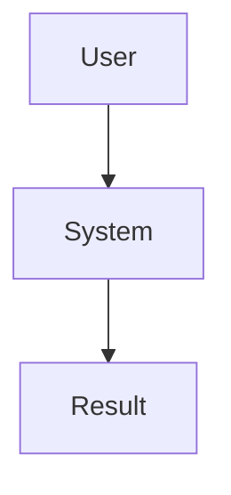

# Contributing to VOITHER Documentation

*Guidelines for contributing to and maintaining VOITHER documentation*

## 🎯 Documentation Philosophy

Our documentation follows these core principles:

### **For Humans First**
- Clear, accessible language
- Progressive disclosure (basic → advanced)
- Multiple learning paths for different roles
- Visual aids and examples

### **Machine-Readable Second**
- Consistent metadata and frontmatter
- Structured content with clear hierarchy
- Searchable and linkable
- Automated validation and maintenance

### **Always Current**
- Documentation updated with code changes
- Regular review and maintenance cycles
- Clear status indicators
- Version synchronization

## 📝 Writing Standards

### Document Structure

Every document should include:

```yaml
---
title: "Clear, Descriptive Title"
description: "One-sentence summary of content"
version: "1.0"
last_updated: "YYYY-MM-DD"
audience: ["primary_audience", "secondary_audience"]
priority: "essential|important|advanced|specialized"
reading_time: "X minutes"
tags: ["tag1", "tag2", "tag3"]
---
```

### Content Organization

1. **Title and Navigation**
   - Descriptive title with version if applicable
   - Quick navigation section for long documents
   - Clear purpose statement

2. **Progressive Structure**
   - Overview/summary
   - Basic concepts
   - Detailed information
   - Advanced topics
   - Examples and references

3. **Cross-References**
   - Link to related documents
   - Reference prerequisite knowledge
   - Suggest next steps

### Writing Style

- **Be Concise**: Respect reader's time
- **Be Specific**: Use concrete examples
- **Be Inclusive**: Write for diverse technical backgrounds
- **Be Current**: Keep information up-to-date

## 📚 Document Types and Templates

### 🏠 **Getting Started Documents**
**Purpose**: Help new users understand and start using VOITHER

**Template Structure**:
```markdown
# Title

*Brief, compelling description*

## What You'll Learn
- Key takeaway 1
- Key takeaway 2
- Key takeaway 3

## Quick Start (X minutes)
Step-by-step instructions

## Core Concepts
Essential information

## Next Steps
Where to go from here
```

**Examples**: README.md, Clinician Quick Start

### 🔧 **Technical Documentation**
**Purpose**: Detailed implementation and architecture information

**Template Structure**:
```markdown
# Technical Title

## Overview
System/component purpose and context

## Architecture
High-level design

## Implementation Details
Code examples, configurations

## API Reference
Detailed interface documentation

## Testing and Validation
How to verify implementation
```

**Examples**: System Architecture, Developer Guide

### 🧠 **Conceptual Documentation**
**Purpose**: Explain complex concepts and theory

**Template Structure**:
```markdown
# Concept Title

## Introduction
Why this concept matters

## Core Principles
Fundamental ideas

## Detailed Explanation
In-depth analysis

## Applications
Real-world usage

## Further Reading
Related concepts and resources
```

**Examples**: Knowledge Graph, Mental Geometry

### 📋 **Reference Documentation**
**Purpose**: Comprehensive information for lookup

**Template Structure**:
```markdown
# Reference Title

## Quick Reference
Most common information

## Complete Specification
Exhaustive details

## Examples
Practical usage patterns

## Troubleshooting
Common issues and solutions
```

**Examples**: Documentation Index, API References

## 🏗️ File Organization

### Directory Structure
```
docs/
├── README.md                 # Main entry point
├── TABLE_OF_CONTENTS.md     # Navigation guide
├── DOCUMENTATION_INDEX.md   # Complete catalog
├── METADATA.md              # Machine-readable data
├── CONTRIBUTING.md          # This file
├── guides/                  # User-focused documentation
│   ├── clinician-quickstart.md
│   ├── developer-guide.md
│   └── system-requirements.md
├── architecture/            # Technical architecture
│   ├── system-overview.md
│   └── data-pipeline.md
├── api/                     # API documentation
│   └── reference.md
├── research/                # Academic and research content
│   ├── theory/
│   └── papers/
└── assets/                  # Images, videos, etc.
    ├── images/
    └── videos/
```

### Naming Conventions

- **Files**: `kebab-case.md`
- **Directories**: `lowercase`
- **Images**: `descriptive-name.png/jpg`
- **Code examples**: `example-name.py/js`

Use descriptive names that clearly indicate content:
- ✅ `clinician-quickstart.md`
- ✅ `system-architecture.md`
- ❌ `guide1.md`
- ❌ `arch.md`

## ✍️ Content Guidelines

### Markdown Standards

#### Headers
```markdown
# H1 - Document Title (only one per document)
## H2 - Major Sections
### H3 - Subsections
#### H4 - Details (use sparingly)
```

#### Code Blocks
Always specify language for syntax highlighting:
```markdown
```python
def example_function():
    return "Always specify language"
```

```yaml
key: value
# Use YAML for configuration examples
```
```

#### Links
- **Internal links**: `[Text](#relative-path)`
- **External links**: `[Text](https://example.com)`
- **Section links**: `[Text](#section-header)`

#### Tables
Use tables for structured comparisons:
```markdown
| Feature | Status | Priority |
|---------|--------|----------|
| Feature 1 | ✅ Done | High |
| Feature 2 | 🔄 In Progress | Medium |
```

#### Callouts
Use consistent formatting for different message types:
```markdown
> **💡 Tip**: Helpful information for users

> **⚠️ Warning**: Important cautions

> **🔴 Critical**: Security or safety concerns

> **📝 Note**: Additional context
```

### Visual Elements

#### Diagrams
- Use Mermaid for system diagrams
- Include alt text for accessibility
- Keep diagrams simple and focused

```markdown

```

#### Screenshots
- Include descriptive captions
- Use consistent styling
- Optimize file sizes
- Include alt text

```markdown

*Figure 1: Main dashboard with dimensional analysis visualization*
```

## 🔄 Maintenance Workflow

### Regular Updates

#### Weekly (Automated)
- Link validation
- Spell checking
- Markdown linting
- Broken reference detection

#### Monthly (Manual Review)
- Content freshness review
- Update reading time estimates
- Review and update tags
- Check cross-references

#### Quarterly (Comprehensive Review)
- Architecture alignment
- Audience feedback integration
- Performance optimization
- Accessibility audit

### Change Management

#### For Minor Updates
1. Edit content directly
2. Update `last_updated` date
3. Commit with descriptive message
4. No approval required

#### For Major Changes
1. Create feature branch
2. Draft changes
3. Request review from relevant team
4. Address feedback
5. Merge after approval

#### For New Documents
1. Choose appropriate template
2. Include all required metadata
3. Add to navigation files
4. Request review
5. Update indexes after merge

## 🎨 Style Guide

### Voice and Tone

- **Professional but approachable**
- **Confident without being arrogant**
- **Helpful and supportive**
- **Clear and direct**

#### Good Examples:
- "VOITHER helps you analyze patient sessions effectively"
- "Follow these steps to configure your system"
- "This approach provides better performance"

#### Avoid:
- "Obviously, VOITHER is the best solution"
- "Simply do this" (nothing is simple for everyone)
- "Just follow these easy steps"

### Technical Writing Best Practices

#### Be Specific
- ✅ "Configure Azure Speech Service with your subscription key"
- ❌ "Set up the speech service"

#### Use Active Voice
- ✅ "The system processes the audio in real-time"
- ❌ "The audio is processed by the system in real-time"

#### Write for Scanning
- Use bullet points for lists
- Include summary sections
- Break up long paragraphs
- Use descriptive subheadings

#### Include Context
- Explain why something matters
- Provide background for decisions
- Link to related concepts
- Anticipate questions

## 🔍 Review Process

### Self-Review Checklist
Before submitting documentation:

- [ ] **Content**
  - [ ] Clear purpose and audience
  - [ ] Accurate and current information
  - [ ] Logical flow and organization
  - [ ] Complete code examples that work
  - [ ] Proper cross-references

- [ ] **Structure**
  - [ ] Required frontmatter included
  - [ ] Consistent formatting
  - [ ] Appropriate headings hierarchy
  - [ ] Working internal links

- [ ] **Quality**
  - [ ] Spell-checked
  - [ ] Grammar-checked
  - [ ] Appropriate tone and voice
  - [ ] Accessible language
  - [ ] Visual elements optimized

### Peer Review Guidelines

#### For Reviewers:
- **Check accuracy**: Verify technical details
- **Test examples**: Ensure code works
- **Consider audience**: Is it appropriate for intended users?
- **Suggest improvements**: Focus on clarity and completeness
- **Be constructive**: Provide specific, actionable feedback

#### Review Comments:
- **Blocking issues**: Technical errors, broken examples
- **Suggestions**: Improvements for clarity or organization
- **Questions**: Clarifications needed
- **Praise**: Highlight particularly well-done sections

## 📊 Metrics and Success

### Documentation Quality Metrics

We track:
- **Completeness**: Coverage of all features
- **Accuracy**: Technical correctness
- **Freshness**: How current the information is
- **Usability**: User feedback and analytics
- **Accessibility**: Compliance with accessibility standards

### Success Indicators
- Reduced support tickets
- Faster onboarding times
- Positive user feedback
- High search success rates
- Low bounce rates on documentation

## 🛠️ Tools and Automation

### Required Tools
- **Markdown editor** with preview
- **Git** for version control
- **Spell checker** integrated into editor
- **Link checker** for validation

### Recommended Tools
- **Grammarly** for grammar checking
- **Hemingway Editor** for readability
- **Mermaid** for diagrams
- **Draw.io** for complex diagrams

### Automation
We use automated tools for:
- Markdown linting
- Link validation
- Spell checking
- Index generation
- Metadata extraction

## 🎓 Learning Resources

### Documentation Best Practices
- [Write the Docs](https://www.writethedocs.org/)
- [GitLab Documentation Style Guide](https://docs.gitlab.com/ee/development/documentation/styleguide/)
- [Microsoft Writing Style Guide](https://docs.microsoft.com/en-us/style-guide/welcome/)

### Technical Writing
- [Google Technical Writing Courses](https://developers.google.com/tech-writing)
- [Mailchimp Content Style Guide](https://styleguide.mailchimp.com/)

### Accessibility
- [Web Content Accessibility Guidelines (WCAG)](https://www.w3.org/WAI/WCAG21/quickref/)
- [Inclusive Design Guidelines](https://inclusive.microsoft.design/)

## 🆘 Getting Help

### For Documentation Questions
- **Content questions**: Ask in #docs channel
- **Technical issues**: Create GitHub issue
- **Style questions**: Reference this guide or ask maintainers
- **Tool problems**: Check tool documentation or ask for help

### Contact Information
- **Documentation team**: docs-team@voither.com
- **Technical writers**: technical-writers@voither.com
- **Community**: GitHub Discussions

---

## 📋 Quick Reference

### New Document Checklist
- [ ] Use appropriate template
- [ ] Include required frontmatter
- [ ] Add to TABLE_OF_CONTENTS.md
- [ ] Add to DOCUMENTATION_INDEX.md
- [ ] Update METADATA.md if needed
- [ ] Request review
- [ ] Test all links and examples

### Edit Document Checklist
- [ ] Update `last_updated` date
- [ ] Check for broken links
- [ ] Verify code examples still work
- [ ] Update cross-references if needed
- [ ] Consider if other documents need updates

### Before Publishing
- [ ] Self-review complete
- [ ] Peer review approved
- [ ] All examples tested
- [ ] Links validated
- [ ] Spell-checked
- [ ] Appropriate for target audience

---

*Thank you for contributing to VOITHER documentation! Together, we're making mental health AI accessible to everyone.* 🙏