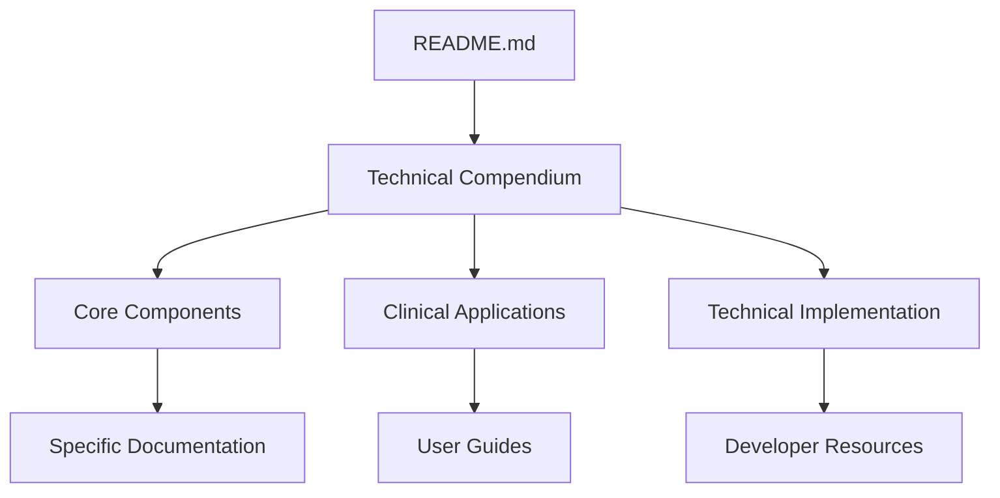

# Repository Comprehension & Integration Improvements

*Identified improvements to facilitate better understanding and complete comprehension of VOITHER repository content*

## 🎯 Assessment Summary

Based on comprehensive analysis of the repository structure, content, and user experience, this document outlines specific improvements to enhance comprehension and integration of all VOITHER content.

### ✅ **Current Strengths Identified:**
- **Comprehensive Documentation**: 50 markdown files with 31,282 lines of content
- **Working Automations**: 100% success rate on all validation systems
- **Well-Structured Architecture**: Clear separation of concerns and modular design
- **Excellent Link Validation**: 257/257 internal links working correctly
- **Strong Knowledge Graph**: Comprehensive system overview available

### 🔧 **Key Improvements Needed:**

#### 1. **Unified Manual Creation** ✅ **COMPLETED**
- **Issue**: Content was distributed across multiple files without central integration
- **Solution**: Created **VOITHER Technical Compendium** - unified system manual
- **Impact**: Single comprehensive reference integrating all content areas

#### 2. **Automation Transparency** ✅ **COMPLETED**
- **Issue**: Automation functionality not clearly documented
- **Solution**: Created **Automation Status & Monitoring** document
- **Impact**: Complete visibility into how automations work and their current status

---

## 📋 Additional Improvement Recommendations

### 🎯 **Immediate Improvements (High Priority)**

#### 1. **Visual Navigation Enhancement**
**Current State**: Text-based navigation
**Recommended**: Add visual system diagrams and interactive navigation



**Implementation**:
- Add interactive navigation flowcharts
- Create visual system overview diagrams
- Implement quick-reference cards for each major component

#### 2. **Progressive Disclosure System**
**Current State**: All content at same level
**Recommended**: Implement progressive complexity levels

| Level | Time Investment | Content Type | Target Audience |
|-------|----------------|--------------|-----------------|
| **Level 1: Overview** | 15-30 min | Executive summaries, key concepts | All users |
| **Level 2: Implementation** | 1-2 hours | Technical details, guides | Practitioners |
| **Level 3: Advanced** | 3+ hours | Complete specifications, research | Specialists |

#### 3. **Quick Start Paths Enhancement**
**Current State**: Role-based quick starts exist
**Recommended**: Add outcome-based quick starts

**Examples**:
- "I want to understand VOITHER in 15 minutes"
- "I want to implement VOITHER clinically"
- "I want to contribute to VOITHER development"
- "I want to understand the research foundation"

### 🔧 **Technical Integration Improvements**

#### 4. **Automated Content Synchronization**
**Recommendation**: Enhance automation to maintain content consistency

```yaml
Proposed Automation Enhancements:
  - Auto-update cross-references when content changes
  - Auto-generate summary statistics in compendium
  - Auto-validate technical code examples
  - Auto-sync knowledge graph with new content
```

#### 5. **Search and Discovery Enhancement**
**Current State**: Manual navigation through documents
**Recommended**: Implement advanced search capabilities

```bash
# Proposed make commands
make search TERM="dimensional analysis"    # Content search
make find-by-audience AUDIENCE="clinician" # Audience-specific content
make find-by-complexity LEVEL="beginner"   # Complexity-based filtering
make find-by-topic TOPIC="automation"      # Topic-based discovery
```

#### 6. **Integration Testing Framework**
**Recommendation**: Add automated testing for documentation consistency

```python
# Proposed validation enhancements
class DocumentationValidator:
    def validate_consistency(self):
        # Check cross-reference accuracy
        # Validate code examples
        # Ensure content freshness
        # Verify link integrity
        pass
    
    def validate_completeness(self):
        # Check coverage of all system components
        # Ensure all user paths are documented
        # Validate example completeness
        pass
```

### 📊 **Content Organization Improvements**

#### 7. **Contextual Cross-Referencing**
**Current State**: Basic linking between documents
**Recommended**: Enhanced contextual navigation

**Example Implementation**:
```markdown
> **💡 Related Content**
> - For implementation details: [MED Core](../core-concepts/med_core.md)
> - For clinical use: [Clinician Guide](../guides/clinician-quickstart.md)
> - For research context: [Mental Geometry](guides/research/geometria_afetos_cognicao.md)

> **🔄 Prerequisites**
> Before reading this section, review:
> - [System Architecture Basics](../architecture/voither_system_architecture.md)
> - [15-Dimensional Framework](../core-concepts/15-dimensions.md)
```

#### 8. **Status Tracking Enhancement**
**Current State**: Static status indicators
**Recommended**: Dynamic status tracking with progress indicators

```yaml
Component Status Tracking:
  MED Core:
    implementation: 100%
    documentation: 95%
    testing: 80%
    integration: 90%
  
  AutoAgency:
    implementation: 60%
    documentation: 70%  # Needs update
    testing: 40%
    integration: 50%
```

### 🎨 **User Experience Improvements**

#### 9. **Multi-Format Output**
**Recommendation**: Generate documentation in multiple formats

```bash
# Proposed output formats
make pdf          # Generate PDF version of compendium
make epub         # Generate eBook version
make slides       # Generate presentation slides
make mobile       # Generate mobile-optimized version
```

#### 10. **Interactive Examples**
**Current State**: Text-based examples
**Recommended**: Interactive code examples and demonstrations

```typescript
// Interactive examples with live editing
interface InteractiveExample {
  code: string;
  canEdit: boolean;
  livePreview: boolean;
  expectedOutput: string;
}
```

### 🔄 **Continuous Improvement Framework**

#### 11. **User Feedback Integration**
**Recommendation**: Implement systematic feedback collection

```yaml
Feedback Collection Points:
  - Document rating system
  - "Was this helpful?" indicators
  - Improvement suggestion forms
  - Usage analytics integration
```

#### 12. **Content Freshness Monitoring**
**Recommendation**: Automated content freshness tracking

```python
class ContentFreshnessMonitor:
    def check_outdated_content(self):
        # Identify content not updated in X months
        # Flag content with broken external links
        # Highlight content referencing deprecated features
        pass
    
    def suggest_updates(self):
        # Propose content updates based on system changes
        # Identify missing documentation for new features
        # Suggest consolidation opportunities
        pass
```

---

## 🚀 Implementation Roadmap

### **Phase 1: Foundation** (Completed ✅)
- [x] Create unified technical compendium
- [x] Document automation status and functionality
- [x] Update navigation and indexing
- [x] Validate all links and references

### **Phase 2: Enhancement** (Recommended - Next Steps)
- [ ] Implement visual navigation diagrams
- [ ] Add progressive disclosure system
- [ ] Create outcome-based quick start paths
- [ ] Enhance search and discovery capabilities

### **Phase 3: Advanced Integration** (Future)
- [ ] Implement automated content synchronization
- [ ] Add integration testing framework
- [ ] Create multi-format output generation
- [ ] Implement interactive examples

### **Phase 4: Continuous Improvement** (Ongoing)
- [ ] Set up user feedback collection
- [ ] Implement content freshness monitoring
- [ ] Establish regular content review cycles
- [ ] Create community contribution guidelines

---

## 📊 Success Metrics

### **Comprehension Metrics**
- **Time to Understanding**: Reduce from ~2 hours to ~30 minutes for basic comprehension
- **User Path Success**: 95% of users should find their needed information within 3 clicks
- **Content Completeness**: 100% coverage of all system components

### **Integration Metrics**
- **Cross-Reference Accuracy**: Maintain 100% valid internal links
- **Content Freshness**: 95% of content updated within last 6 months
- **User Satisfaction**: Target 90% positive feedback on documentation usefulness

### **Automation Metrics**
- **Validation Success**: Maintain 100% automation success rate
- **Content Consistency**: Automated detection of inconsistencies
- **Update Efficiency**: Reduce manual update time by 70%

---

## 🎯 Immediate Action Items

### **For Maintainers:**
1. Review and approve the technical compendium structure
2. Implement basic visual navigation diagrams
3. Set up regular content review schedule
4. Establish feedback collection mechanisms

### **For Users:**
1. Start with the [Technical Compendium](VOITHER_TECHNICAL_COMPENDIUM.md) for comprehensive understanding
2. Use [Automation Status](AUTOMATION_STATUS.md) to understand system capabilities
3. Provide feedback on documentation usefulness and clarity
4. Suggest additional integration needs

### **For Contributors:**
1. Follow the unified documentation structure when adding content
2. Ensure all new content is cross-referenced in the compendium
3. Update automation status when implementing new automations
4. Validate all links and references before committing

---

## 🆘 Support & Feedback

### **Getting Help with Improvements:**
- **Technical Questions**: Review [Developer Guide](../guides/developer-guide.md)
- **Content Questions**: Check [Table of Contents](TABLE_OF_CONTENTS.md)
- **Integration Issues**: Consult [System Architecture](../architecture/voither_system_architecture.md)

### **Providing Feedback:**
- **Documentation Issues**: Create GitHub issue with "documentation" label
- **Integration Suggestions**: Use GitHub discussions
- **Automation Improvements**: Contact maintainers directly

---

*This improvement document will be updated as enhancements are implemented and new needs are identified. The goal is continuous evolution toward optimal repository comprehension and integration.*

**Status: ACTIVE IMPLEMENTATION** | **Last Updated: 2024-08-11** | **Version: 1.0**