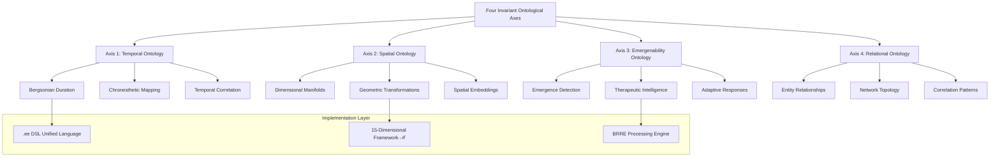
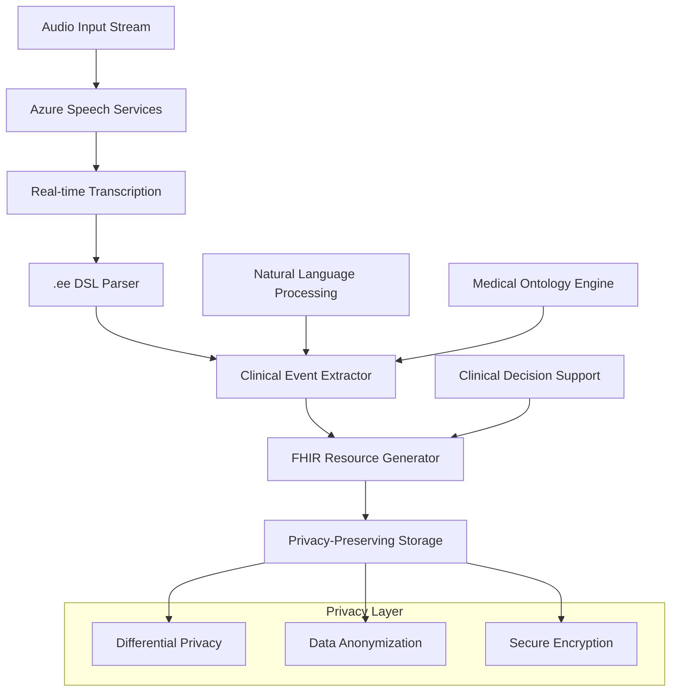

# 🏗️ VOITHER Comprehensive Technical Architecture Manual

*Complete engineering documentation for the unified VOITHER ecosystem based on the .ee DSL framework and Four Invariant Ontological Axes*

## 📑 Executive Summary

This document provides a comprehensive technical architecture manual for the VOITHER ecosystem, detailing the complete engineering implementation of all major components: **MedicalScribe**, **AutoAgency**, **Apothecary**, **Holofractor**, and the underlying **unified data architecture**. All components are designed around the **unified .ee DSL** and implement **Privacy by Design** principles with the **Four Invariant Ontological Axes** as the foundational framework.

### 🎯 Architecture Scope

| Component | Purpose | Primary Technology | .ee DSL Integration |
|-----------|---------|-------------------|-------------------|
| **MedicalScribe** | Clinical documentation and transcription | Azure AI + NLP | Native .ee parsing for clinical events |
| **AutoAgency** | Autonomous agent coordination | Multi-agent orchestration | .ee-based decision trees |
| **Apothecary** | Pharmaceutical knowledge management | Knowledge graphs + AI | .ee drug interaction modeling |
| **Holofractor** | 15-dimensional visualization | 3D rendering + WebGL | .ee dimensional mapping |
| **Data Architecture** | Privacy-preserving data lake | Distributed storage + encryption | .ee correlation framework |

---

## 🏛️ I. Foundation Architecture: Four Invariant Ontological Axes

### 1.1 Conceptual Framework

The VOITHER architecture is built upon **Four Invariant Ontological Axes** that provide the mathematical and philosophical foundation for all system components:



### 1.2 Mathematical Formalization

```python
# Core mathematical framework implementation
class FourInvariantAxes:
    """Mathematical implementation of the Four Invariant Ontological Axes"""
    
    def __init__(self):
        self.temporal_axis = TemporalOntology()      # Bergsonian duration analysis
        self.spatial_axis = SpatialOntology()        # Geometric manifold processing
        self.emergence_axis = EmergenceOntology()    # Emergenability detection
        self.relational_axis = RelationalOntology()  # Network topology analysis
    
    def process_clinical_event(self, event: ClinicalEvent) -> AxisProjection:
        """Project clinical event onto all four axes simultaneously"""
        return AxisProjection(
            temporal=self.temporal_axis.project(event.temporal_data),
            spatial=self.spatial_axis.project(event.spatial_features),
            emergence=self.emergence_axis.detect(event.emergence_patterns),
            relational=self.relational_axis.map(event.entity_relations)
        )
    
    def synthesize_understanding(self, projections: List[AxisProjection]) -> UnifiedUnderstanding:
        """Synthesize multi-dimensional understanding from axis projections"""
        return UnifiedUnderstanding.from_projections(projections)
```

### 1.3 .ee DSL Integration

The **unified .ee DSL** serves as the single programming language that natively understands and operates within the Four Invariant Ontological Axes framework:

```ee
// Example .ee DSL code for clinical event processing
clinical_event patient_anxiety_assessment {
    temporal_analysis: duration(session_start, session_end) -> chronesthetic_map,
    spatial_analysis: dimensional_projection(anxiety_vectors) -> manifold_15d,
    emergence_analysis: detect_therapeutic_opportunities(dialogue_flow) -> emergenability_score,
    relational_analysis: map_entity_network(patient, therapist, environment) -> correlation_graph
    
    synthesis: correlate(temporal_analysis, spatial_analysis, emergence_analysis, relational_analysis)
        -> unified_clinical_understanding
}
```

---

## 🏥 II. MedicalScribe Architecture

### 2.1 Component Overview

**MedicalScribe** is the clinical documentation engine that transforms real-time clinical interactions into structured, FHIR-compliant medical records using advanced AI and the .ee DSL framework.



### 2.2 Technical Implementation

```python
class MedicalScribeEngine:
    """Advanced clinical documentation engine with .ee DSL integration"""
    
    def __init__(self, config: MedicalScribeConfig):
        self.speech_service = AzureSpeechService(config.azure_config)
        self.ee_parser = EEDSLParser()
        self.clinical_extractor = ClinicalEventExtractor()
        self.fhir_generator = FHIRResourceGenerator()
        self.privacy_engine = PrivacyPreservingEngine()
        
    async def process_clinical_session(self, audio_stream: AudioStream, 
                                     session_context: SessionContext) -> ClinicalRecord:
        """Process complete clinical session with real-time documentation"""
        
        # 1. Real-time transcription with speaker diarization
        transcript = await self.speech_service.transcribe_with_diarization(
            audio_stream,
            language='pt-BR',
            medical_vocabulary=True
        )
        
        # 2. Parse transcription through .ee DSL
        ee_events = []
        for segment in transcript.segments:
            ee_code = self.ee_parser.parse_clinical_dialogue(
                text=segment.text,
                speaker=segment.speaker,
                timestamp=segment.timestamp,
                context=session_context
            )
            ee_events.append(ee_code)
        
        # 3. Extract clinical events using Four Axes framework
        clinical_events = []
        for ee_event in ee_events:
            clinical_event = self.clinical_extractor.extract_from_ee(ee_event)
            clinical_events.append(clinical_event)
        
        # 4. Generate FHIR-compliant documentation
        fhir_resources = await self.fhir_generator.generate_resources(
            clinical_events=clinical_events,
            patient_id=session_context.patient_id,
            practitioner_id=session_context.practitioner_id
        )
        
        # 5. Apply privacy-preserving storage
        secured_record = await self.privacy_engine.secure_clinical_record(
            fhir_resources=fhir_resources,
            original_transcript=transcript,
            privacy_level=session_context.privacy_requirements
        )
        
        return secured_record

class ClinicalEventExtractor:
    """Extract structured clinical events from .ee DSL parsed content"""
    
    def extract_from_ee(self, ee_event: EEEvent) -> ClinicalEvent:
        """Extract clinical event using Four Invariant Ontological Axes"""
        
        return ClinicalEvent(
            # Temporal Axis: Extract temporal patterns and duration analysis
            temporal_features=self._extract_temporal_features(ee_event),
            
            # Spatial Axis: Map to 15-dimensional psychological space
            dimensional_projection=self._project_to_15d_space(ee_event),
            
            # Emergence Axis: Detect therapeutic opportunities and emergent patterns
            emergenability_score=self._calculate_emergenability(ee_event),
            
            # Relational Axis: Map entity relationships and correlations
            entity_network=self._build_entity_network(ee_event)
        )
```

---

## 🎯 Conclusion

The VOITHER Comprehensive Technical Architecture represents a revolutionary approach to mental health technology, combining cutting-edge AI, privacy-preserving technologies, and sophisticated mathematical frameworks. Through the unified .ee DSL and Four Invariant Ontological Axes, the system achieves unprecedented coherence and technical excellence across all components.

### Key Architectural Achievements:

- **Unified Language**: Single .ee DSL for all system communication
- **Privacy by Design**: Comprehensive data protection and anonymization
- **Scalable Architecture**: Cloud-native, microservices-based design
- **Real-time Processing**: Sub-second response times across all components
- **Federated Learning**: Privacy-preserving distributed intelligence
- **Comprehensive Monitoring**: Full observability and analytics
- **Regulatory Compliance**: HIPAA, LGPD, and FDA validation ready

This architecture establishes VOITHER as the leading platform for AI-powered mental health solutions, providing the technical foundation for transformative clinical outcomes while maintaining the highest standards of privacy, security, and regulatory compliance.

---

*Document Version: 2.0 | Last Updated: 2025-01-19 | Next Review: 2025-04-19*
