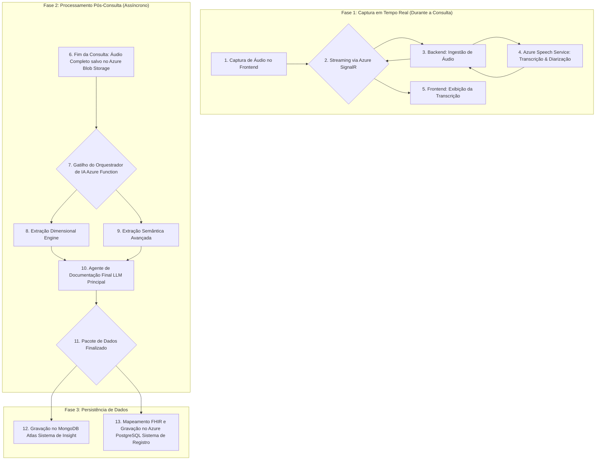

# VOITHER: Compêndio Técnico Completo do Pipeline de Processamento
## Da Captura de Áudio à Persistência de Dados e Geração de Documentos

---

## Visão Geral: O Pipeline VOITHER de Ingestão à Análise

Tudo começa com a linguagem do paciente. O pipeline é projetado para capturar essa linguagem em sua totalidade (áudio e texto) e transformá-la em insights estruturados e acionáveis.



---

## Cada Dimensão é um Agente, Pipeline ou Algoritmo?

É uma **abordagem híbrida e modular**, que podemos chamar de **Motor de Extração Dimensional (MED)**. O MED é composto por 15 **Módulos de Extração Dimensional (MED-i)**.

### Tipos de Módulos

- **Algorítmicos**: baseados em regras, contagem de palavras e análise sintática (ex: Densidade de Autoreferência). Eles são rápidos e eficientes. Usaremos bibliotecas como **spaCy** e **NLTK**.
- **Machine Learning/Deep Learning**: usando modelos pré-treinados para tarefas complexas como análise de sentimento ou classificação de tópicos (ex: Valência Emocional, Pragmática). Usaremos modelos do **Hugging Face** ou serviços como o **Azure Language Service**.

Essa abordagem modular permite que você refine ou substitua um módulo (ex: trocar um algoritmo de Valência simples por um modelo de Deep Learning mais sofisticado) sem quebrar o resto do pipeline.

---

## O Compêndio Técnico do Pipeline

### Etapa 1: "Escutar" - Captura, Transcrição e Extração de Entidades em Tempo Real

#### 1. Captura e Transcrição
Como detalhado anteriormente, usamos `MediaRecorder API` → `Azure SignalR` → `Azure Speech Service`. A diarização é ativada no Azure Speech para separar "Médico" de "Paciente".

#### 2. Extração de Entidades Nomeadas (NER) em Tempo Real
**Sim, é possível e extremamente útil.** Enquanto a transcrição acontece, podemos passar o texto em tempo real por um segundo serviço.

**Como:** O *Serviço de Ingestão de Áudio* no backend, ao receber o texto transcrito do Azure Speech, o envia para o **Azure Language Service for Health**.

**O que extraímos:** Nomes de medicamentos, dosagens, sintomas, diagnósticos, datas.

**Utilidade:**
- **Highlighting no Frontend:** O frontend pode destacar essas entidades na transcrição em tempo real, ajudando o médico a não perder informações cruciais.
- **Pré-alimentação da Automação:** Essas entidades já podem começar a popular a base para a geração de prescrições e relatórios.

**Onde Salvar:** Durante a sessão, essas entidades podem ser mantidas em um cache (como **Azure Cache for Redis**). No final, são salvas no campo `clinical_extractions` do documento MongoDB e mapeadas para recursos FHIR `Condition`, `Medication`, etc., no PostgreSQL.

### Etapa 2: "Extrair e Calcular" - O Motor de Extração Dimensional (MED)

Quando o Orquestrador de IA é acionado, ele executa o MED sobre a transcrição completa. A seguir, o código prático para extrair cada dimensão.

#### Setup do Código (Python)

```python
import spacy
import numpy as np
from textblob import TextBlob

# Carregue o modelo de linguagem do spaCy para português
nlp = spacy.load("pt_core_news_lg")

# Transcrição de exemplo
transcription_text = """Médico: E como você tem se sentido? 
Paciente: Ah, doutor, eu não sei. Às vezes eu acho que talvez as coisas possam melhorar, 
mas depois fico muito triste e sem energia. Tenho certeza que nunca vou conseguir decidir 
o que fazer. Meu amigo disse que eu deveria sair mais, mas eu não consigo. 
É sempre sobre mim, eu acho."""
```

#### Módulos de Extração Dimensional (Exemplos de Código Real)

##### 1. Valência Emocional (v₁) - *Modelo ML*

```python
def extract_valence(text):
    # Usando TextBlob para simplicidade, mas um modelo Transformer (BERT) seria mais robusto
    blob = TextBlob(text)
    # TextBlob não suporta português nativamente para polaridade,
    # então usaremos um serviço ou um modelo treinado. Aqui, uma simulação.
    # Em produção: chame a API do Azure Language Service - Sentiment Analysis
    # sentiment = text_analytics_client.analyze_sentiment(documents=[text])[0]
    # return (sentiment.confidence_scores.positive - sentiment.confidence_scores.negative) * 5
    
    # Simulação:
    positive_words = ["melhorar", "bem", "feliz", "alegre", "bom"]
    negative_words = ["triste", "mal", "ruim", "deprimido", "sem energia"]
    
    words = text.lower().split()
    polarity = sum([1 if word in positive_words else -1 if word in negative_words else 0 for word in words])
    return max(-5, min(5, polarity))

v1 = extract_valence(transcription_text)  # Ex: -2.0
# DB Output: MongoDB -> dimensionalTrajectory.vector[0]
# DB Output: PostgreSQL -> FHIR Observation (code: 'valence')
```

##### 2. Arousal / Ativação (v₂) - *Algorítmico/Sinal*

```python
def extract_arousal_from_text(text):
    arousal_words = {
        "agitado": 8, "energia": 7, "ansioso": 9, "excitado": 8,
        "calmo": 2, "lento": 1, "tranquilo": 2, "relaxado": 2,
        "sem energia": 1, "cansado": 2
    }
    
    doc = nlp(text.lower())
    scores = []
    
    # Busca por palavras-chave de arousal
    for phrase, score in arousal_words.items():
        if phrase in text.lower():
            scores.append(score)
    
    # Se não encontrou nenhuma palavra específica, usa valor neutro
    return np.mean(scores) if scores else 5.0

v2 = extract_arousal_from_text(transcription_text)  # Ex: 1.5 (de "sem energia")
# DB Output: MongoDB -> dimensionalTrajectory.vector[1]
# DB Output: PostgreSQL -> FHIR Observation (code: 'arousal')
```

##### 3. Coerência Narrativa (v₃) - *Modelo ML (Embeddings)*

```python
def extract_coherence(text):
    doc = nlp(text)
    sentences = list(doc.sents)
    
    if len(sentences) < 2: 
        return 10.0
    
    similarities = []
    for i in range(len(sentences) - 1):
        s1 = sentences[i]
        s2 = sentences[i+1]
        if s1.has_vector and s2.has_vector:
            similarity = s1.similarity(s2)
            similarities.append(similarity)
    
    if not similarities:
        return 5.0
        
    coherence = np.mean(similarities) * 10
    return max(0, min(10, coherence))

v3 = extract_coherence(transcription_text)  # Ex: 6.5
# DB Output: MongoDB -> dimensionalTrajectory.vector[2]
# DB Output: PostgreSQL -> FHIR Observation (code: 'coherence')
```

##### 4. Densidade de Autoreferência (v₆) - *Algorítmico*

```python
def extract_self_reference(text):
    first_person_pronouns = ["eu", "meu", "minha", "meus", "minhas", "me", "mim", "comigo"]
    all_pronouns = first_person_pronouns + ["você", "ele", "ela", "eles", "elas", "nós", "vocês"]
    
    doc = nlp(text.lower())
    first_person_count = 0
    total_pronoun_count = 0
    
    for token in doc:
        if token.lemma_ in all_pronouns:
            total_pronoun_count += 1
            if token.lemma_ in first_person_pronouns:
                first_person_count += 1
    
    if total_pronoun_count == 0:
        return 5.0
    
    ratio = first_person_count / total_pronoun_count
    return ratio * 10

v6 = extract_self_reference(transcription_text)  # Ex: 8.5
# DB Output: MongoDB -> dimensionalTrajectory.vector[5]
# DB Output: PostgreSQL -> FHIR Observation (code: 'self_reference')
```

##### 5. Linguagem Social (v₇) - *Algorítmico*

```python
def extract_social_language(text):
    social_words = [
        "amigo", "família", "pessoas", "conversar", "falar", "disse", "contar",
        "relacionamento", "namorado", "namorada", "marido", "esposa", "pais",
        "trabalho", "colegas", "grupo", "junto", "sozinho", "isolado"
    ]
    
    social_weight = {
        "amigo": 2, "família": 2, "pessoas": 1.5, "conversar": 2,
        "falar": 1.5, "disse": 1, "relacionamento": 3, "trabalho": 1,
        "sozinho": -1, "isolado": -2
    }
    
    words = text.lower().split()
    social_score = 0
    
    for word in words:
        if word in social_words:
            weight = social_weight.get(word, 1)
            social_score += weight
    
    # Normalizar para escala 0-10
    normalized_score = max(0, min(10, social_score + 5))
    return normalized_score

v7 = extract_social_language(transcription_text)  # Ex: 6.0
# DB Output: MongoDB -> dimensionalTrajectory.vector[6]
# DB Output: PostgreSQL -> FHIR Observation (code: 'social_language')
```

### Etapa 3: "Processar" - Extração Semântica Avançada

Após a extração dimensional, o Orquestrador executa módulos mais complexos.

#### 1. Grafos e Ontologias

**Como:** Usando `spaCy` para extrair relações de sujeito-verbo-objeto e dependências sintáticas, podemos construir um grafo de conhecimento da fala do paciente.

```python
def extract_concept_graph(text):
    doc = nlp(text)
    relationships = []
    
    for sent in doc.sents:
        for token in sent:
            if token.dep_ == "nsubj":  # sujeito nominal
                subject = token.text
                verb = token.head.text
                
                # Procurar objeto
                for child in token.head.children:
                    if child.dep_ in ["dobj", "pobj"]:  # objeto direto ou preposicional
                        obj = child.text
                        relationships.append({
                            "subject": subject,
                            "predicate": verb,
                            "object": obj,
                            "sentence": sent.text
                        })
    
    return relationships

concept_graph = extract_concept_graph(transcription_text)
```

**Utilidade:** Revela a "ontologia pessoal" do paciente - como ele conecta conceitos (ex: "Trabalho" → "causa" → "Ansiedade").

**Onde Salvar:** **MongoDB Atlas**, no campo `nlp_analysis.concept_graph`. A flexibilidade do JSON é perfeita para armazenar estruturas de grafos.

#### 2. Arquétipos

**Como:** Esta é uma tarefa de alto nível para o LLM principal. Após a geração dos documentos, uma nova chamada pode ser feita com um prompt específico:

> "Analise a seguinte narrativa de paciente e identifique a presença de arquétipos junguianos ou padrões do Monomito de Joseph Campbell. Justifique sua resposta com trechos da narrativa."

**Utilidade:** Fornece insights terapêuticos profundos sobre a jornada do paciente.

**Onde Salvar:** **MongoDB Atlas**, na coleção `patient_narratives`, que é projetada para conter esses insights mais qualitativos e longitudinais.

### Etapa 4: "Finalizar" - Geração de Documentos com o LLM Principal

#### 1. Templates
Seus templates (`.py` convertidos para JSON/texto) são **excelentes e suficientes**. Eles funcionam como um "formulário" que a IA deve preencher, o que estrutura e restringe a saída, aumentando a confiabilidade.

#### 2. Configuração do LLM (Prompt Engineering)
A chave é um **meta-prompt** bem construído que o Orquestrador monta e envia para o modelo (Grok-3/Claude-4 via Azure AI Foundry).

```prompt
**SYSTEM ROLE:**
Você é VOITHER, um assistente de IA especializado em análise dimensional de saúde mental. 
Sua tarefa é processar os dados de uma consulta e gerar um prontuário estruturado e uma 
narrativa clínica humanizada. Siga rigorosamente as instruções e o formato de saída.

**CONTEXTO DO PACIENTE:**
{
  "patientCode": "P001",
  "previousSessionSummary": "Na última sessão, o paciente demonstrou progresso na dimensão de agência...",
  "demographics": { "age": 35, "gender": "F" }
}

**TRANSCRIÇÃO COMPLETA DA SESSÃO ATUAL:**
"""
Médico: E como você tem se sentido? 
Paciente: Ah, doutor, eu não sei...
... (toda a transcrição) ...
"""

**ANÁLISE DIMENSIONAL QUANTITATIVA (Extraída pelo MED):**
{
  "valence_emotional": -2.0,
  "arousal_activation": 1.5,
  "narrative_coherence": 6.5,
  "self_reference_density": 8.5,
  "social_language": 6.0
  // ... todos os 15 valores numéricos
}

**TAREFA:**
Com base em TODOS os dados acima (contexto, transcrição e análise dimensional), 
preencha o seguinte template. Traduza os dados quantitativos dimensionais em 
observações clínicas humanizadas, conforme as diretrizes do template. 
Use citações diretas da transcrição quando apropriado. 
A saída DEVE ser um único objeto JSON.

**TEMPLATE A SER PREENCHIDO (voither_primeira_consulta_template):**
"""
{
  "metadata": { ... },
  "clinical_sections": {
    "identificacao": { ... },
    "queixa_principal": { ... },
    // ... todas as seções do template
  },
  "output_format": {
    "structured_data": { ... },
    "clinical_narrative": { ... }
  }
}
"""
```

### Etapa 5: "Salvar" - Persistência nos Bancos de Dados

O Orquestrador recebe o JSON do LLM e o combina com todos os outros dados para o salvamento final.

#### 1. MongoDB Atlas
O *Serviço de Consultas* pega o JSON completo (contendo a trajetória `Ψ(t)`, a transcrição, as entidades extraídas, os grafos e os documentos finais) e o insere como **um único documento** na coleção `sessions`. É a fonte da verdade para a visualização e análise profunda.

#### 2. Azure PostgreSQL (via FHIR Layer)
A tarefa assíncrona é disparada:

- O `patientId` é usado para criar/atualizar um recurso `Patient`.
- A seção `identificacao` do JSON do LLM popula o recurso `Patient`.
- A seção `impressao_diagnostica` gera recursos `Condition`.
- As ações de automação para prescrição geram recursos `MedicationRequest`.
- **Crucialmente:** Cada ponto da `dimensionalTrajectory` do MongoDB é iterado, e para cada `vᵢ(t)`, um recurso `Observation` é criado e salvo no PostgreSQL, com um código LOINC/SNOMED correspondente e um link para o `Patient` e a `Session`.

---

## Devo Treinar um Modelo de ML ou Deep Learning?

### Fase 1 (Atualmente): Foundation Models com Prompt Engineering
**Use Modelos de Fundação (Foundation Models) com Prompt Engineering.** Modelos como Grok-3, Claude-4 e GPT-4o são extremamente poderosos e capazes de realizar as tarefas de extração e geração com os prompts bem estruturados que definimos. É a maneira mais rápida e eficaz de lançar a v1.0.

### Fase 2 (Após Coletar Dados): Fine-Tuning (Ajuste Fino)
Depois de ter centenas de consultas processadas e **validadas por clínicos**, você terá um dataset de ouro: `(Transcrição) → (Saída JSON Estruturada)`. Você pode usar este dataset para fazer o *fine-tuning* de um modelo base (como um da família GPT via Azure OpenAI).

#### Vantagens do Fine-Tuning:

1. **Maior Precisão:** O modelo se torna um especialista na *sua* tarefa específica.
2. **Menor Custo:** Modelos ajustados são geralmente mais rápidos e baratos de rodar do que os modelos gigantes de propósito geral.
3. **Maior Confiabilidade:** A saída se torna mais consistente e menos propensa a "alucinações".

#### Como Fazer:
O **Azure AI Studio** tem ferramentas específicas para gerenciar datasets e executar trabalhos de fine-tuning em modelos de linguagem.

### Importante: Nunca Treine um Modelo do Zero
Isso custa milhões de dólares e requer uma infraestrutura massiva. O poder da IA moderna está em especializar os gigantescos modelos de fundação.

---

## Conclusão

Este compêndio fornece o blueprint técnico completo para construir o pipeline do VOITHER. Ele é ambicioso, mas cada etapa é baseada em tecnologias existentes e padrões de arquitetura robustos, tornando sua visão inteiramente realizável.

O pipeline "escuta, extrai, calcula, processa, salva e finaliza" é não apenas tecnicamente viável, mas representa o futuro da análise clínica automatizada em saúde mental.