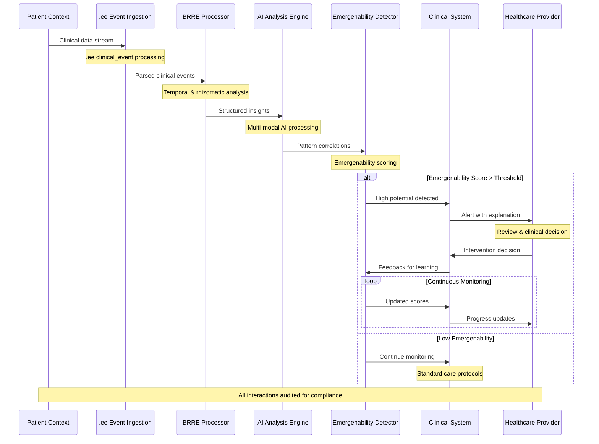
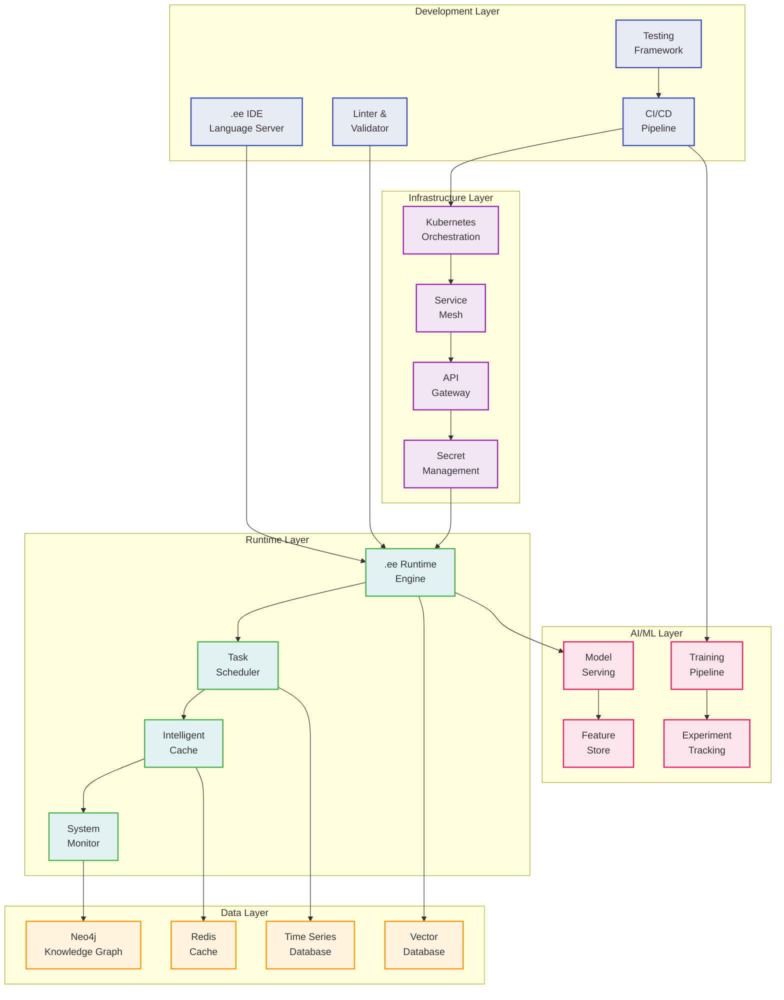
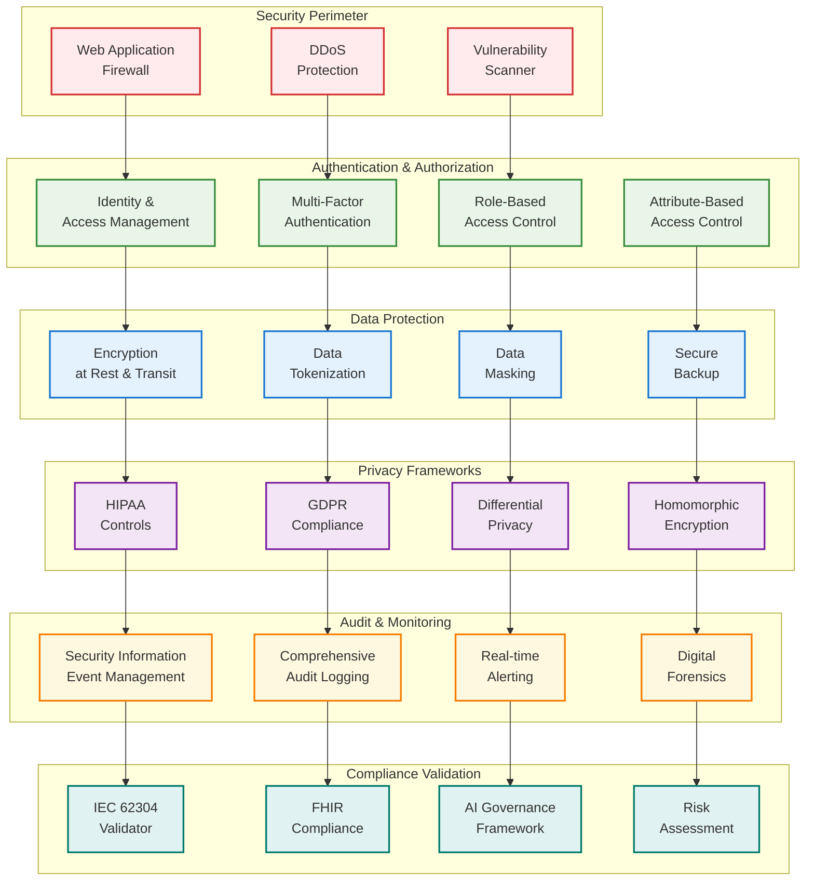
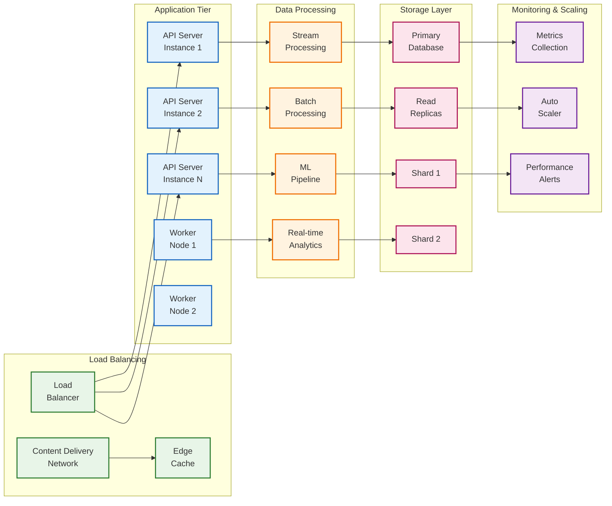

# VOITHER System Architecture - Complete Visual Overview

## 1. Overall System Architecture

```mermaid
graph TB
    subgraph "VOITHER Ecosystem - Unified .ee DSL Architecture"
        subgraph "Core Foundation - Four Invariant Ontological Axes"
            A1[Ontologies<br/>Entity Definitions]
            A2[Parsing<br/>Language Processing]
            A3[Vectors<br/>Mathematical Representations]
            A4[Graphs<br/>Relationship Modeling]
        end
        
        subgraph "Unified .ee DSL Layer"
            DSL[.ee Language<br/>Unified Healthcare AI Programming]
            GRAMMAR[ANTLR4 Grammar<br/>500+ Production Lines]
            COMPILER[.ee Compiler<br/>AI-Native Code Generation]
        end
        
        subgraph "AI-Native Processing Engine"
            BRRE[BRRE Processor<br/>Bergsonian-Rhizomatic<br/>Reasoning Engine]
            EMERGEN[Emergenability<br/>Detection Engine]
            TEMPORAL[Durational<br/>Intelligence Core]
            NETWORK[Rhizomatic<br/>Memory Networks]
        end
        
        subgraph "Healthcare Intelligence Platform"
            CLINICAL[Clinical Flow<br/>Orchestrator]
            EVENT[Event Sourcing<br/>Engine]
            CORRELATE[Pattern Correlation<br/>System]
            EXECUTE[Execution<br/>Runtime]
        end
        
        subgraph "AI Model Integration"
            LLM[Medical LLM<br/>Integration]
            ML[Machine Learning<br/>Pipeline]
            CONF[Confidence<br/>Management]
            EXPLAIN[Explainability<br/>Engine]
        end
        
        subgraph "Compliance & Security"
            HIPAA[HIPAA<br/>Validator]
            IEC[IEC 62304<br/>Compliance]
            FHIR[FHIR R4<br/>Integration]
            AUDIT[Audit<br/>System]
        end
        
        subgraph "Clinical Applications"
            HOLO[Dimensional<br/>Holofractor]
            DAP[DAP/BIRT<br/>Platform]
            ASSESS[Clinical<br/>Assessment]
            INTERVENE[Intervention<br/>Planning]
        end
    end
    
    %% Core Connections
    A1 --> DSL
    A2 --> DSL
    A3 --> DSL
    A4 --> DSL
    
    DSL --> GRAMMAR
    DSL --> COMPILER
    
    COMPILER --> BRRE
    COMPILER --> EMERGEN
    COMPILER --> TEMPORAL
    COMPILER --> NETWORK
    
    BRRE --> CLINICAL
    EMERGEN --> EVENT
    TEMPORAL --> CORRELATE
    NETWORK --> EXECUTE
    
    CLINICAL --> LLM
    EVENT --> ML
    CORRELATE --> CONF
    EXECUTE --> EXPLAIN
    
    LLM --> HIPAA
    ML --> IEC
    CONF --> FHIR
    EXPLAIN --> AUDIT
    
    HIPAA --> HOLO
    IEC --> DAP
    FHIR --> ASSESS
    AUDIT --> INTERVENE
    
    %% Styling
    classDef foundation fill:#e1f5fe,stroke:#01579b,stroke-width:2px
    classDef dsl fill:#f3e5f5,stroke:#4a148c,stroke-width:2px
    classDef ai fill:#e8f5e8,stroke:#1b5e20,stroke-width:2px
    classDef healthcare fill:#fff3e0,stroke:#e65100,stroke-width:2px
    classDef models fill:#fce4ec,stroke:#880e4f,stroke-width:2px
    classDef compliance fill:#f1f8e9,stroke:#33691e,stroke-width:2px
    classDef clinical fill:#e0f2f1,stroke:#004d40,stroke-width:2px
    
    class A1,A2,A3,A4 foundation
    class DSL,GRAMMAR,COMPILER dsl
    class BRRE,EMERGEN,TEMPORAL,NETWORK ai
    class CLINICAL,EVENT,CORRELATE,EXECUTE healthcare
    class LLM,ML,CONF,EXPLAIN models
    class HIPAA,IEC,FHIR,AUDIT compliance
    class HOLO,DAP,ASSESS,INTERVENE clinical
```

## 2. Data Flow Architecture

```mermaid
flowchart LR
    subgraph "Input Layer"
        PATIENT[Patient Data<br/>Clinical Records]
        SENSORS[IoT Sensors<br/>Real-time Data]
        NOTES[Clinical Notes<br/>Unstructured Text]
        IMAGES[Medical Images<br/>DICOM Data]
    end
    
    subgraph "Processing Pipeline"
        INGEST[Data Ingestion<br/>.ee Event Processing]
        PARSE[Natural Language<br/>Parsing & Analysis]
        VECTORIZE[Embedding<br/>Generation]
        GRAPH[Knowledge Graph<br/>Construction]
    end
    
    subgraph "AI Analysis Engine"
        EMERGEN_DETECT[Emergenability<br/>Detection]
        PATTERN[Pattern<br/>Recognition]
        CORRELATION[Cross-Domain<br/>Correlation]
        PREDICTION[Outcome<br/>Prediction]
    end
    
    subgraph "Clinical Intelligence"
        DECISION[Clinical Decision<br/>Support]
        RECOMMEND[Treatment<br/>Recommendations]
        MONITOR[Continuous<br/>Monitoring]
        ALERT[Alert<br/>Generation]
    end
    
    subgraph "Output & Integration"
        FHIR_OUT[FHIR R4<br/>Resources]
        CLINICAL_UI[Clinical<br/>Interface]
        REPORTS[Clinical<br/>Reports]
        INTEGRATION[EMR<br/>Integration]
    end
    
    %% Data Flow
    PATIENT --> INGEST
    SENSORS --> INGEST
    NOTES --> PARSE
    IMAGES --> VECTORIZE
    
    INGEST --> PARSE
    PARSE --> VECTORIZE
    VECTORIZE --> GRAPH
    
    GRAPH --> EMERGEN_DETECT
    EMERGEN_DETECT --> PATTERN
    PATTERN --> CORRELATION
    CORRELATION --> PREDICTION
    
    PREDICTION --> DECISION
    DECISION --> RECOMMEND
    RECOMMEND --> MONITOR
    MONITOR --> ALERT
    
    ALERT --> FHIR_OUT
    DECISION --> CLINICAL_UI
    RECOMMEND --> REPORTS
    MONITOR --> INTEGRATION
    
    %% Styling
    classDef input fill:#e3f2fd,stroke:#1565c0,stroke-width:2px
    classDef processing fill:#f3e5f5,stroke:#7b1fa2,stroke-width:2px
    classDef ai fill:#e8f5e8,stroke:#2e7d32,stroke-width:2px
    classDef clinical fill:#fff8e1,stroke:#f57c00,stroke-width:2px
    classDef output fill:#fce4ec,stroke:#c2185b,stroke-width:2px
    
    class PATIENT,SENSORS,NOTES,IMAGES input
    class INGEST,PARSE,VECTORIZE,GRAPH processing
    class EMERGEN_DETECT,PATTERN,CORRELATION,PREDICTION ai
    class DECISION,RECOMMEND,MONITOR,ALERT clinical
    class FHIR_OUT,CLINICAL_UI,REPORTS,INTEGRATION output
```

## 3. Emergenability Detection Workflow

## 4. Technical Component Integration

## 5. Security & Compliance Architecture

## 6. Performance & Scalability Architecture

---

**Legend & Key Components:**

- **Foundation Layer**: Four Invariant Ontological Axes providing computational substrate
- **DSL Layer**: Unified .ee language with ANTLR4 grammar and AI-native compilation
- **AI Engine**: BRRE-powered emergenability detection with temporal intelligence
- **Clinical Platform**: Healthcare-specific processing with regulatory compliance
- **Security**: Zero-trust architecture with comprehensive privacy protection
- **Scalability**: Cloud-native infrastructure with auto-scaling capabilities

**Performance Targets:**
- **Response Time**: <2s for emergenability detection, <5s for clinical flows
- **Throughput**: 50K+ API requests/second, 100K+ events/second
- **Availability**: 99.99% uptime with disaster recovery
- **Scalability**: Auto-scaling from 1 to 1000+ instances based on load