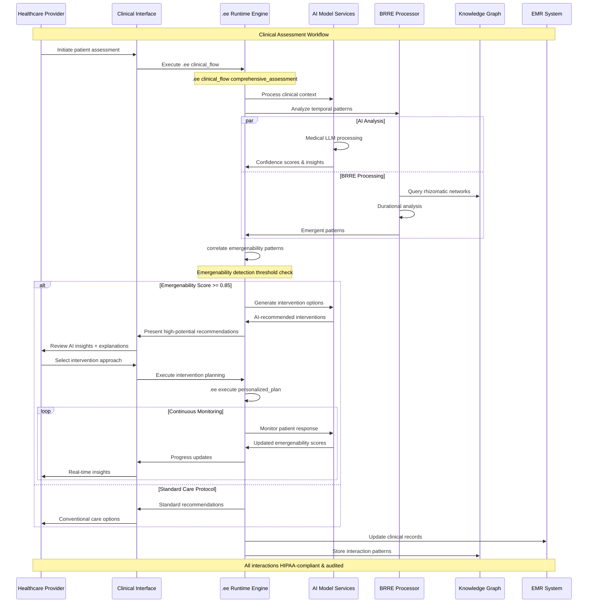
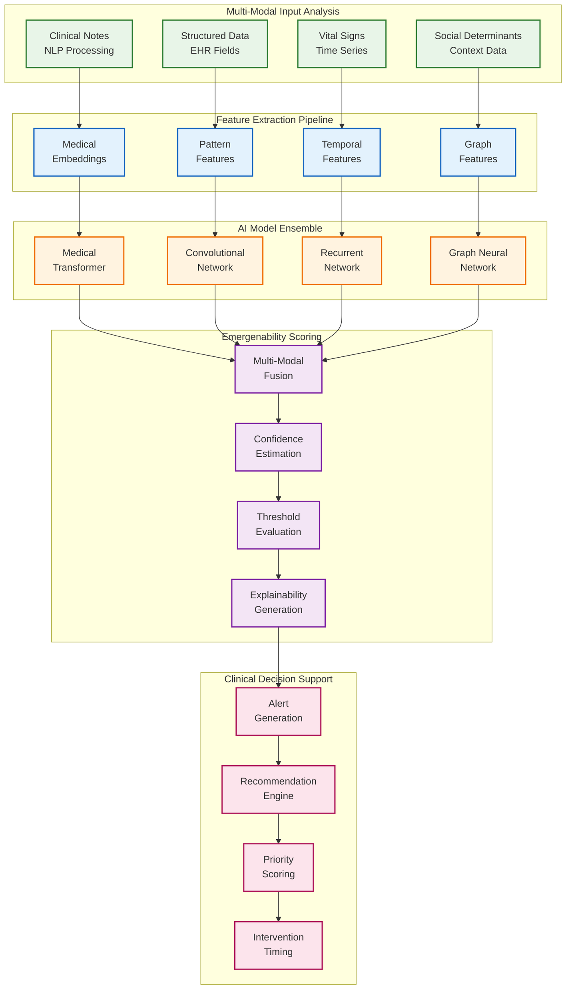
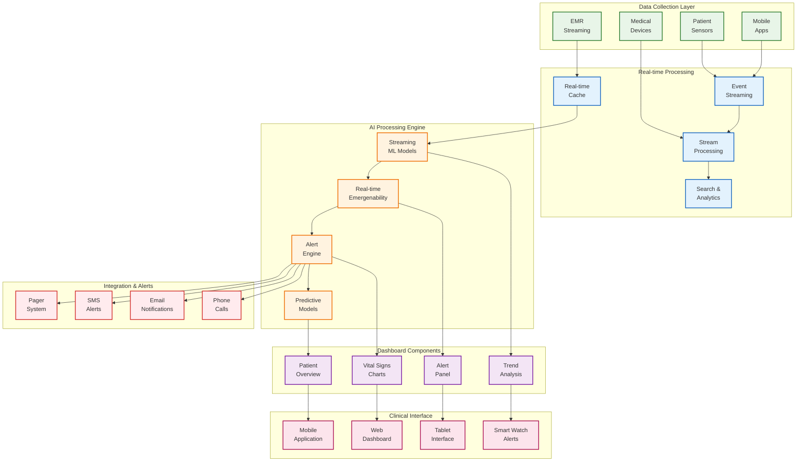
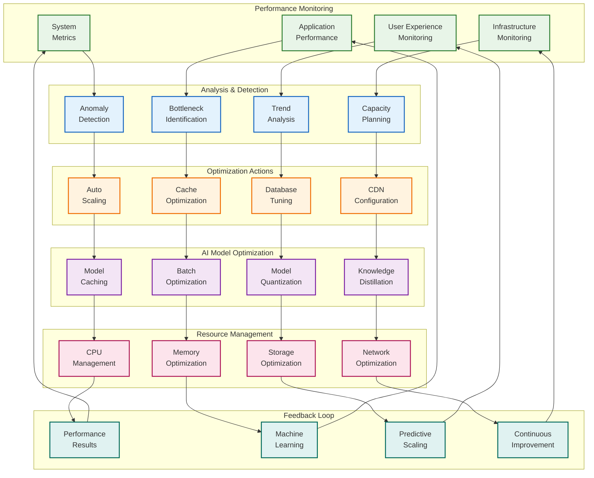

# Clinical Workflow Pipeline - Complete .ee DSL Integration

## 1. Unified .ee Clinical Pipeline

```mermaid
flowchart TD
    subgraph "Patient Interaction Layer"
        ENCOUNTER[Patient Encounter<br/>Multi-modal Input]
        EMR[Electronic Medical<br/>Records Access]
        REALTIME[Real-time<br/>Monitoring]
        IMAGING[Medical<br/>Imaging Data]
    end
    
    subgraph ".ee DSL Processing Engine"
        EVENT_PROC[.ee clinical_event<br/>Processing]
        PARSE_NLP[Natural Language<br/>Parsing Engine]
        CONTEXT_BUILD[Clinical Context<br/>Builder]
        VALIDATION[HIPAA/FHIR<br/>Validation]
    end
    
    subgraph "AI-Native Analysis Pipeline"
        EMERGEN_DETECT[emergenability<br/>Detection Algorithm]
        PATTERN_AI[AI Pattern<br/>Recognition]
        RISK_ASSESS[Risk Stratification<br/>& Assessment]
        TEMPORAL_ANAL[Durational Intelligence<br/>Temporal Analysis]
    end
    
    subgraph "BRRE Cognitive Processing"
        ABDUCTIVE[Parallel Abductive<br/>Reasoning]
        RHIZOMATIC[Rhizomatic Memory<br/>Network Access]
        BERGSON_TIME[Bergsonian Temporal<br/>Quality Processing]
        INTEGRATION[Multi-stream<br/>Insight Integration]
    end
    
    subgraph ".ee Clinical Flow Orchestration"
        FLOW_EXEC[.ee clinical_flow<br/>Execution]
        DECISION_GATES[AI-powered<br/>Decision Gates]
        SAFETY_CHECK[Clinical Safety<br/>Validation]
        HUMAN_LOOP[Human-in-the-Loop<br/>Oversight]
    end
    
    subgraph "Therapeutic Intelligence Output"
        RECOMMEND[Treatment<br/>Recommendations]
        INTERVENTION[Intervention<br/>Planning]
        MONITORING[Continuous<br/>Monitoring Setup]
        OUTCOMES[Outcome<br/>Prediction]
    end
    
    subgraph "Clinical Integration & Delivery"
        FHIR_GEN[FHIR Resource<br/>Generation]
        EMR_INTEG[EMR System<br/>Integration]
        ALERTS[Clinical Alert<br/>System]
        REPORTING[Clinical<br/>Reporting]
    end
    
    %% Primary Flow
    ENCOUNTER --> EVENT_PROC
    EMR --> EVENT_PROC
    REALTIME --> PARSE_NLP
    IMAGING --> CONTEXT_BUILD
    
    EVENT_PROC --> PARSE_NLP
    PARSE_NLP --> CONTEXT_BUILD
    CONTEXT_BUILD --> VALIDATION
    
    VALIDATION --> EMERGEN_DETECT
    EMERGEN_DETECT --> PATTERN_AI
    PATTERN_AI --> RISK_ASSESS
    RISK_ASSESS --> TEMPORAL_ANAL
    
    TEMPORAL_ANAL --> ABDUCTIVE
    ABDUCTIVE --> RHIZOMATIC
    RHIZOMATIC --> BERGSON_TIME
    BERGSON_TIME --> INTEGRATION
    
    INTEGRATION --> FLOW_EXEC
    FLOW_EXEC --> DECISION_GATES
    DECISION_GATES --> SAFETY_CHECK
    SAFETY_CHECK --> HUMAN_LOOP
    
    HUMAN_LOOP --> RECOMMEND
    RECOMMEND --> INTERVENTION
    INTERVENTION --> MONITORING
    MONITORING --> OUTCOMES
    
    OUTCOMES --> FHIR_GEN
    RECOMMEND --> EMR_INTEG
    INTERVENTION --> ALERTS
    MONITORING --> REPORTING
    
    %% Feedback Loops
    OUTCOMES -.-> EMERGEN_DETECT
    ALERTS -.-> FLOW_EXEC
    REPORTING -.-> CONTEXT_BUILD
    
    %% Styling
    classDef patient fill:#e8f5e8,stroke:#2e7d32,stroke-width:2px
    classDef dsl fill:#e3f2fd,stroke:#1565c0,stroke-width:2px
    classDef ai fill:#fff3e0,stroke:#ef6c00,stroke-width:2px
    classDef brre fill:#f3e5f5,stroke:#7b1fa2,stroke-width:2px
    classDef flow fill:#fce4ec,stroke:#ad1457,stroke-width:2px
    classDef output fill:#e0f2f1,stroke:#00695c,stroke-width:2px
    classDef integration fill:#fff8e1,stroke:#f57c00,stroke-width:2px
    
    class ENCOUNTER,EMR,REALTIME,IMAGING patient
    class EVENT_PROC,PARSE_NLP,CONTEXT_BUILD,VALIDATION dsl
    class EMERGEN_DETECT,PATTERN_AI,RISK_ASSESS,TEMPORAL_ANAL ai
    class ABDUCTIVE,RHIZOMATIC,BERGSON_TIME,INTEGRATION brre
    class FLOW_EXEC,DECISION_GATES,SAFETY_CHECK,HUMAN_LOOP flow
    class RECOMMEND,INTERVENTION,MONITORING,OUTCOMES output
    class FHIR_GEN,EMR_INTEG,ALERTS,REPORTING integration
```

## 2. .ee DSL Code Execution Flow

## 3. Emergenability Detection Deep Dive

## 4. Clinical Safety & Compliance Pipeline

```mermaid
flowchart LR
    subgraph "Input Validation"
        PHI_CHECK[PHI Data<br/>Validation]
        CONSENT[Patient Consent<br/>Verification]
        AUTH[Authorization<br/>Check]
    end
    
    subgraph "Processing Controls"
        ENCRYPT[Data<br/>Encryption]
        AUDIT_LOG[Audit<br/>Logging]
        ACCESS_CTRL[Access<br/>Control]
    end
    
    subgraph "AI Safety Controls"
        BIAS_CHECK[Bias<br/>Detection]
        CONF_VALID[Confidence<br/>Validation]
        EXPLAIN_REQ[Explainability<br/>Requirement]
    end
    
    subgraph "Clinical Validation"
        SAFETY_RULES[Clinical Safety<br/>Rules Engine]
        DRUG_INTERACT[Drug Interaction<br/>Checking]
        PROTOCOL_CHECK[Protocol<br/>Compliance]
    end
    
    subgraph "Regulatory Compliance"
        HIPAA_VALID[HIPAA<br/>Validation]
        IEC_COMPLY[IEC 62304<br/>Compliance]
        FHIR_STD[FHIR<br/>Standards]
    end
    
    subgraph "Human Oversight"
        HUMAN_REVIEW[Human Review<br/>Requirements]
        ESCALATION[Escalation<br/>Procedures]
        OVERRIDE[Override<br/>Mechanisms]
    end
    
    subgraph "Output Controls"
        RESULT_VALID[Result<br/>Validation]
        DELIVERY[Secure<br/>Delivery]
        TRACKING[Outcome<br/>Tracking]
    end
    
    %% Flow
    PHI_CHECK --> ENCRYPT
    CONSENT --> AUDIT_LOG
    AUTH --> ACCESS_CTRL
    
    ENCRYPT --> BIAS_CHECK
    AUDIT_LOG --> CONF_VALID
    ACCESS_CTRL --> EXPLAIN_REQ
    
    BIAS_CHECK --> SAFETY_RULES
    CONF_VALID --> DRUG_INTERACT
    EXPLAIN_REQ --> PROTOCOL_CHECK
    
    SAFETY_RULES --> HIPAA_VALID
    DRUG_INTERACT --> IEC_COMPLY
    PROTOCOL_CHECK --> FHIR_STD
    
    HIPAA_VALID --> HUMAN_REVIEW
    IEC_COMPLY --> ESCALATION
    FHIR_STD --> OVERRIDE
    
    HUMAN_REVIEW --> RESULT_VALID
    ESCALATION --> DELIVERY
    OVERRIDE --> TRACKING
    
    %% Styling
    classDef validation fill:#ffebee,stroke:#d32f2f,stroke-width:2px
    classDef controls fill:#e8f5e8,stroke:#2e7d32,stroke-width:2px
    classDef safety fill:#e3f2fd,stroke:#1565c0,stroke-width:2px
    classDef clinical fill:#fff3e0,stroke:#ef6c00,stroke-width:2px
    classDef regulatory fill:#f3e5f5,stroke:#7b1fa2,stroke-width:2px
    classDef human fill:#fce4ec,stroke:#ad1457,stroke-width:2px
    classDef output fill:#e0f2f1,stroke:#00695c,stroke-width:2px
    
    class PHI_CHECK,CONSENT,AUTH validation
    class ENCRYPT,AUDIT_LOG,ACCESS_CTRL controls
    class BIAS_CHECK,CONF_VALID,EXPLAIN_REQ safety
    class SAFETY_RULES,DRUG_INTERACT,PROTOCOL_CHECK clinical
    class HIPAA_VALID,IEC_COMPLY,FHIR_STD regulatory
    class HUMAN_REVIEW,ESCALATION,OVERRIDE human
    class RESULT_VALID,DELIVERY,TRACKING output
```

## 5. Real-time Monitoring Dashboard Architecture

## 6. Performance Optimization Pipeline

---

**Performance Targets for Clinical Workflows:**

| **Metric** | **Target** | **Critical Threshold** |
|------------|------------|------------------------|
| Emergenability Detection | <2 seconds | 5 seconds |
| Clinical Flow Execution | <5 seconds | 10 seconds |
| AI Model Inference | <1 second | 2 seconds |
| Real-time Alerts | <500ms | 1 second |
| Dashboard Updates | <200ms | 500ms |
| FHIR Integration | <3 seconds | 7 seconds |

**Clinical Safety Requirements:**
- Human oversight required for all high-risk decisions
- Explainability mandatory for AI recommendations
- Continuous audit trail for all patient interactions
- Real-time compliance validation
- Immediate escalation for safety violations