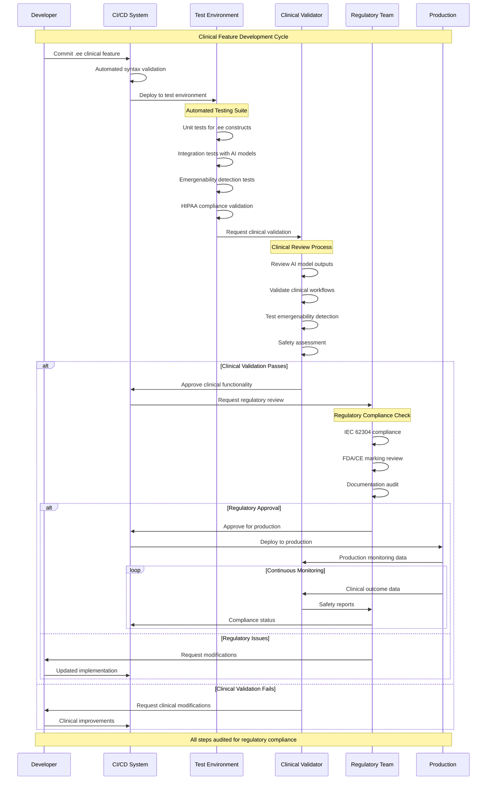
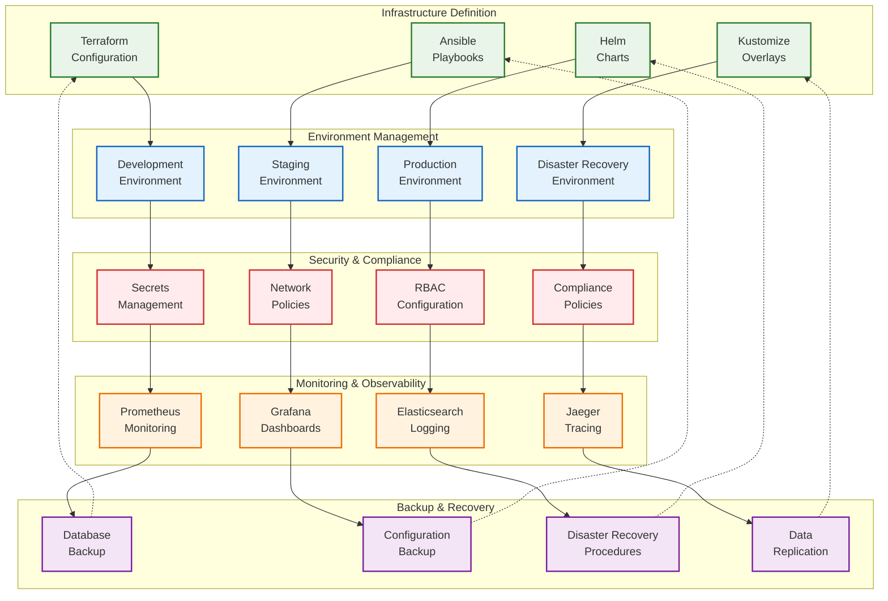

# VOITHER Development Lifecycle - Complete DevOps Pipeline

## 1. Development Lifecycle Overview

```mermaid
flowchart TD
    subgraph "Development Phase"
        IDEATION[Feature Ideation<br/>& Requirements]
        DESIGN[System Design<br/>& Architecture]
        CODE[.ee Code<br/>Development]
        REVIEW[Code Review<br/>& Validation]
    end
    
    subgraph "Quality Assurance"
        UNIT[Unit<br/>Testing]
        INTEGRATION[Integration<br/>Testing]
        CLINICAL[Clinical<br/>Validation]
        COMPLIANCE[Compliance<br/>Testing]
    end
    
    subgraph "Security & Validation"
        SECURITY[Security<br/>Testing]
        PENETRATION[Penetration<br/>Testing]
        AUDIT[Audit<br/>Preparation]
        CERTIFICATION[Regulatory<br/>Certification]
    end
    
    subgraph "Deployment Pipeline"
        BUILD[Build<br/>Automation]
        STAGING[Staging<br/>Environment]
        PRODUCTION[Production<br/>Deployment]
        MONITORING[Production<br/>Monitoring]
    end
    
    subgraph "Maintenance & Evolution"
        FEEDBACK[User<br/>Feedback]
        ANALYTICS[Usage<br/>Analytics]
        OPTIMIZATION[Performance<br/>Optimization]
        ITERATION[Next<br/>Iteration]
    end
    
    %% Development Flow
    IDEATION --> DESIGN
    DESIGN --> CODE
    CODE --> REVIEW
    REVIEW --> UNIT
    
    %% QA Flow
    UNIT --> INTEGRATION
    INTEGRATION --> CLINICAL
    CLINICAL --> COMPLIANCE
    
    %% Security Flow
    COMPLIANCE --> SECURITY
    SECURITY --> PENETRATION
    PENETRATION --> AUDIT
    AUDIT --> CERTIFICATION
    
    %% Deployment Flow
    CERTIFICATION --> BUILD
    BUILD --> STAGING
    STAGING --> PRODUCTION
    PRODUCTION --> MONITORING
    
    %% Maintenance Flow
    MONITORING --> FEEDBACK
    FEEDBACK --> ANALYTICS
    ANALYTICS --> OPTIMIZATION
    OPTIMIZATION --> ITERATION
    
    %% Feedback Loops
    ITERATION -.-> IDEATION
    MONITORING -.-> DESIGN
    CLINICAL -.-> CODE
    SECURITY -.-> REVIEW
    
    %% Styling
    classDef development fill:#e8f5e8,stroke:#2e7d32,stroke-width:2px
    classDef qa fill:#e3f2fd,stroke:#1565c0,stroke-width:2px
    classDef security fill:#ffebee,stroke:#d32f2f,stroke-width:2px
    classDef deployment fill:#fff3e0,stroke:#ef6c00,stroke-width:2px
    classDef maintenance fill:#f3e5f5,stroke:#7b1fa2,stroke-width:2px
    
    class IDEATION,DESIGN,CODE,REVIEW development
    class UNIT,INTEGRATION,CLINICAL,COMPLIANCE qa
    class SECURITY,PENETRATION,AUDIT,CERTIFICATION security
    class BUILD,STAGING,PRODUCTION,MONITORING deployment
    class FEEDBACK,ANALYTICS,OPTIMIZATION,ITERATION maintenance
```

## 2. CI/CD Pipeline Architecture

```mermaid
flowchart LR
    subgraph "Source Control"
        GIT[Git Repository<br/>Feature Branches]
        PR[Pull Request<br/>Creation]
        MERGE[Merge to<br/>Main Branch]
    end
    
    subgraph "Automated Testing"
        LINT[.ee Language<br/>Linting]
        SYNTAX[Syntax<br/>Validation]
        UNIT_AUTO[Automated<br/>Unit Tests]
        INTEGRATION_AUTO[Integration<br/>Test Suite]
    end
    
    subgraph "Security Scanning"
        SAST[Static Application<br/>Security Testing]
        DEPS[Dependency<br/>Vulnerability Scan]
        SECRETS[Secret<br/>Detection]
        COMPLIANCE_SCAN[Compliance<br/>Scanning]
    end
    
    subgraph "Build Process"
        COMPILE[.ee Code<br/>Compilation]
        CONTAINER[Container<br/>Image Build]
        ARTIFACTS[Artifact<br/>Generation]
        SIGN[Digital<br/>Signing]
    end
    
    subgraph "Deployment Stages"
        DEV_DEPLOY[Development<br/>Deployment]
        STAGING_DEPLOY[Staging<br/>Deployment]
        UAT[User Acceptance<br/>Testing]
        PROD_DEPLOY[Production<br/>Deployment]
    end
    
    subgraph "Monitoring & Feedback"
        HEALTH[Health<br/>Checks]
        METRICS[Performance<br/>Metrics]
        ALERTS[Alert<br/>System]
        ROLLBACK[Automated<br/>Rollback]
    end
    
    %% Primary Flow
    GIT --> PR
    PR --> MERGE
    MERGE --> LINT
    
    LINT --> SYNTAX
    SYNTAX --> UNIT_AUTO
    UNIT_AUTO --> INTEGRATION_AUTO
    
    INTEGRATION_AUTO --> SAST
    SAST --> DEPS
    DEPS --> SECRETS
    SECRETS --> COMPLIANCE_SCAN
    
    COMPLIANCE_SCAN --> COMPILE
    COMPILE --> CONTAINER
    CONTAINER --> ARTIFACTS
    ARTIFACTS --> SIGN
    
    SIGN --> DEV_DEPLOY
    DEV_DEPLOY --> STAGING_DEPLOY
    STAGING_DEPLOY --> UAT
    UAT --> PROD_DEPLOY
    
    PROD_DEPLOY --> HEALTH
    HEALTH --> METRICS
    METRICS --> ALERTS
    ALERTS --> ROLLBACK
    
    %% Feedback Loops
    ROLLBACK -.-> STAGING_DEPLOY
    ALERTS -.-> GIT
    METRICS -.-> OPTIMIZATION
    
    %% Styling
    classDef source fill:#e8f5e8,stroke:#2e7d32,stroke-width:2px
    classDef testing fill:#e3f2fd,stroke:#1565c0,stroke-width:2px
    classDef security fill:#ffebee,stroke:#d32f2f,stroke-width:2px
    classDef build fill:#fff3e0,stroke:#ef6c00,stroke-width:2px
    classDef deployment fill:#f3e5f5,stroke:#7b1fa2,stroke-width:2px
    classDef monitoring fill:#fce4ec,stroke:#ad1457,stroke-width:2px
    
    class GIT,PR,MERGE source
    class LINT,SYNTAX,UNIT_AUTO,INTEGRATION_AUTO testing
    class SAST,DEPS,SECRETS,COMPLIANCE_SCAN security
    class COMPILE,CONTAINER,ARTIFACTS,SIGN build
    class DEV_DEPLOY,STAGING_DEPLOY,UAT,PROD_DEPLOY deployment
    class HEALTH,METRICS,ALERTS,ROLLBACK monitoring
```

## 3. Clinical Testing & Validation Pipeline

## 4. Infrastructure as Code (IaC) Pipeline

## 5. AI Model Lifecycle Management

```mermaid
flowchart TD
    subgraph "Model Development"
        RESEARCH[Research &<br/>Experimentation]
        TRAINING[Model<br/>Training]
        VALIDATION[Model<br/>Validation]
        OPTIMIZATION[Model<br/>Optimization]
    end
    
    subgraph "Model Testing"
        UNIT_TEST[Unit<br/>Testing]
        INTEGRATION_TEST[Integration<br/>Testing]
        PERFORMANCE_TEST[Performance<br/>Testing]
        BIAS_TEST[Bias<br/>Testing]
    end
    
    subgraph "Clinical Validation"
        CLINICAL_TRIAL[Clinical<br/>Trial Data]
        EXPERT_REVIEW[Expert<br/>Review]
        SAFETY_EVAL[Safety<br/>Evaluation]
        EFFICACY_TEST[Efficacy<br/>Testing]
    end
    
    subgraph "Regulatory Approval"
        FDA_SUBMIT[FDA<br/>Submission]
        CE_MARKING[CE<br/>Marking]
        AUDIT_PREP[Audit<br/>Preparation]
        APPROVAL[Regulatory<br/>Approval]
    end
    
    subgraph "Deployment"
        MODEL_REGISTRY[Model<br/>Registry]
        VERSION_CONTROL[Version<br/>Control]
        DEPLOYMENT[Model<br/>Deployment]
        MONITORING[Performance<br/>Monitoring]
    end
    
    subgraph "Maintenance"
        DRIFT_DETECTION[Model Drift<br/>Detection]
        RETRAINING[Model<br/>Retraining]
        UPDATE[Model<br/>Update]
        RETIREMENT[Model<br/>Retirement]
    end
    
    %% Flow
    RESEARCH --> TRAINING
    TRAINING --> VALIDATION
    VALIDATION --> OPTIMIZATION
    
    OPTIMIZATION --> UNIT_TEST
    UNIT_TEST --> INTEGRATION_TEST
    INTEGRATION_TEST --> PERFORMANCE_TEST
    PERFORMANCE_TEST --> BIAS_TEST
    
    BIAS_TEST --> CLINICAL_TRIAL
    CLINICAL_TRIAL --> EXPERT_REVIEW
    EXPERT_REVIEW --> SAFETY_EVAL
    SAFETY_EVAL --> EFFICACY_TEST
    
    EFFICACY_TEST --> FDA_SUBMIT
    FDA_SUBMIT --> CE_MARKING
    CE_MARKING --> AUDIT_PREP
    AUDIT_PREP --> APPROVAL
    
    APPROVAL --> MODEL_REGISTRY
    MODEL_REGISTRY --> VERSION_CONTROL
    VERSION_CONTROL --> DEPLOYMENT
    DEPLOYMENT --> MONITORING
    
    MONITORING --> DRIFT_DETECTION
    DRIFT_DETECTION --> RETRAINING
    RETRAINING --> UPDATE
    UPDATE --> RETIREMENT
    
    %% Feedback Loops
    DRIFT_DETECTION -.-> TRAINING
    UPDATE -.-> MODEL_REGISTRY
    RETIREMENT -.-> RESEARCH
    
    %% Styling
    classDef development fill:#e8f5e8,stroke:#2e7d32,stroke-width:2px
    classDef testing fill:#e3f2fd,stroke:#1565c0,stroke-width:2px
    classDef clinical fill:#fff3e0,stroke:#ef6c00,stroke-width:2px
    classDef regulatory fill:#ffebee,stroke:#d32f2f,stroke-width:2px
    classDef deployment fill:#f3e5f5,stroke:#7b1fa2,stroke-width:2px
    classDef maintenance fill:#fce4ec,stroke:#ad1457,stroke-width:2px
    
    class RESEARCH,TRAINING,VALIDATION,OPTIMIZATION development
    class UNIT_TEST,INTEGRATION_TEST,PERFORMANCE_TEST,BIAS_TEST testing
    class CLINICAL_TRIAL,EXPERT_REVIEW,SAFETY_EVAL,EFFICACY_TEST clinical
    class FDA_SUBMIT,CE_MARKING,AUDIT_PREP,APPROVAL regulatory
    class MODEL_REGISTRY,VERSION_CONTROL,DEPLOYMENT,MONITORING deployment
    class DRIFT_DETECTION,RETRAINING,UPDATE,RETIREMENT maintenance
```

## 6. Release Management Pipeline

```mermaid
graph LR
    subgraph "Release Planning"
        ROADMAP[Product<br/>Roadmap]
        SPRINT[Sprint<br/>Planning]
        FEATURE[Feature<br/>Planning]
        DEPENDENCIES[Dependency<br/>Management]
    end
    
    subgraph "Development Sprint"
        CODING[Feature<br/>Development]
        TESTING[Feature<br/>Testing]
        INTEGRATION[Feature<br/>Integration]
        DOCUMENTATION[Documentation<br/>Updates]
    end
    
    subgraph "Release Preparation"
        FREEZE[Code<br/>Freeze]
        FINAL_TEST[Final<br/>Testing]
        RELEASE_NOTES[Release<br/>Notes]
        ROLLBACK_PLAN[Rollback<br/>Planning]
    end
    
    subgraph "Deployment"
        BLUE_GREEN[Blue-Green<br/>Deployment]
        CANARY[Canary<br/>Release]
        FULL_DEPLOY[Full<br/>Deployment]
        VERIFICATION[Deployment<br/>Verification]
    end
    
    subgraph "Post-Release"
        MONITORING[Release<br/>Monitoring]
        FEEDBACK[User<br/>Feedback]
        HOTFIX[Hotfix<br/>Deployment]
        RETROSPECTIVE[Sprint<br/>Retrospective]
    end
    
    %% Flow
    ROADMAP --> SPRINT
    SPRINT --> FEATURE
    FEATURE --> DEPENDENCIES
    
    DEPENDENCIES --> CODING
    CODING --> TESTING
    TESTING --> INTEGRATION
    INTEGRATION --> DOCUMENTATION
    
    DOCUMENTATION --> FREEZE
    FREEZE --> FINAL_TEST
    FINAL_TEST --> RELEASE_NOTES
    RELEASE_NOTES --> ROLLBACK_PLAN
    
    ROLLBACK_PLAN --> BLUE_GREEN
    BLUE_GREEN --> CANARY
    CANARY --> FULL_DEPLOY
    FULL_DEPLOY --> VERIFICATION
    
    VERIFICATION --> MONITORING
    MONITORING --> FEEDBACK
    FEEDBACK --> HOTFIX
    HOTFIX --> RETROSPECTIVE
    
    %% Feedback Loop
    RETROSPECTIVE -.-> ROADMAP
    
    %% Styling
    classDef planning fill:#e8f5e8,stroke:#2e7d32,stroke-width:2px
    classDef development fill:#e3f2fd,stroke:#1565c0,stroke-width:2px
    classDef preparation fill:#fff3e0,stroke:#ef6c00,stroke-width:2px
    classDef deployment fill:#f3e5f5,stroke:#7b1fa2,stroke-width:2px
    classDef postrelease fill:#fce4ec,stroke:#ad1457,stroke-width:2px
    
    class ROADMAP,SPRINT,FEATURE,DEPENDENCIES planning
    class CODING,TESTING,INTEGRATION,DOCUMENTATION development
    class FREEZE,FINAL_TEST,RELEASE_NOTES,ROLLBACK_PLAN preparation
    class BLUE_GREEN,CANARY,FULL_DEPLOY,VERIFICATION deployment
    class MONITORING,FEEDBACK,HOTFIX,RETROSPECTIVE postrelease
```

---

**Key DevOps Metrics & Targets:**

| **Metric** | **Target** | **Current** | **Improvement Goal** |
|------------|------------|-------------|---------------------|
| Build Time | <10 minutes | 8 minutes | <5 minutes |
| Test Coverage | >90% | 92% | >95% |
| Deployment Frequency | Daily | 2x/week | 2x/day |
| Lead Time | <2 hours | 4 hours | <1 hour |
| MTTR (Mean Time to Recovery) | <30 minutes | 45 minutes | <15 minutes |
| Change Failure Rate | <5% | 3% | <2% |

**Clinical Development Requirements:**
- **Clinical validation required** for all AI model changes
- **Regulatory approval** needed for production deployments
- **Complete audit trail** for all clinical-related changes
- **Expert review** mandatory for emergenability detection updates
- **Safety testing** required for all patient-facing features