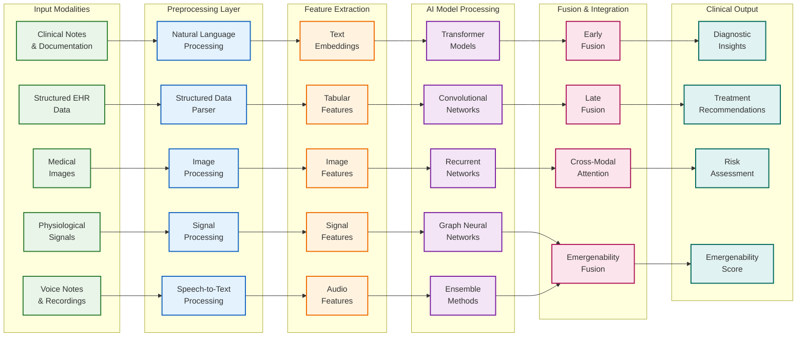
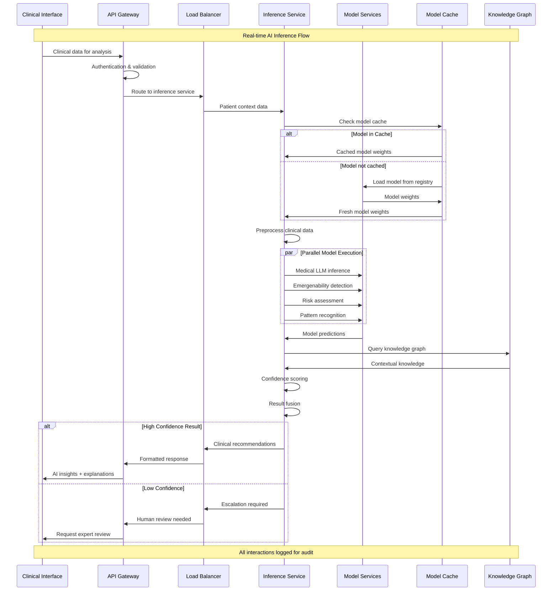
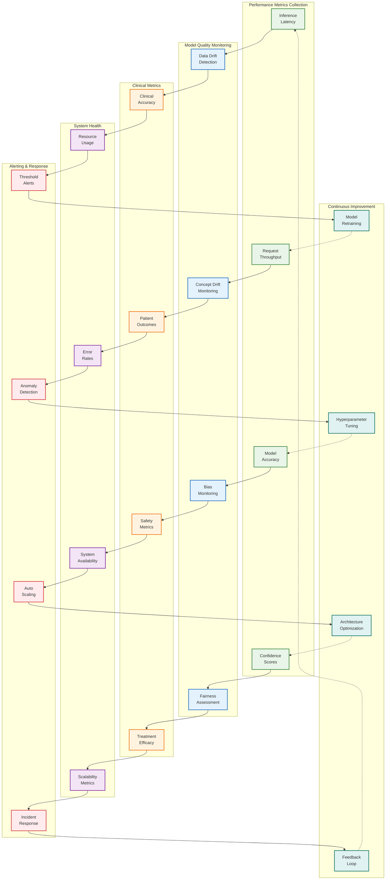
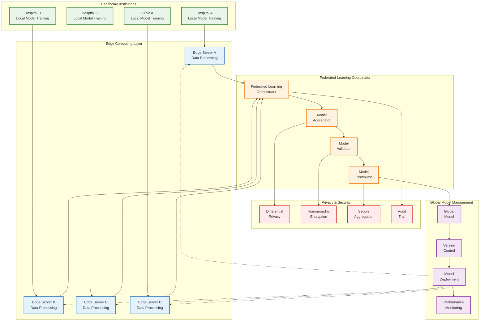
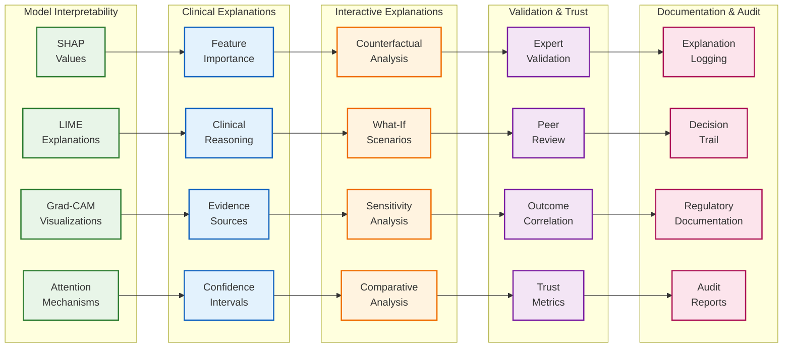

# VOITHER AI Model Integration & Pipeline Architecture

## 1. AI Model Integration Overview

```mermaid
graph TB
    subgraph "AI Model Ecosystem"
        subgraph "Medical LLM Models"
            MEDICAL_LLM[Medical LLM<br/>GPT-4 Healthcare]
            CLINICAL_BERT[Clinical BERT<br/>Medical Text Processing]
            BIOMED_LLAMA[BioMed LLaMA<br/>Biomedical Knowledge]
        end
        
        subgraph "Specialized Models"
            EMERGEN_MODEL[Emergenability<br/>Detection Model]
            TEMPORAL_MODEL[Temporal Pattern<br/>Analysis Model]
            RHIZO_MODEL[Rhizomatic Network<br/>Mapping Model]
        end
        
        subgraph "Healthcare AI Models"
            DIAGNOSIS_AI[Diagnostic<br/>Support AI]
            TREATMENT_AI[Treatment<br/>Recommendation AI]
            RISK_AI[Risk<br/>Assessment AI]
            OUTCOME_AI[Outcome<br/>Prediction AI]
        end
    end
    
    subgraph ".ee DSL Integration Layer"
        AI_REGISTRY[AI Model<br/>Registry]
        MODEL_LOADER[Dynamic Model<br/>Loader]
        INFERENCE_ENGINE[Inference<br/>Engine]
        CONFIDENCE_MANAGER[Confidence<br/>Manager]
    end
    
    subgraph "BRRE Processing Engine"
        PARALLEL_ENGINE[Parallel Processing<br/>Engine]
        ABDUCTIVE_REASON[Abductive<br/>Reasoning]
        TEMPORAL_PROCESS[Temporal<br/>Processing]
        NETWORK_ANALYSIS[Network<br/>Analysis]
    end
    
    subgraph "Clinical Integration"
        WORKFLOW_ORCHESTRATOR[Clinical Workflow<br/>Orchestrator]
        DECISION_SUPPORT[Clinical Decision<br/>Support System]
        ALERT_SYSTEM[Intelligent<br/>Alert System]
        INTERVENTION_PLANNER[Intervention<br/>Planner]
    end
    
    %% Model Connections
    MEDICAL_LLM --> AI_REGISTRY
    CLINICAL_BERT --> AI_REGISTRY
    BIOMED_LLAMA --> AI_REGISTRY
    
    EMERGEN_MODEL --> MODEL_LOADER
    TEMPORAL_MODEL --> MODEL_LOADER
    RHIZO_MODEL --> MODEL_LOADER
    
    DIAGNOSIS_AI --> INFERENCE_ENGINE
    TREATMENT_AI --> INFERENCE_ENGINE
    RISK_AI --> CONFIDENCE_MANAGER
    OUTCOME_AI --> CONFIDENCE_MANAGER
    
    %% Processing Flow
    AI_REGISTRY --> PARALLEL_ENGINE
    MODEL_LOADER --> ABDUCTIVE_REASON
    INFERENCE_ENGINE --> TEMPORAL_PROCESS
    CONFIDENCE_MANAGER --> NETWORK_ANALYSIS
    
    %% Clinical Integration
    PARALLEL_ENGINE --> WORKFLOW_ORCHESTRATOR
    ABDUCTIVE_REASON --> DECISION_SUPPORT
    TEMPORAL_PROCESS --> ALERT_SYSTEM
    NETWORK_ANALYSIS --> INTERVENTION_PLANNER
    
    %% Styling
    classDef medical fill:#e8f5e8,stroke:#2e7d32,stroke-width:2px
    classDef specialized fill:#e3f2fd,stroke:#1565c0,stroke-width:2px
    classDef healthcare fill:#fff3e0,stroke:#ef6c00,stroke-width:2px
    classDef integration fill:#f3e5f5,stroke:#7b1fa2,stroke-width:2px
    classDef brre fill:#fce4ec,stroke:#ad1457,stroke-width:2px
    classDef clinical fill:#e0f2f1,stroke:#00695c,stroke-width:2px
    
    class MEDICAL_LLM,CLINICAL_BERT,BIOMED_LLAMA medical
    class EMERGEN_MODEL,TEMPORAL_MODEL,RHIZO_MODEL specialized
    class DIAGNOSIS_AI,TREATMENT_AI,RISK_AI,OUTCOME_AI healthcare
    class AI_REGISTRY,MODEL_LOADER,INFERENCE_ENGINE,CONFIDENCE_MANAGER integration
    class PARALLEL_ENGINE,ABDUCTIVE_REASON,TEMPORAL_PROCESS,NETWORK_ANALYSIS brre
    class WORKFLOW_ORCHESTRATOR,DECISION_SUPPORT,ALERT_SYSTEM,INTERVENTION_PLANNER clinical
```

## 2. Multi-Modal AI Processing Pipeline

## 3. Real-time AI Inference Architecture

## 4. AI Model Performance Monitoring

## 5. Federated Learning Architecture

## 6. AI Explainability & Trust Framework

---

**AI Model Performance Benchmarks:**

| **Model Type** | **Accuracy Target** | **Latency Target** | **Confidence Threshold** |
|----------------|--------------------|--------------------|---------------------------|
| Medical LLM | >92% | <1s | 0.85 |
| Emergenability Detection | >88% | <2s | 0.80 |
| Diagnostic Support | >95% | <3s | 0.90 |
| Risk Assessment | >90% | <1.5s | 0.85 |
| Treatment Recommendation | >93% | <2s | 0.88 |

**Clinical AI Safety Requirements:**
- **Human oversight mandatory** for all high-risk decisions
- **Explainability required** for all clinical recommendations
- **Continuous monitoring** of model performance and bias
- **Regular retraining** based on new clinical evidence
- **Regulatory compliance** with FDA/CE marking requirements