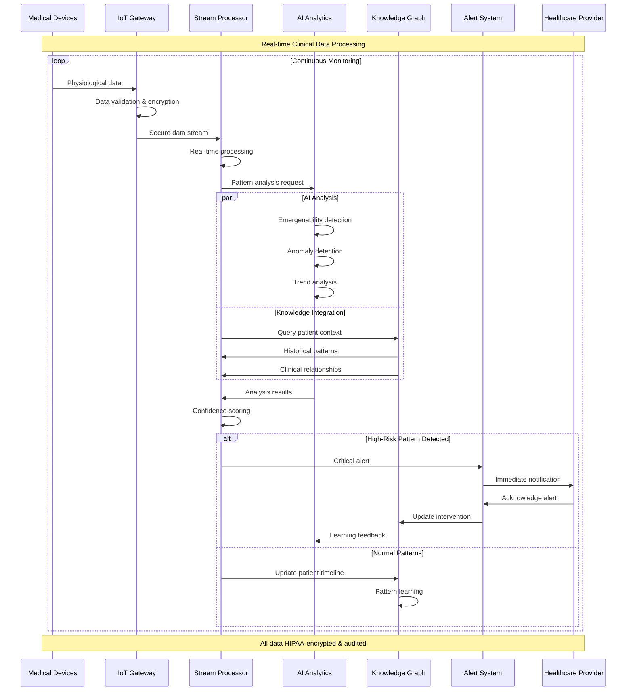
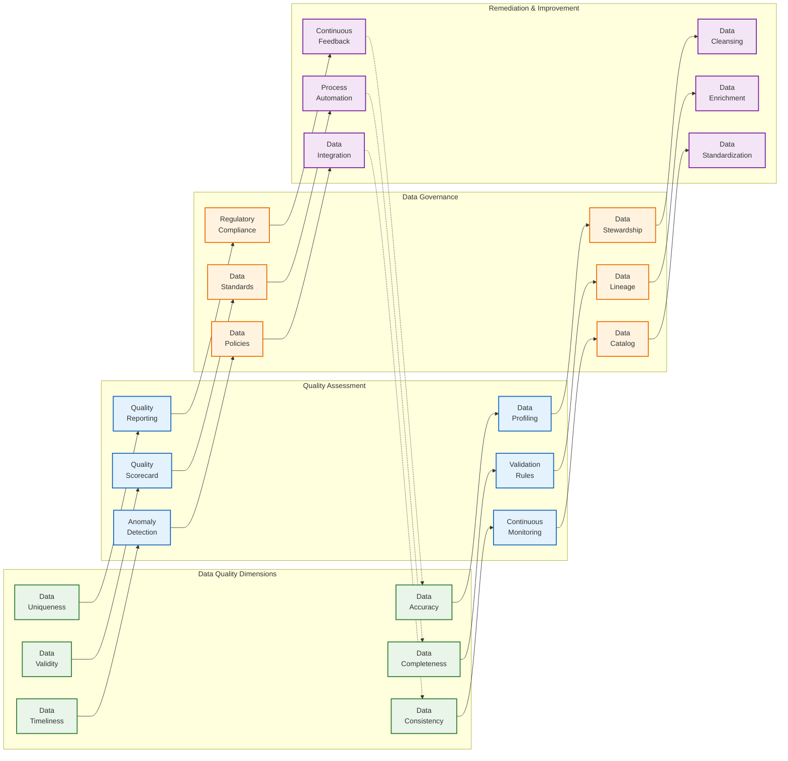
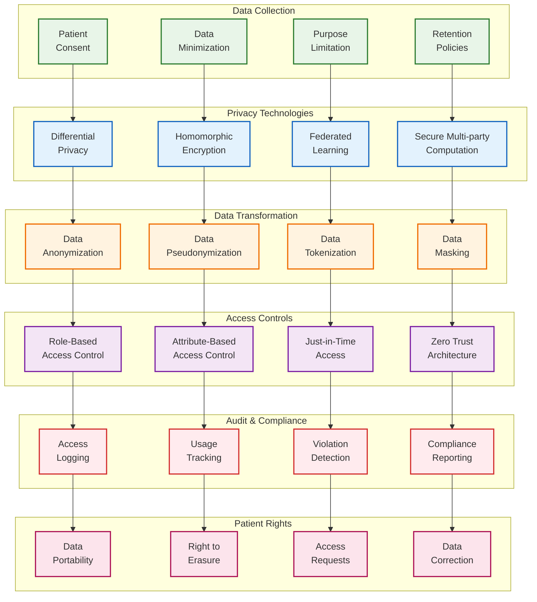
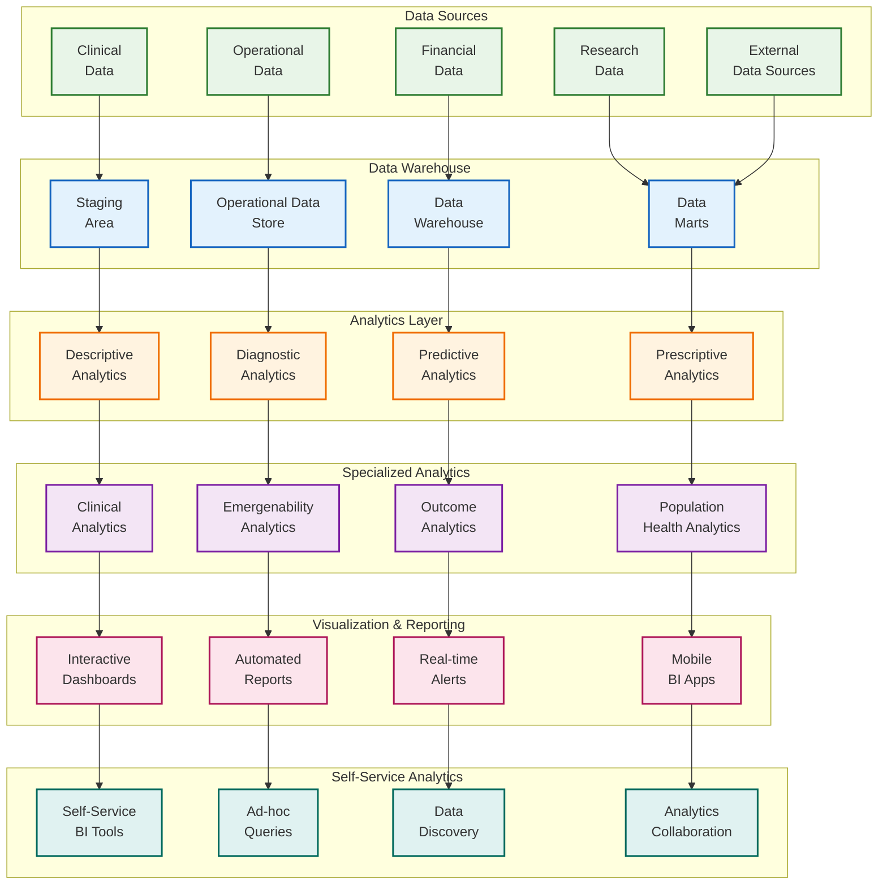

# VOITHER Data Architecture & Knowledge Management

## 1. Data Architecture Overview

```mermaid
graph TB
    subgraph "Data Ingestion Layer"
        EMR[Electronic Medical<br/>Records]
        SENSORS[IoT Medical<br/>Sensors]
        IMAGING[Medical<br/>Imaging]
        WEARABLES[Patient<br/>Wearables]
        EXTERNAL[External<br/>Data Sources]
    end
    
    subgraph "Data Processing Pipeline"
        STREAMING[Real-time<br/>Streaming]
        BATCH[Batch<br/>Processing]
        ETL[Extract Transform<br/>Load Pipeline]
        VALIDATION[Data Quality<br/>Validation]
        ENRICHMENT[Data<br/>Enrichment]
    end
    
    subgraph "Storage Layer"
        DATA_LAKE[Healthcare<br/>Data Lake]
        GRAPH_DB[Knowledge<br/>Graph (Neo4j)]
        VECTOR_DB[Vector<br/>Database]
        TIME_SERIES[Time Series<br/>Database]
        CACHE[High-Speed<br/>Cache (Redis)]
    end
    
    subgraph "Knowledge Management"
        ONTOLOGY[Medical<br/>Ontology]
        TAXONOMY[Clinical<br/>Taxonomy]
        RELATIONSHIPS[Semantic<br/>Relationships]
        EMBEDDINGS[Knowledge<br/>Embeddings]
    end
    
    subgraph "Data Access Layer"
        FHIR_API[FHIR R4<br/>API]
        GRAPH_API[Graph Query<br/>API]
        ANALYTICS_API[Analytics<br/>API]
        STREAMING_API[Real-time<br/>Streaming API]
    end
    
    subgraph "Security & Compliance"
        ENCRYPTION[Data<br/>Encryption]
        ACCESS_CONTROL[Access<br/>Control]
        AUDIT[Audit<br/>Logging]
        PRIVACY[Privacy<br/>Protection]
    end
    
    %% Data Flow
    EMR --> STREAMING
    SENSORS --> STREAMING
    IMAGING --> BATCH
    WEARABLES --> STREAMING
    EXTERNAL --> ETL
    
    STREAMING --> VALIDATION
    BATCH --> VALIDATION
    ETL --> ENRICHMENT
    VALIDATION --> ENRICHMENT
    
    ENRICHMENT --> DATA_LAKE
    ENRICHMENT --> GRAPH_DB
    ENRICHMENT --> VECTOR_DB
    ENRICHMENT --> TIME_SERIES
    ENRICHMENT --> CACHE
    
    DATA_LAKE --> ONTOLOGY
    GRAPH_DB --> TAXONOMY
    VECTOR_DB --> RELATIONSHIPS
    TIME_SERIES --> EMBEDDINGS
    
    ONTOLOGY --> FHIR_API
    TAXONOMY --> GRAPH_API
    RELATIONSHIPS --> ANALYTICS_API
    EMBEDDINGS --> STREAMING_API
    
    FHIR_API --> ENCRYPTION
    GRAPH_API --> ACCESS_CONTROL
    ANALYTICS_API --> AUDIT
    STREAMING_API --> PRIVACY
    
    %% Styling
    classDef ingestion fill:#e8f5e8,stroke:#2e7d32,stroke-width:2px
    classDef processing fill:#e3f2fd,stroke:#1565c0,stroke-width:2px
    classDef storage fill:#fff3e0,stroke:#ef6c00,stroke-width:2px
    classDef knowledge fill:#f3e5f5,stroke:#7b1fa2,stroke-width:2px
    classDef access fill:#fce4ec,stroke:#ad1457,stroke-width:2px
    classDef security fill:#ffebee,stroke:#d32f2f,stroke-width:2px
    
    class EMR,SENSORS,IMAGING,WEARABLES,EXTERNAL ingestion
    class STREAMING,BATCH,ETL,VALIDATION,ENRICHMENT processing
    class DATA_LAKE,GRAPH_DB,VECTOR_DB,TIME_SERIES,CACHE storage
    class ONTOLOGY,TAXONOMY,RELATIONSHIPS,EMBEDDINGS knowledge
    class FHIR_API,GRAPH_API,ANALYTICS_API,STREAMING_API access
    class ENCRYPTION,ACCESS_CONTROL,AUDIT,PRIVACY security
```

## 2. Knowledge Graph Architecture

```mermaid
graph TD
    subgraph "Entity Types"
        PATIENT[Patient<br/>Entities]
        CONDITION[Medical<br/>Conditions]
        MEDICATION[Medications<br/>& Treatments]
        PROCEDURE[Medical<br/>Procedures]
        PROVIDER[Healthcare<br/>Providers]
        FACILITY[Healthcare<br/>Facilities]
    end
    
    subgraph "Relationship Types"
        DIAGNOSED[HAS_DIAGNOSIS]
        PRESCRIBED[PRESCRIBED]
        UNDERWENT[UNDERWENT_PROCEDURE]
        TREATED_BY[TREATED_BY]
        LOCATED_AT[LOCATED_AT]
        RELATES_TO[CLINICALLY_RELATED]
    end
    
    subgraph "Temporal Relationships"
        BEFORE[OCCURRED_BEFORE]
        AFTER[OCCURRED_AFTER]
        DURING[OCCURRED_DURING]
        CONCURRENT[CONCURRENT_WITH]
        EMERGEN_TIME[EMERGENABILITY_WINDOW]
    end
    
    subgraph "Knowledge Sources"
        SNOMED[SNOMED CT<br/>Terminology]
        ICD10[ICD-10<br/>Codes]
        LOINC[LOINC<br/>Lab Codes]
        RXNORM[RxNorm<br/>Medication Codes]
        UMLS[UMLS<br/>Metathesaurus]
    end
    
    subgraph "AI-Enhanced Knowledge"
        ML_PATTERNS[ML-Discovered<br/>Patterns]
        EMERGEN_PATTERNS[Emergenability<br/>Patterns]
        CLINICAL_INSIGHTS[Clinical<br/>Insights]
        PREDICTIVE_LINKS[Predictive<br/>Relationships]
    end
    
    subgraph "Graph Operations"
        TRAVERSAL[Graph<br/>Traversal]
        PATTERN_MATCH[Pattern<br/>Matching]
        SIMILARITY[Similarity<br/>Search]
        CLUSTERING[Community<br/>Detection]
    end
    
    %% Entity Relationships
    PATIENT --> DIAGNOSED
    CONDITION --> DIAGNOSED
    PATIENT --> PRESCRIBED
    MEDICATION --> PRESCRIBED
    PATIENT --> UNDERWENT
    PROCEDURE --> UNDERWENT
    PATIENT --> TREATED_BY
    PROVIDER --> TREATED_BY
    PROVIDER --> LOCATED_AT
    FACILITY --> LOCATED_AT
    
    %% Temporal Integration
    DIAGNOSED --> BEFORE
    PRESCRIBED --> AFTER
    UNDERWENT --> DURING
    TREATED_BY --> CONCURRENT
    RELATES_TO --> EMERGEN_TIME
    
    %% Knowledge Integration
    SNOMED --> ML_PATTERNS
    ICD10 --> EMERGEN_PATTERNS
    LOINC --> CLINICAL_INSIGHTS
    RXNORM --> PREDICTIVE_LINKS
    UMLS --> PREDICTIVE_LINKS
    
    %% Graph Processing
    ML_PATTERNS --> TRAVERSAL
    EMERGEN_PATTERNS --> PATTERN_MATCH
    CLINICAL_INSIGHTS --> SIMILARITY
    PREDICTIVE_LINKS --> CLUSTERING
    
    %% Styling
    classDef entities fill:#e8f5e8,stroke:#2e7d32,stroke-width:2px
    classDef relationships fill:#e3f2fd,stroke:#1565c0,stroke-width:2px
    classDef temporal fill:#fff3e0,stroke:#ef6c00,stroke-width:2px
    classDef sources fill:#f3e5f5,stroke:#7b1fa2,stroke-width:2px
    classDef ai fill:#fce4ec,stroke:#ad1457,stroke-width:2px
    classDef operations fill:#e0f2f1,stroke:#00695c,stroke-width:2px
    
    class PATIENT,CONDITION,MEDICATION,PROCEDURE,PROVIDER,FACILITY entities
    class DIAGNOSED,PRESCRIBED,UNDERWENT,TREATED_BY,LOCATED_AT,RELATES_TO relationships
    class BEFORE,AFTER,DURING,CONCURRENT,EMERGEN_TIME temporal
    class SNOMED,ICD10,LOINC,RXNORM,UMLS sources
    class ML_PATTERNS,EMERGEN_PATTERNS,CLINICAL_INSIGHTS,PREDICTIVE_LINKS ai
    class TRAVERSAL,PATTERN_MATCH,SIMILARITY,CLUSTERING operations
```



## 3. Real-time Data Processing Pipeline



## 4. Data Quality & Governance Framework



## 5. Privacy-Preserving Data Architecture



## 6. Analytics & Business Intelligence Platform



---

**Data Architecture Specifications:**

| **Component** | **Technology** | **Capacity** | **Performance** |
|---------------|----------------|-------------|-----------------|
| Data Lake | AWS S3/Azure Data Lake | 100+ TB | 10GB/s throughput |
| Knowledge Graph | Neo4j Enterprise | 1B+ nodes | <100ms queries |
| Vector Database | Pinecone/Weaviate | 100M+ vectors | <50ms similarity |
| Time Series DB | InfluxDB | 1M+ points/sec | <10ms latency |
| Cache Layer | Redis Cluster | 1TB memory | <1ms access |
| Streaming | Apache Kafka | 1M+ msgs/sec | <5ms latency |

**Data Quality Targets:**
- **Accuracy**: >99.5% for critical clinical data
- **Completeness**: >95% for required fields
- **Timeliness**: <5 minutes for real-time data
- **Consistency**: >99% across all systems
- **Compliance**: 100% HIPAA/GDPR compliance