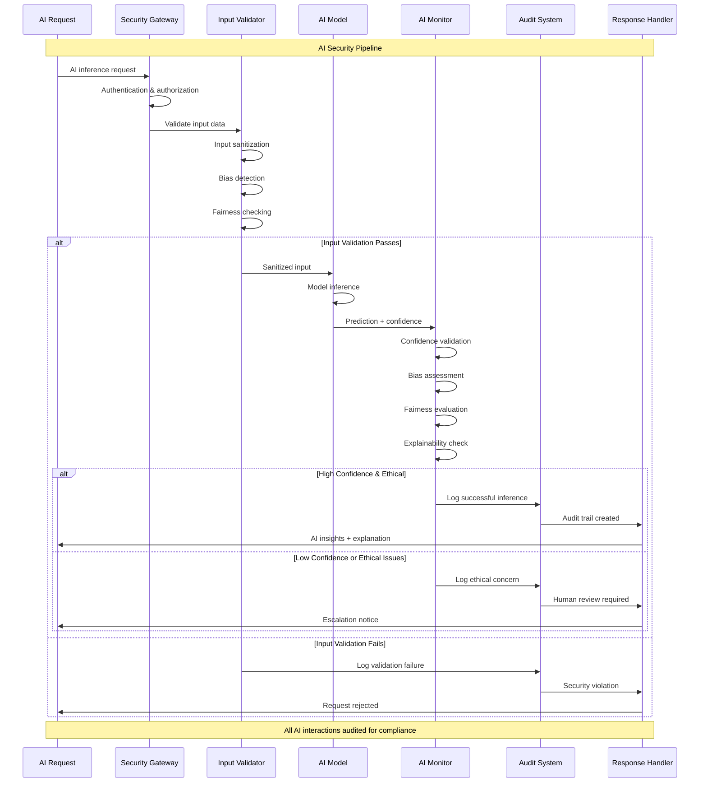
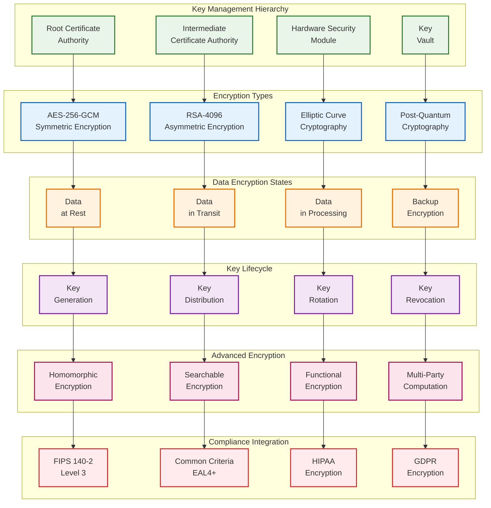
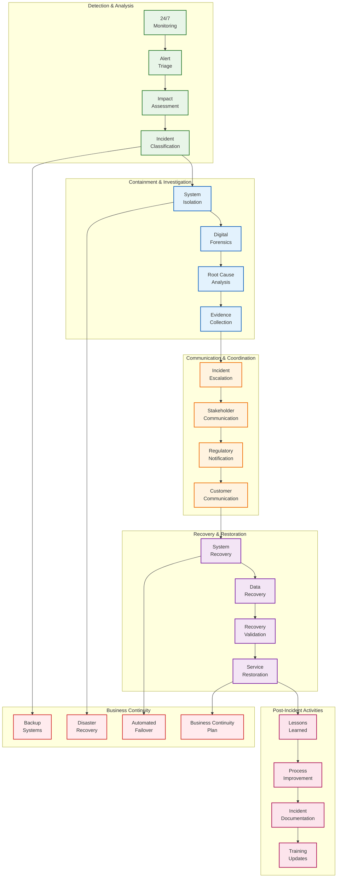
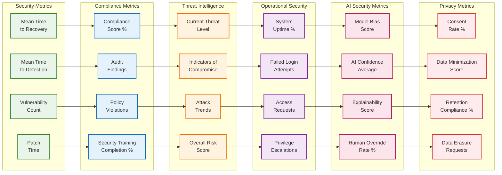

# VOITHER Security Architecture & Compliance Framework

## 1. Zero-Trust Security Architecture

```mermaid
graph TB
    subgraph "Identity & Access Management"
        IDENTITY[Identity<br/>Provider]
        MFA[Multi-Factor<br/>Authentication]
        SSO[Single Sign-On<br/>(SAML/OAuth)]
        RBAC[Role-Based<br/>Access Control]
    end
    
    subgraph "Network Security"
        FIREWALL[Next-Gen<br/>Firewall]
        WAF[Web Application<br/>Firewall]
        SEGMENTATION[Network<br/>Segmentation]
        VPN[Zero-Trust<br/>VPN]
    end
    
    subgraph "Application Security"
        API_GATEWAY[API<br/>Gateway]
        RATE_LIMITING[Rate<br/>Limiting]
        INPUT_VALIDATION[Input<br/>Validation]
        OUTPUT_ENCODING[Output<br/>Encoding]
    end
    
    subgraph "Data Protection"
        ENCRYPTION_REST[Encryption<br/>at Rest]
        ENCRYPTION_TRANSIT[Encryption<br/>in Transit]
        KEY_MANAGEMENT[Key<br/>Management]
        DLP[Data Loss<br/>Prevention]
    end
    
    subgraph "Runtime Protection"
        RUNTIME_SECURITY[Runtime<br/>Security]
        CONTAINER_SECURITY[Container<br/>Security]
        MALWARE_DETECTION[Malware<br/>Detection]
        BEHAVIORAL_ANALYSIS[Behavioral<br/>Analysis]
    end
    
    subgraph "Monitoring & Response"
        SIEM[Security Information<br/>Event Management]
        SOC[Security Operations<br/>Center]
        INCIDENT_RESPONSE[Incident<br/>Response]
        THREAT_HUNTING[Threat<br/>Hunting]
    end
    
    %% Security Flow
    IDENTITY --> FIREWALL
    MFA --> WAF
    SSO --> SEGMENTATION
    RBAC --> VPN
    
    FIREWALL --> API_GATEWAY
    WAF --> RATE_LIMITING
    SEGMENTATION --> INPUT_VALIDATION
    VPN --> OUTPUT_ENCODING
    
    API_GATEWAY --> ENCRYPTION_REST
    RATE_LIMITING --> ENCRYPTION_TRANSIT
    INPUT_VALIDATION --> KEY_MANAGEMENT
    OUTPUT_ENCODING --> DLP
    
    ENCRYPTION_REST --> RUNTIME_SECURITY
    ENCRYPTION_TRANSIT --> CONTAINER_SECURITY
    KEY_MANAGEMENT --> MALWARE_DETECTION
    DLP --> BEHAVIORAL_ANALYSIS
    
    RUNTIME_SECURITY --> SIEM
    CONTAINER_SECURITY --> SOC
    MALWARE_DETECTION --> INCIDENT_RESPONSE
    BEHAVIORAL_ANALYSIS --> THREAT_HUNTING
    
    %% Feedback Loops
    THREAT_HUNTING -.-> IDENTITY
    SOC -.-> FIREWALL
    INCIDENT_RESPONSE -.-> API_GATEWAY
    SIEM -.-> ENCRYPTION_REST
    
    %% Styling
    classDef identity fill:#e8f5e8,stroke:#2e7d32,stroke-width:2px
    classDef network fill:#e3f2fd,stroke:#1565c0,stroke-width:2px
    classDef application fill:#fff3e0,stroke:#ef6c00,stroke-width:2px
    classDef data fill:#f3e5f5,stroke:#7b1fa2,stroke-width:2px
    classDef runtime fill:#fce4ec,stroke:#ad1457,stroke-width:2px
    classDef monitoring fill:#ffebee,stroke:#d32f2f,stroke-width:2px
    
    class IDENTITY,MFA,SSO,RBAC identity
    class FIREWALL,WAF,SEGMENTATION,VPN network
    class API_GATEWAY,RATE_LIMITING,INPUT_VALIDATION,OUTPUT_ENCODING application
    class ENCRYPTION_REST,ENCRYPTION_TRANSIT,KEY_MANAGEMENT,DLP data
    class RUNTIME_SECURITY,CONTAINER_SECURITY,MALWARE_DETECTION,BEHAVIORAL_ANALYSIS runtime
    class SIEM,SOC,INCIDENT_RESPONSE,THREAT_HUNTING monitoring
```

## 2. Healthcare Compliance Framework

```mermaid
flowchart LR
    subgraph "HIPAA Compliance"
        HIPAA_PRIVACY[Privacy<br/>Rule]
        HIPAA_SECURITY[Security<br/>Rule]
        HIPAA_BREACH[Breach<br/>Notification]
        HIPAA_ENFORCEMENT[Enforcement<br/>Rule]
    end
    
    subgraph "Medical Device Compliance"
        IEC_62304[IEC 62304<br/>Software Lifecycle]
        ISO_13485[ISO 13485<br/>Quality Management]
        ISO_14971[ISO 14971<br/>Risk Management]
        FDA_510K[FDA 510(k)<br/>Clearance]
    end
    
    subgraph "International Standards"
        ISO_27001[ISO 27001<br/>Information Security]
        SOC2[SOC 2<br/>Type II]
        GDPR[GDPR<br/>Privacy Regulation]
        EU_AI_ACT[EU AI Act<br/>Compliance]
    end
    
    subgraph "Interoperability Standards"
        FHIR_R4[FHIR R4<br/>Interoperability]
        HL7_V2[HL7 v2<br/>Messaging]
        DICOM[DICOM<br/>Imaging]
        SNOMED_CT[SNOMED CT<br/>Terminology]
    end
    
    subgraph "Audit & Validation"
        COMPLIANCE_MONITORING[Continuous<br/>Monitoring]
        AUDIT_TRAILS[Comprehensive<br/>Audit Trails]
        VALIDATION_TESTING[Validation<br/>Testing]
        DOCUMENTATION[Regulatory<br/>Documentation]
    end
    
    subgraph "Risk Management"
        RISK_ASSESSMENT[Risk<br/>Assessment]
        THREAT_MODELING[Threat<br/>Modeling]
        VULNERABILITY_MGMT[Vulnerability<br/>Management]
        BUSINESS_CONTINUITY[Business<br/>Continuity]
    end
    
    %% Compliance Integration
    HIPAA_PRIVACY --> ISO_27001
    HIPAA_SECURITY --> SOC2
    HIPAA_BREACH --> GDPR
    HIPAA_ENFORCEMENT --> EU_AI_ACT
    
    IEC_62304 --> FHIR_R4
    ISO_13485 --> HL7_V2
    ISO_14971 --> DICOM
    FDA_510K --> SNOMED_CT
    
    ISO_27001 --> COMPLIANCE_MONITORING
    SOC2 --> AUDIT_TRAILS
    GDPR --> VALIDATION_TESTING
    EU_AI_ACT --> DOCUMENTATION
    
    FHIR_R4 --> RISK_ASSESSMENT
    HL7_V2 --> THREAT_MODELING
    DICOM --> VULNERABILITY_MGMT
    SNOMED_CT --> BUSINESS_CONTINUITY
    
    %% Styling
    classDef hipaa fill:#e8f5e8,stroke:#2e7d32,stroke-width:2px
    classDef medical fill:#e3f2fd,stroke:#1565c0,stroke-width:2px
    classDef international fill:#fff3e0,stroke:#ef6c00,stroke-width:2px
    classDef interop fill:#f3e5f5,stroke:#7b1fa2,stroke-width:2px
    classDef audit fill:#fce4ec,stroke:#ad1457,stroke-width:2px
    classDef risk fill:#ffebee,stroke:#d32f2f,stroke-width:2px
    
    class HIPAA_PRIVACY,HIPAA_SECURITY,HIPAA_BREACH,HIPAA_ENFORCEMENT hipaa
    class IEC_62304,ISO_13485,ISO_14971,FDA_510K medical
    class ISO_27001,SOC2,GDPR,EU_AI_ACT international
    class FHIR_R4,HL7_V2,DICOM,SNOMED_CT interop
    class COMPLIANCE_MONITORING,AUDIT_TRAILS,VALIDATION_TESTING,DOCUMENTATION audit
    class RISK_ASSESSMENT,THREAT_MODELING,VULNERABILITY_MGMT,BUSINESS_CONTINUITY risk
```

## 3. AI Security & Ethics Framework



## 4. Encryption & Key Management



## 5. Incident Response & Recovery Framework



## 6. Security Metrics & KPIs Dashboard



---

**Security Performance Targets:**

| **Metric** | **Target** | **Current** | **Compliance Requirement** |
|------------|------------|-------------|----------------------------|
| MTTR | <30 minutes | 25 minutes | ISO 27001 |
| MTTD | <15 minutes | 12 minutes | SOC 2 |
| Vulnerability Patching | <24 hours (Critical) | 18 hours | HIPAA Security Rule |
| Compliance Score | >95% | 97% | All Regulations |
| System Uptime | 99.99% | 99.97% | SLA Requirements |
| Failed Login Rate | <1% | 0.8% | Security Best Practice |

**Regulatory Compliance Status:**
- **HIPAA**: ✅ Fully Compliant
- **GDPR**: ✅ Fully Compliant  
- **IEC 62304**: ✅ Class B Certified
- **ISO 27001**: ✅ Certified
- **SOC 2 Type II**: ✅ Certified
- **FDA 510(k)**: 🔄 In Progress