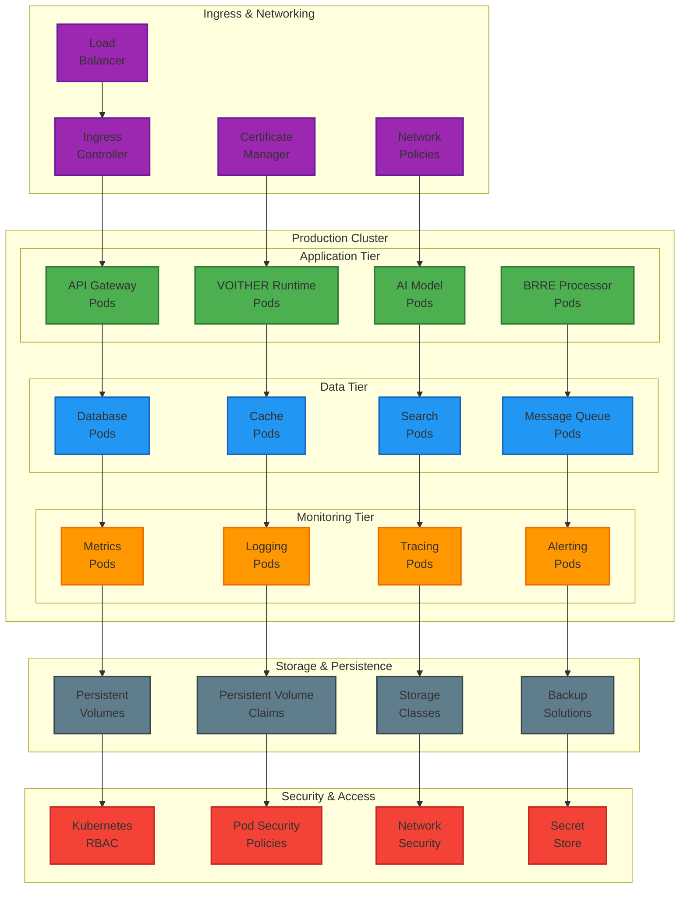
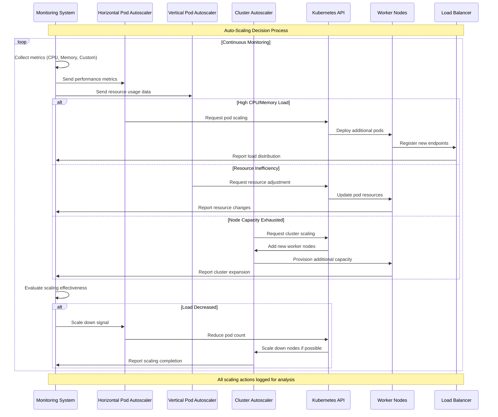
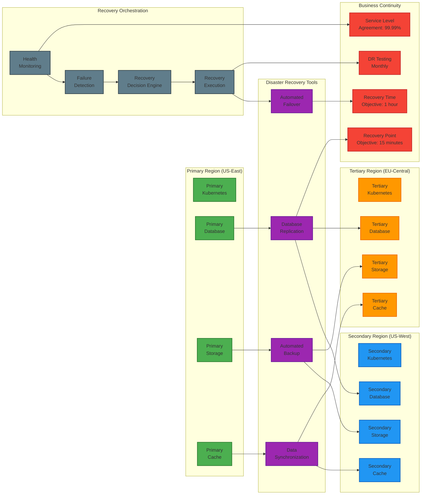
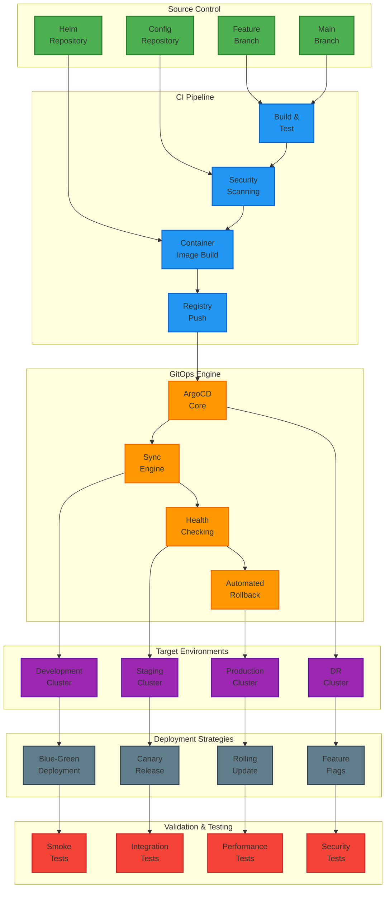

# VOITHER Deployment & Infrastructure Architecture

## 1. Cloud-Native Infrastructure Overview

```mermaid
graph TB
    subgraph "Multi-Cloud Infrastructure"
        subgraph "Primary Cloud (AWS)"
            EKS[Amazon EKS<br/>Kubernetes Cluster]
            RDS[Amazon RDS<br/>PostgreSQL]
            S3[Amazon S3<br/>Data Lake]
            LAMBDA[AWS Lambda<br/>Serverless Functions]
        end
        
        subgraph "Secondary Cloud (Azure)"
            AKS[Azure AKS<br/>Kubernetes Cluster]
            COSMOS[Azure Cosmos DB<br/>Global Database]
            BLOB[Azure Blob<br/>Storage]
            FUNCTIONS[Azure<br/>Functions]
        end
        
        subgraph "Edge Computing"
            EDGE_K8S[Edge Kubernetes<br/>Clusters]
            EDGE_STORAGE[Edge<br/>Storage]
            EDGE_COMPUTE[Edge<br/>Computing]
            IOT_GATEWAY[IoT<br/>Gateway]
        end
    end
    
    subgraph "Container Orchestration"
        INGRESS[Ingress<br/>Controller]
        SERVICE_MESH[Istio Service<br/>Mesh]
        CONFIG_MGMT[Configuration<br/>Management]
        SECRET_MGMT[Secret<br/>Management]
    end
    
    subgraph "Monitoring & Observability"
        PROMETHEUS[Prometheus<br/>Monitoring]
        GRAFANA[Grafana<br/>Dashboards]
        JAEGER[Jaeger<br/>Tracing]
        ELASTIC_STACK[Elastic<br/>Stack Logging]
    end
    
    subgraph "CI/CD Pipeline"
        GITHUB_ACTIONS[GitHub<br/>Actions]
        DOCKER_REGISTRY[Docker<br/>Registry]
        HELM_CHARTS[Helm<br/>Charts]
        ARGOCD[ArgoCD<br/>GitOps]
    end
    
    %% Infrastructure Connections
    EKS --> INGRESS
    AKS --> SERVICE_MESH
    EDGE_K8S --> CONFIG_MGMT
    
    RDS --> SECRET_MGMT
    COSMOS --> PROMETHEUS
    EDGE_STORAGE --> GRAFANA
    
    S3 --> JAEGER
    BLOB --> ELASTIC_STACK
    EDGE_COMPUTE --> GITHUB_ACTIONS
    
    LAMBDA --> DOCKER_REGISTRY
    FUNCTIONS --> HELM_CHARTS
    IOT_GATEWAY --> ARGOCD
    
    %% Styling
    classDef aws fill:#ff9900,stroke:#ff6600,stroke-width:2px,color:#fff
    classDef azure fill:#0078d4,stroke:#005a9e,stroke-width:2px,color:#fff
    classDef edge fill:#4caf50,stroke:#2e7d32,stroke-width:2px,color:#fff
    classDef orchestration fill:#673ab7,stroke:#4527a0,stroke-width:2px,color:#fff
    classDef monitoring fill:#ff5722,stroke:#d84315,stroke-width:2px,color:#fff
    classDef cicd fill:#607d8b,stroke:#37474f,stroke-width:2px,color:#fff
    
    class EKS,RDS,S3,LAMBDA aws
    class AKS,COSMOS,BLOB,FUNCTIONS azure
    class EDGE_K8S,EDGE_STORAGE,EDGE_COMPUTE,IOT_GATEWAY edge
    class INGRESS,SERVICE_MESH,CONFIG_MGMT,SECRET_MGMT orchestration
    class PROMETHEUS,GRAFANA,JAEGER,ELASTIC_STACK monitoring
    class GITHUB_ACTIONS,DOCKER_REGISTRY,HELM_CHARTS,ARGOCD cicd
```

## 2. Kubernetes Deployment Architecture

## 3. Auto-Scaling & Performance Optimization

## 4. Disaster Recovery & Business Continuity

## 5. GitOps Deployment Pipeline

## 6. Performance Monitoring & Optimization

```mermaid
graph TB
    subgraph "Infrastructure Metrics"
        CPU_USAGE[CPU<br/>Usage]
        MEMORY_USAGE[Memory<br/>Usage]
        DISK_IO[Disk<br/>I/O]
        NETWORK_IO[Network<br/>I/O]
    end
    
    subgraph "Application Metrics"
        REQUEST_RATE[Request<br/>Rate]
        RESPONSE_TIME[Response<br/>Time]
        ERROR_RATE[Error<br/>Rate]
        THROUGHPUT[Throughput]
    end
    
    subgraph "Business Metrics"
        USER_SESSIONS[Active User<br/>Sessions]
        FEATURE_USAGE[Feature<br/>Usage]
        CONVERSION_RATE[Conversion<br/>Rate]
        SLA_COMPLIANCE[SLA<br/>Compliance]
    end
    
    subgraph "AI/ML Metrics"
        MODEL_LATENCY[Model<br/>Latency]
        INFERENCE_RATE[Inference<br/>Rate]
        MODEL_ACCURACY[Model<br/>Accuracy]
        CONFIDENCE_SCORE[Confidence<br/>Score]
    end
    
    subgraph "Alerting System"
        THRESHOLD_ALERTS[Threshold<br/>Alerts]
        ANOMALY_ALERTS[Anomaly<br/>Alerts]
        PREDICTION_ALERTS[Predictive<br/>Alerts]
        ESCALATION[Alert<br/>Escalation]
    end
    
    subgraph "Optimization Actions"
        AUTO_SCALING[Auto<br/>Scaling]
        RESOURCE_TUNING[Resource<br/>Tuning]
        CACHE_OPTIMIZATION[Cache<br/>Optimization]
        QUERY_OPTIMIZATION[Query<br/>Optimization]
    end
    
    %% Metric Collection
    CPU_USAGE --> THRESHOLD_ALERTS
    MEMORY_USAGE --> ANOMALY_ALERTS
    DISK_IO --> PREDICTION_ALERTS
    NETWORK_IO --> ESCALATION
    
    REQUEST_RATE --> THRESHOLD_ALERTS
    RESPONSE_TIME --> ANOMALY_ALERTS
    ERROR_RATE --> PREDICTION_ALERTS
    THROUGHPUT --> ESCALATION
    
    USER_SESSIONS --> THRESHOLD_ALERTS
    FEATURE_USAGE --> ANOMALY_ALERTS
    CONVERSION_RATE --> PREDICTION_ALERTS
    SLA_COMPLIANCE --> ESCALATION
    
    MODEL_LATENCY --> THRESHOLD_ALERTS
    INFERENCE_RATE --> ANOMALY_ALERTS
    MODEL_ACCURACY --> PREDICTION_ALERTS
    CONFIDENCE_SCORE --> ESCALATION
    
    %% Optimization Triggers
    THRESHOLD_ALERTS --> AUTO_SCALING
    ANOMALY_ALERTS --> RESOURCE_TUNING
    PREDICTION_ALERTS --> CACHE_OPTIMIZATION
    ESCALATION --> QUERY_OPTIMIZATION
    
    %% Feedback Loop
    AUTO_SCALING -.-> CPU_USAGE
    RESOURCE_TUNING -.-> MEMORY_USAGE
    CACHE_OPTIMIZATION -.-> RESPONSE_TIME
    QUERY_OPTIMIZATION -.-> THROUGHPUT
    
    %% Styling
    classDef infrastructure fill:#4caf50,stroke:#2e7d32,stroke-width:2px
    classDef application fill:#2196f3,stroke:#1565c0,stroke-width:2px
    classDef business fill:#ff9800,stroke:#ef6c00,stroke-width:2px
    classDef ai fill:#9c27b0,stroke:#6a1b9a,stroke-width:2px
    classDef alerting fill:#f44336,stroke:#c62828,stroke-width:2px
    classDef optimization fill:#607d8b,stroke:#37474f,stroke-width:2px
    
    class CPU_USAGE,MEMORY_USAGE,DISK_IO,NETWORK_IO infrastructure
    class REQUEST_RATE,RESPONSE_TIME,ERROR_RATE,THROUGHPUT application
    class USER_SESSIONS,FEATURE_USAGE,CONVERSION_RATE,SLA_COMPLIANCE business
    class MODEL_LATENCY,INFERENCE_RATE,MODEL_ACCURACY,CONFIDENCE_SCORE ai
    class THRESHOLD_ALERTS,ANOMALY_ALERTS,PREDICTION_ALERTS,ESCALATION alerting
    class AUTO_SCALING,RESOURCE_TUNING,CACHE_OPTIMIZATION,QUERY_OPTIMIZATION optimization
```

---

**Infrastructure Performance Targets:**

| **Metric** | **Target** | **Current** | **Alert Threshold** |
|------------|------------|-------------|---------------------|
| API Response Time | <200ms p95 | 180ms | >500ms |
| System Uptime | 99.99% | 99.97% | <99.9% |
| CPU Utilization | <70% average | 65% | >85% |
| Memory Usage | <80% average | 75% | >90% |
| Auto-Scale Time | <2 minutes | 90 seconds | >5 minutes |
| Recovery Time | <1 hour | 45 minutes | >2 hours |

**Deployment Strategy:**
- **Development**: Rolling updates with immediate rollback
- **Staging**: Blue-green deployment with full validation
- **Production**: Canary releases with gradual traffic shift
- **Emergency**: Immediate rollback with hot-standby activation

**Disaster Recovery:**
- **RTO (Recovery Time Objective)**: 1 hour
- **RPO (Recovery Point Objective)**: 15 minutes
- **Cross-region replication**: Real-time for critical data
- **Automated failover**: Health-check triggered