# VOITHER Visual Flows Charts - Complete Architecture Index

## 📊 Comprehensive Visual Documentation Suite

This directory contains the complete visual architecture documentation for the VOITHER ecosystem, showcasing the unified .ee DSL integration and emergenability framework across all system components.

### 🎯 Visual Charts Overview

| **Chart** | **Focus Area** | **Key Components** | **Audience** |
|-----------|----------------|-------------------|--------------|
| **01** | [System Architecture](./01_voither_system_architecture.md) | Core foundation, unified .ee DSL, BRRE engine | Technical Leadership, Architects |
| **02** | [Clinical Workflow Pipeline](./02_clinical_workflow_pipeline.md) | Clinical processes, AI integration, patient care | Clinical Teams, Healthcare IT |
| **03** | [Development Lifecycle](./03_development_lifecycle.md) | DevOps, CI/CD, quality assurance | Development Teams, DevOps Engineers |
| **04** | [AI Model Integration](./04_ai_model_integration.md) | Machine learning, AI models, inference pipeline | AI/ML Engineers, Data Scientists |
| **05** | [Data Architecture](./05_data_architecture.md) | Knowledge graphs, data flow, analytics | Data Engineers, Architects |
| **06** | [Security & Compliance](./06_security_compliance.md) | Zero-trust security, regulatory compliance | Security Teams, Compliance Officers |
| **07** | [Deployment & Infrastructure](./07_deployment_infrastructure.md) | Cloud-native deployment, Kubernetes, scalability | Infrastructure Teams, Site Reliability |

### 🏗️ Architecture Visualization Hierarchy

```mermaid
graph TD
    subgraph "Strategic Level"
        SYSTEM[01. System Architecture<br/>🏛️ Foundation & Integration]
        CLINICAL[02. Clinical Workflow<br/>🏥 Healthcare Processes]
    end
    
    subgraph "Operational Level"
        DEVELOPMENT[03. Development Lifecycle<br/>⚙️ DevOps & Quality]
        AI_MODELS[04. AI Model Integration<br/>🤖 Machine Learning]
        DATA[05. Data Architecture<br/>📊 Knowledge Management]
    end
    
    subgraph "Infrastructure Level"
        SECURITY[06. Security & Compliance<br/>🔒 Zero-Trust & Regulations]
        DEPLOYMENT[07. Deployment & Infrastructure<br/>☁️ Cloud-Native Platform]
    end
    
    %% Strategic Connections
    SYSTEM --> CLINICAL
    SYSTEM --> DEVELOPMENT
    SYSTEM --> AI_MODELS
    
    %% Operational Connections
    CLINICAL --> AI_MODELS
    CLINICAL --> DATA
    DEVELOPMENT --> AI_MODELS
    DEVELOPMENT --> DATA
    
    %% Infrastructure Connections
    AI_MODELS --> SECURITY
    DATA --> SECURITY
    DEVELOPMENT --> DEPLOYMENT
    SECURITY --> DEPLOYMENT
    
    %% Styling
    classDef strategic fill:#e8f5e8,stroke:#2e7d32,stroke-width:3px
    classDef operational fill:#e3f2fd,stroke:#1565c0,stroke-width:3px
    classDef infrastructure fill:#fff3e0,stroke:#ef6c00,stroke-width:3px
    
    class SYSTEM,CLINICAL strategic
    class DEVELOPMENT,AI_MODELS,DATA operational
    class SECURITY,DEPLOYMENT infrastructure
```

### 🎨 Visualization Standards & Conventions

#### Color Coding System
- **🟢 Green**: Core systems, successful states, secure components
- **🔵 Blue**: Data flow, processing pipelines, operational systems  
- **🟠 Orange**: AI/ML components, analytics, performance metrics
- **🟣 Purple**: Advanced features, emergenability, specialized processing
- **🔴 Red**: Security, alerts, critical systems, compliance
- **⚫ Gray**: Infrastructure, supporting systems, utilities

#### Icon & Symbol Legend
- **🏛️** System Architecture & Foundation
- **🏥** Healthcare & Clinical Systems
- **⚙️** Development & Operations
- **🤖** AI & Machine Learning
- **📊** Data & Analytics
- **🔒** Security & Compliance
- **☁️** Cloud & Infrastructure
- **🔄** Workflows & Processes
- **📈** Monitoring & Metrics
- **🎯** Goals & Targets

#### Diagram Types Used
1. **System Architecture Diagrams**: High-level component relationships
2. **Flow Charts**: Process and workflow visualization
3. **Sequence Diagrams**: Interaction patterns over time
4. **Network Diagrams**: Infrastructure and connectivity
5. **Data Flow Diagrams**: Information processing and transformation
6. **Security Architecture**: Zero-trust and compliance frameworks

### 🚀 Key Innovation Highlights

#### Unified .ee DSL Architecture
All visual documentation reflects the consolidated **single .ee DSL reality**, showing how the unified language replaces the previous multiple DSL complexity (.aje/.ire/.e/.Re) with a streamlined, AI-native approach.

#### Emergenability-Driven Design
Every chart incorporates **emergenability detection and facilitation** as a core architectural principle, visualizing how potential actualization drives clinical decision-making and therapeutic intelligence.

#### AI-Native Integration
Visual flows demonstrate **native AI integration** throughout the platform, from clinical data processing to real-time decision support, all powered by the BRRE (Bergsonian-Rhizomatic Reasoning Engine).

#### Healthcare Compliance by Design
Security and compliance frameworks are **built into every component**, with visual representation of HIPAA, IEC 62304, FHIR R4, and other regulatory requirements integrated at the architectural level.

### 📋 Usage Guidelines

#### For Technical Teams
1. **Start with System Architecture** (Chart 01) for overall understanding
2. **Dive into specific domains** based on your role and responsibilities
3. **Cross-reference charts** for complete component understanding
4. **Use sequence diagrams** for implementation guidance

#### For Clinical Teams
1. **Begin with Clinical Workflow** (Chart 02) for healthcare processes
2. **Review AI Model Integration** (Chart 04) for AI capabilities
3. **Examine Security & Compliance** (Chart 06) for regulatory assurance
4. **Check Data Architecture** (Chart 05) for data privacy understanding

#### For Leadership & Stakeholders
1. **Review System Architecture** (Chart 01) for strategic overview
2. **Examine Deployment & Infrastructure** (Chart 07) for operational scalability
3. **Study Security & Compliance** (Chart 06) for risk management
4. **Analyze Development Lifecycle** (Chart 03) for delivery capabilities

### 🔄 Continuous Updates

These visual flows are **living documents** that evolve with the VOITHER platform:

- **Version Control**: All charts tracked in Git with change history
- **Automated Updates**: CI/CD pipeline regenerates charts from infrastructure definitions
- **Stakeholder Reviews**: Regular reviews ensure accuracy and completeness
- **Real-time Monitoring**: Integration with monitoring systems for live status updates

### 📊 Performance & Scalability Visualization

Each chart includes **quantitative metrics and targets**:
- Response time requirements
- Throughput specifications  
- Availability targets
- Scalability parameters
- Compliance percentages

### 🔗 Integration with Documentation

These visual flows integrate seamlessly with:
- **Technical specifications** in `/docs/dsl/`
- **Clinical documentation** in `/docs/voither-system/`
- **Architecture guides** in `/docs/architecture/`
- **Development guides** in `/docs/reengine/`
- **Knowledge management** in `/docs/core-concepts/`

---

**Visual Documentation Principles:**
- ✅ **Accuracy**: All diagrams reflect production reality
- ✅ **Completeness**: Comprehensive coverage of all system aspects  
- ✅ **Clarity**: Clear visual communication for all audiences
- ✅ **Consistency**: Standardized notation and color schemes
- ✅ **Currency**: Regular updates to maintain relevance
- ✅ **Accessibility**: Multiple formats and detail levels

**Mermaid.js Advantages:**
- 📝 **Version Controlled**: Diagrams stored as code
- 🔄 **Dynamic**: Generated from live system data where possible
- 🎨 **Consistent**: Standardized styling and formatting
- 📱 **Responsive**: Scalable for different viewing contexts
- 🔗 **Interactive**: Clickable elements for navigation