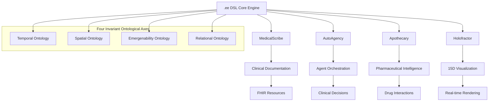

# 🤖 VOITHER AI-Native Developer Guide

*Building in the AI-native ecosystem with coordinated agents, enterprise resources, and unified VOITHER framework*

## 🎯 Revolutionary Development Paradigm

Welcome to a new era of development where **AI agents are your team members**, not just tools. This guide shows you how to develop within the VOITHER ecosystem using:

- **10 GitHub Enterprise subscriptions** as specialized team environments
- **AI agent coordination** for collaborative development
- **Claude Max as Strategic CTO** for architectural decisions
- **OpenAI Constructor** for intelligent code generation
- **Gemini Research Agent** for advanced analytics
- **Copilot Enterprise×10** for specialized domain development
- **Azure Medical AI** for clinical compliance

### 🧠 What You'll Master

- **AI Team Coordination**: Leading a team of specialized AI agents
- **Multi-Repository Architecture**: Leveraging 10 GitHub Enterprise accounts
- **VOITHER Ontological Programming**: Four Axes-driven development
- **.ee DSL AI Integration**: AI-native language processing
- **Enterprise Resource Optimization**: Maximizing your startup tools
- **Cross-AI Communication**: Agent-to-Agent coordination protocols

---

## 🚀 Quick Start: Your First AI-Coordinated Project

### Step 1: Initialize Your AI Team (10 minutes)

```bash
# Clone the VOITHER ecosystem
git clone https://github.com/myselfgus/docs voither-ecosystem
cd voither-ecosystem

# Setup AI agent coordination
python scripts/setup_ai_agents.py --all
# This initializes Claude Strategic, OpenAI Constructor, Gemini Research, etc.

# Configure GitHub Enterprise integration
python scripts/setup_github_enterprise.py --accounts=10 --copilot-licenses=18
```

### Step 2: Initiate Your First AI-Coordinated Development

```python
# quick_start_example.py
from voither.ai_orchestration import VoitherAIOrchestrationEngine
from voither.projects import ProjectRequest

async def main():
    # Initialize AI orchestration engine
    orchestrator = VoitherAIOrchestrationEngine()
    
    # Define project using natural language
    project = ProjectRequest(
        description="Build a VOITHER-powered clinical notes analyzer",
        requirements=[
            "TEA-friendly interface design",
            "HIPAA compliance",
            "Real-time emergenability detection",
            ".ee DSL query interface"
        ],
        timeline="2 weeks"
    )
    
    # Let AI agents coordinate the development
    result = await orchestrator.orchestrate_project(project)
    
    print(f"AI Team Coordination Result: {result.summary}")
    print(f"Generated Repositories: {result.repositories}")
    print(f"Code Artifacts: {result.artifacts}")

if __name__ == "__main__":
    import asyncio
    asyncio.run(main())
```

### Step 3: Monitor AI Team Collaboration

```bash
# Launch the AI team dashboard
python scripts/launch_ai_dashboard.py

# Watch real-time AI agent coordination
# - Claude Strategic making architectural decisions
# - OpenAI Constructor generating code
# - Gemini Research analyzing requirements
# - Copilot specialists implementing features
```

---

## 🧠 AI Agent Coordination Framework



### Technology Stack for VOITHER Ecosystem

| Layer | Technology | Purpose | VOITHER Integration |
|-------|------------|---------|-------------------|
| **DSL Engine** | .ee Parser + ANTLR4 | Unified language processing | Native emergenability detection |
| **Frontend** | React 19 + TypeScript | User interface and Holofractor 3D | Real-time dimensional visualization |
| **Real-time** | Azure SignalR | WebSocket connections | Live .ee event streaming |
| **Backend** | Node.js/Express or Python/FastAPI | API services and business logic | .ee DSL integration layer |
| **AI Processing** | Azure AI Studio + Custom Models | Four Axes analysis | Native .ee processing |
| **Data Storage** | MongoDB + PostgreSQL + Neo4j | Hybrid storage architecture | Privacy-preserving correlations |
| **File Storage** | Azure Blob Storage | Audio files and media | Clinical session storage |
| **Orchestration** | Azure Functions + Kubernetes | Serverless + container processing | Multi-component coordination |

## 🧠 Core VOITHER Components

### 1. .ee DSL Engine Integration

The heart of VOITHER - unified language for all system components.

```python
from voither.ee_dsl import EEDSLEngine
from voither.four_axes import FourInvariantAxes

# Initialize the .ee DSL engine
ee_engine = EEDSLEngine({
    'azure_key': 'your-azure-key',
    'azure_endpoint': 'your-endpoint',
    'four_axes_config': {
        'temporal_ontology': True,
        'spatial_ontology': True,
        'emergenability_ontology': True,
        'relational_ontology': True
    }
})

# Process clinical event through .ee DSL
result = await ee_engine.process_clinical_event(
    ee_code="""
    clinical_event anxiety_assessment {
        temporal: duration(session_start, session_end) -> chronesthetic_map,
        spatial: dimensional_projection(patient_state) -> manifold_15d,
        emergence: detect_therapeutic_window(dialogue_patterns) -> emergenability_score,
        relational: map_entity_network(patient, therapist, context) -> correlation_graph
    }
    """,
    context=clinical_context
)

# Result structure integrates all VOITHER components
{
    'medicalscribe': {
        'fhir_resources': [...],
        'clinical_documentation': {...}
    },
    'autoagency': {
        'agent_recommendations': [...],
        'decision_synthesis': {...}
    },
    'apothecary': {
        'drug_interactions': [...],
        'pharmaceutical_analysis': {...}
    },
    'holofractor': {
        'dimensional_coordinates': [...],
        'visualization_data': {...}
    },
    'four_axes_analysis': {
        'temporal_projection': {...},
        'spatial_projection': {...},
        'emergence_detection': {...},
        'relational_mapping': {...}
    }
}
```

### 2. MedicalScribe Integration

```python
from voither.medicalscribe import MedicalScribeEngine
from voither.ee_dsl import EEDSLParser

class VoitherMedicalScribe:
    """Enhanced MedicalScribe with full VOITHER ecosystem integration"""
    
    def __init__(self, config: VoitherConfig):
        self.medicalscribe = MedicalScribeEngine(config.medicalscribe)
        self.ee_parser = EEDSLParser()
        self.four_axes = FourInvariantAxes()
        self.autoagency = AutoAgencyOrchestrator(config.autoagency)
        self.apothecary = ApothecaryEngine(config.apothecary)
        
    async def process_clinical_session(self, audio_stream: AudioStream, 
                                     patient_context: PatientContext) -> VoitherSessionResult:
        """Process clinical session with full VOITHER ecosystem integration"""
        
        # 1. MedicalScribe: Transcription and clinical documentation
        clinical_record = await self.medicalscribe.process_session(audio_stream, patient_context)
        
        # 2. Convert to .ee DSL events
        ee_events = []
        for segment in clinical_record.transcript.segments:
            ee_event = self.ee_parser.parse_clinical_segment(segment)
            ee_events.append(ee_event)
        
        # 3. Four Axes analysis
        axes_analysis = await self.four_axes.analyze_session(ee_events)
        
        # 4. AutoAgency: Clinical decision support
        clinical_recommendations = await self.autoagency.process_clinical_context(
            clinical_record, axes_analysis
        )
        
        # 5. Apothecary: Medication analysis (if applicable)
        medication_analysis = None
        if patient_context.medications:
            medication_analysis = await self.apothecary.analyze_regimen(
                patient_context.medications, clinical_record
            )
        
        # 6. Holofractor: Real-time visualization data
        holofractor_data = await self.generate_holofractor_visualization(
            axes_analysis, clinical_record
        )
        
        return VoitherSessionResult(
            clinical_record=clinical_record,
            ee_events=ee_events,
            four_axes_analysis=axes_analysis,
            clinical_recommendations=clinical_recommendations,
            medication_analysis=medication_analysis,
            holofractor_visualization=holofractor_data
        )
```

### 3. AutoAgency Multi-Component Orchestration

```python
class VoitherAutoAgency:
    """AutoAgency orchestrator for multi-component VOITHER integration"""
    
    def __init__(self, config: AutoAgencyConfig):
        self.agent_registry = AgentRegistry()
        self.ee_event_bus = EEEventBus()
        self.medicalscribe_agent = MedicalScribeAgent()
        self.apothecary_agent = ApothecaryAgent()
        self.holofractor_agent = HolofractorAgent()
        
    async def orchestrate_voither_session(self, session_context: SessionContext) -> VoitherDecision:
        """Orchestrate all VOITHER components for comprehensive clinical support"""
        
        # Initialize specialized agents for each VOITHER component
        agents = [
            self.medicalscribe_agent,
            self.apothecary_agent,
            self.holofractor_agent,
            ClinicalAssessmentAgent(),
            DiagnosticSupportAgent(),
            TreatmentPlanningAgent()
        ]
        
        # Broadcast session context via .ee DSL
        ee_session_event = self.ee_event_bus.create_session_event(session_context)
        agent_responses = await self.coordinate_agents(ee_session_event, agents)
        
        # Synthesize multi-component decision
        voither_decision = await self.synthesize_voither_decision(
            medicalscribe_response=agent_responses['medicalscribe'],
            apothecary_response=agent_responses['apothecary'],
            holofractor_response=agent_responses['holofractor'],
            clinical_responses=agent_responses['clinical_agents']
        )
        
        return voither_decision
```

### 4. Apothecary Pharmaceutical Intelligence

```python
class VoitherApothecary:
    """Pharmaceutical intelligence with VOITHER ecosystem integration"""
    
    def __init__(self, config: ApothecaryConfig):
        self.drug_knowledge_graph = DrugKnowledgeGraph()
        self.ee_pharmaceutical_parser = EEPharmaceuticalParser()
        self.four_axes_mapper = FourAxesDrugMapper()
        
    async def analyze_with_voither_context(self, medications: List[Medication], 
                                         clinical_context: ClinicalContext) -> VoitherPharmaceuticalAnalysis:
        """Analyze medications with full VOITHER ecosystem context"""
        
        # Convert medications to .ee DSL representation
        ee_medication_events = []
        for medication in medications:
            ee_event = self.ee_pharmaceutical_parser.medication_to_ee(
                medication, clinical_context
            )
            ee_medication_events.append(ee_event)
        
        # Apply Four Invariant Ontological Axes analysis
        axes_analysis = await self.four_axes_mapper.map_medications_to_axes(
            ee_medication_events
        )
        
        # Integration with MedicalScribe clinical data
        clinical_integration = await self.integrate_with_medicalscribe(
            ee_medication_events, clinical_context.medicalscribe_data
        )
        
        # AutoAgency decision support integration
        agent_recommendations = await self.request_autoagency_input(
            ee_medication_events, clinical_context
        )
        
        # Holofractor visualization integration
        visualization_data = await self.generate_holofractor_medication_view(
            axes_analysis, ee_medication_events
        )
        
        return VoitherPharmaceuticalAnalysis(
            medication_analysis=axes_analysis,
            clinical_integration=clinical_integration,
            agent_recommendations=agent_recommendations,
            visualization_data=visualization_data
        )
```

### 5. Holofractor 15-Dimensional Visualization

```javascript
// Enhanced Holofractor with VOITHER ecosystem integration
class VoitherHolofractor {
    constructor(canvas, voitherConfig) {
        this.gl = canvas.getContext('webgl2');
        this.voitherConfig = voitherConfig;
        this.eeEventStream = new EEEventStream();
        this.fourAxesProcessor = new FourAxesProcessor();
        this.componentDataStreams = {
            medicalscribe: new MedicalScribeDataStream(),
            autoagency: new AutoAgencyDataStream(),
            apothecary: new ApothecaryDataStream()
        };
        
        this.initializeVoitherShaders();
        this.initializeComponentIntegration();
    }
    
    initializeVoitherShaders() {
        const vertexShaderSource = \`#version 300 es
            precision highp float;
            
            in vec3 position;
            in vec3 normal;
            
            uniform mat4 projectionMatrix;
            uniform mat4 modelViewMatrix;
            uniform float dimensions[15];  // 15-dimensional VOITHER coordinates
            uniform float fourAxesWeights[4];  // Four Invariant Ontological Axes weights
            uniform float time;
            
            // VOITHER component data
            uniform float medicalscribeInfluence;
            uniform float autoagencyInfluence;
            uniform float apothecaryInfluence;
            
            out vec3 vNormal;
            out vec3 vPosition;
            out float vVoitherIntensity;
            out vec4 vComponentInfluences;
            
            void main() {
                vec3 transformedPosition = position;
                
                // Apply Four Invariant Ontological Axes transformations
                float temporalWeight = fourAxesWeights[0];
                float spatialWeight = fourAxesWeights[1];
                float emergenceWeight = fourAxesWeights[2];
                float relationalWeight = fourAxesWeights[3];
                
                // Temporal Axis: Bergsonian duration effects
                float temporalOffset = sin(time * 0.001 * temporalWeight) * 0.1;
                transformedPosition.z += temporalOffset;
                
                // Spatial Axis: 15-dimensional projection
                for(int i = 0; i < 15; i++) {
                    float dimensionValue = dimensions[i];
                    transformedPosition += normal * (dimensionValue * spatialWeight * 0.05);
                }
                
                // Emergence Axis: Therapeutic opportunity visualization
                float emergenceEffect = emergenceWeight * 0.2;
                transformedPosition *= (1.0 + emergenceEffect);
                
                // Relational Axis: Entity network influence
                float relationalEffect = relationalWeight * 0.15;
                transformedPosition.y *= (1.0 + relationalEffect);
                
                // VOITHER component influences
                vComponentInfluences = vec4(
                    medicalscribeInfluence,
                    autoagencyInfluence,
                    apothecaryInfluence,
                    1.0
                );
                
                // Calculate overall VOITHER intensity
                vVoitherIntensity = (temporalWeight + spatialWeight + emergenceWeight + relationalWeight) / 4.0;
                
                vNormal = normal;
                vPosition = transformedPosition;
                
                gl_Position = projectionMatrix * modelViewMatrix * vec4(transformedPosition, 1.0);
            }
        \`;
        
        this.voitherShaderProgram = this.compileShaderProgram(vertexShaderSource, fragmentShaderSource);
    }
    
    async processVoitherEcosystemData(voitherSessionData) {
        // Process data from all VOITHER components
        const medicalscribeData = this.processMedicalScribeData(voitherSessionData.medicalscribe);
        const autoagencyData = this.processAutoAgencyData(voitherSessionData.autoagency);
        const apothecaryData = this.processApothecaryData(voitherSessionData.apothecary);
        
        // Apply Four Invariant Ontological Axes analysis
        const fourAxesData = this.fourAxesProcessor.process(voitherSessionData.four_axes_analysis);
        
        // Update visualization with integrated VOITHER data
        this.updateVoitherVisualization({
            dimensionalCoordinates: voitherSessionData.dimensional_coordinates,
            fourAxesWeights: fourAxesData.weights,
            componentInfluences: {
                medicalscribe: medicalscribeData.influence,
                autoagency: autoagencyData.influence,
                apothecary: apothecaryData.influence
            }
        });
    }
}
```

## 📊 VOITHER Data Models

### Unified Session Document Structure

```javascript
// Complete VOITHER session document in MongoDB
{
    "_id": ObjectId("..."),
    "voitherSessionId": "voither_session_12345",
    "patientId": ObjectId("..."),
    "sessionDate": ISODate("2024-01-15"),
    "durationMinutes": 90,
    
    // .ee DSL Events
    "eeDSLEvents": [
        {
            "eventType": "clinical_event",
            "eeCode": "clinical_event anxiety_assessment { ... }",
            "timestamp": 1234567890,
            "fourAxesAnalysis": {
                "temporal": {...},
                "spatial": {...},
                "emergence": {...},
                "relational": {...}
            }
        }
    ],
    
    // MedicalScribe Component
    "medicalScribe": {
        "transcript": {...},
        "fhirResources": [...],
        "clinicalDocumentation": {...}
    },
    
    // AutoAgency Component
    "autoAgency": {
        "agentRecommendations": [...],
        "decisionSynthesis": {...},
        "coordinationLog": [...]
    },
    
    // Apothecary Component
    "apothecary": {
        "medicationAnalysis": {...},
        "drugInteractions": [...],
        "dosageOptimizations": [...]
    },
    
    // Holofractor Component
    "holofractor": {
        "dimensionalTrajectory": [...],
        "visualizationData": {...},
        "real-timeUpdates": [...]
    },
    
    // Four Invariant Ontological Axes Analysis
    "fourAxesAnalysis": {
        "temporalOntology": {...},
        "spatialOntology": {...},
        "emergenabilityOntology": {...},
        "relationalOntology": {...}
    },
    
    // Privacy and Compliance
    "privacyMetadata": {
        "anonymizationLevel": "k_anonymity_5",
        "differentialPrivacyEpsilon": 0.1,
        "encryptionStatus": "aes_256_gcm"
    }
}
```

## 🧪 VOITHER Testing Strategy

### Integrated Component Testing

```python
import pytest
from voither.ecosystem import VoitherEcosystem

@pytest.fixture
def voither_ecosystem():
    return VoitherEcosystem({
        'medicalscribe_config': {...},
        'autoagency_config': {...},
        'apothecary_config': {...},
        'holofractor_config': {...},
        'ee_dsl_config': {...}
    })

async def test_voither_ecosystem_integration(voither_ecosystem):
    """Test complete VOITHER ecosystem integration"""
    
    # Create test clinical session
    test_session = create_test_clinical_session()
    
    # Process through complete VOITHER ecosystem
    voither_result = await voither_ecosystem.process_session(test_session)
    
    # Verify all components processed correctly
    assert voither_result.medicalscribe.clinical_record is not None
    assert len(voither_result.autoagency.agent_recommendations) > 0
    assert voither_result.apothecary.medication_analysis is not None
    assert voither_result.holofractor.visualization_data is not None
    
    # Verify .ee DSL integration
    assert len(voither_result.ee_events) > 0
    assert voither_result.four_axes_analysis is not None
    
    # Verify cross-component correlations
    assert voither_result.cross_component_correlations is not None

async def test_four_axes_integration(voither_ecosystem):
    """Test Four Invariant Ontological Axes integration across all components"""
    
    test_input = ".ee DSL clinical event code"
    
    # Process through all axes
    axes_result = await voither_ecosystem.four_axes.process(test_input)
    
    # Verify all axes are represented
    assert axes_result.temporal_ontology is not None
    assert axes_result.spatial_ontology is not None
    assert axes_result.emergenability_ontology is not None
    assert axes_result.relational_ontology is not None
    
    # Verify component integration with axes
    assert axes_result.medicalscribe_integration is not None
    assert axes_result.autoagency_integration is not None
    assert axes_result.apothecary_integration is not None
    assert axes_result.holofractor_integration is not None
```

## 🚀 VOITHER Deployment Guide

### Complete Ecosystem Deployment

```yaml
# docker-compose.yml for VOITHER ecosystem
version: '3.8'
services:
  voither-ee-dsl-engine:
    image: voither/ee-dsl-engine:v2.0
    environment:
      - FOUR_AXES_CONFIG=production
    ports:
      - "8001:8000"
    
  voither-medicalscribe:
    image: voither/medicalscribe:v2.0
    depends_on:
      - voither-ee-dsl-engine
    environment:
      - EE_DSL_ENDPOINT=http://voither-ee-dsl-engine:8000
    ports:
      - "8002:8000"
    
  voither-autoagency:
    image: voither/autoagency:v2.0
    depends_on:
      - voither-ee-dsl-engine
    environment:
      - AGENT_ORCHESTRATION_MODE=production
    ports:
      - "8003:8000"
    
  voither-apothecary:
    image: voither/apothecary:v2.0
    depends_on:
      - voither-ee-dsl-engine
    environment:
      - DRUG_KNOWLEDGE_GRAPH=neo4j://neo4j:7687
    ports:
      - "8004:8000"
    
  voither-holofractor:
    image: voither/holofractor:v2.0
    depends_on:
      - voither-ee-dsl-engine
    environment:
      - WEBGL_RENDERING=enabled
    ports:
      - "8005:8000"
    
  voither-gateway:
    image: voither/api-gateway:v2.0
    depends_on:
      - voither-medicalscribe
      - voither-autoagency
      - voither-apothecary
      - voither-holofractor
    ports:
      - "8000:8000"
    environment:
      - VOITHER_ECOSYSTEM_MODE=unified
```

---

## 📞 VOITHER Developer Support

### Ecosystem Community
- **GitHub Discussions**: VOITHER ecosystem questions
- **Discord**: Real-time VOITHER development chat
- **Stack Overflow**: Tag questions with `voither-ecosystem`

### VOITHER Resources
- **API Documentation**: Auto-generated from .ee DSL
- **Architecture Diagrams**: Four Axes visual documentation
- **Code Examples**: Complete VOITHER integration examples
- **Video Tutorials**: Ecosystem implementation guides

*Ready to build the future of unified healthcare AI with VOITHER? Let's develop the complete ecosystem!* 🚀
