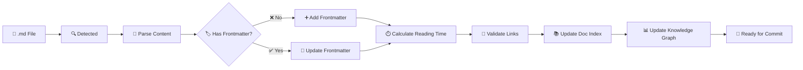
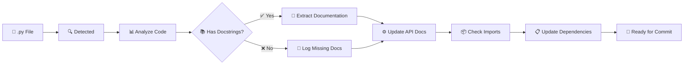
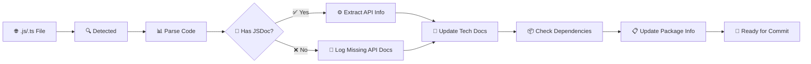
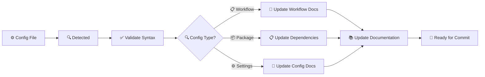

# 📋 File Processing Matrix

## Como Diferentes Tipos de Arquivo são Processados

Esta matriz mostra **exatamente** como cada tipo de arquivo é detectado, processado e atualizado pelo sistema de automação.

## 🎯 Matriz Completa de Processamento

### **📝 Arquivos Markdown (.md)**



| Ação | Automática | Condicional | Manual |
|------|------------|------------|--------|
| **Adicionar Frontmatter** | ✅ Sempre | - | - |
| **Calcular Tempo de Leitura** | ✅ Sempre | - | - |
| **Validar Links Internos** | ✅ Sempre | - | - |
| **Análise Ontológica** | - | ✅ Se conceitos novos | ⚙️ Manual dispatch |
| **Atualizar Knowledge Graph** | ✅ Sempre | - | - |
| **Atualizar Documentation Index** | ✅ Sempre | - | - |

### **🐍 Arquivos Python (.py)**



| Ação | Automática | Condicional | Manual |
|------|------------|------------|--------|
| **Extrair Docstrings** | ✅ Sempre | - | - |
| **Atualizar API Docs** | - | ✅ Se docstrings presentes | ⚙️ Pode ser manual |
| **Verificar Imports** | ✅ Sempre | - | - |
| **Atualizar requirements.txt** | - | ✅ Se novos imports | ⚙️ Pode ser manual |
| **Análise de Código** | - | ✅ Se mudanças significativas | ⚙️ Manual dispatch |

### **🌐 Arquivos JavaScript/TypeScript (.js/.ts)**



| Ação | Automática | Condicional | Manual |
|------|------------|------------|--------|
| **Extrair JSDoc** | ✅ Sempre | - | - |
| **Atualizar Tech Docs** | - | ✅ Se JSDoc presente | ⚙️ Pode ser manual |
| **Verificar Dependencies** | ✅ Sempre | - | - |
| **Atualizar package.json Info** | - | ✅ Se mudanças em deps | ⚙️ Pode ser manual |

### **⚙️ Arquivos de Configuração (.json/.yml/.yaml)**



| Ação | Automática | Condicional | Manual |
|------|------------|------------|--------|
| **Validar Sintaxe** | ✅ Sempre | - | - |
| **Documentar Mudanças** | ✅ Sempre | - | - |
| **Atualizar Config Docs** | - | ✅ Se arquivo de config | ⚙️ Pode ser manual |
| **Verificar Breaking Changes** | - | ✅ Se mudanças críticas | ⚙️ Manual review |

## 📊 Matriz de Regras por Extensão

### **Regras de Processamento Detalhadas**

| Extensão | Trigger Automático | Processamento | Output | Validação |
|----------|-------------------|---------------|--------|-----------|
| **.md** | ✅ Push/PR | Frontmatter + Links + Content | Knowledge Graph + Index | Link validation |
| **.py** | ✅ Push/PR | Docstrings + Imports | API Docs + Dependencies | Syntax check |
| **.js** | ✅ Push/PR | JSDoc + Dependencies | Tech Docs + Package info | ESLint |
| **.ts** | ✅ Push/PR | TSDoc + Types | API Docs + Type definitions | TypeScript compiler |
| **.json** | ✅ Push/PR | Validation + Schema | Config Docs | JSON schema |
| **.yml** | ✅ Push/PR | YAML validation | Workflow Docs | YAML lint |
| **.yaml** | ✅ Push/PR | YAML validation | Config Docs | YAML lint |

### **Threshold de Processamento**

| Tipo de Mudança | Threshold | Ação |
|------------------|-----------|------|
| **Arquivo Novo** | 1 arquivo | Processamento completo |
| **Arquivo Editado** | 1+ linhas | Processamento incremental |
| **Arquivo Removido** | 1 arquivo | Limpeza de referências |
| **Renomeação** | 1 arquivo | Atualização de links |
| **Mudanças em Lote** | 5+ arquivos | Processamento em batch |

## 🔄 Fluxos de Processamento Específicos

### **📝 Frontmatter Processing (Arquivos .md)**

```python
# Template de frontmatter aplicado automaticamente
frontmatter_template = {
    "title": extract_title_from_content(content) or filename_to_title(filename),
    "description": extract_first_paragraph(content) or f"Documentation for {title}",
    "version": "1.0",
    "last_updated": current_date(),
    "audience": determine_audience_from_content(content),
    "priority": determine_priority_from_path(filepath),
    "reading_time": calculate_reading_time(content),
    "tags": extract_tags_from_content(content) + ["documentation"]
}
```

#### **Campos Calculados Automaticamente**:

| Campo | Método de Cálculo | Exemplo |
|-------|-------------------|---------|
| **title** | H1 do documento ou nome do arquivo | "VOITHER System Architecture" |
| **description** | Primeiro parágrafo ou descrição gerada | "Complete technical overview..." |
| **reading_time** | 250 palavras/minuto | "8 minutes" |
| **audience** | Baseado no conteúdo e localização | ["developers", "architects"] |
| **priority** | Baseado no caminho do arquivo | "essential" para core/, "important" para guides/ |
| **tags** | Extraído do conteúdo + tags padrão | ["system", "architecture", "technical"] |

### **🔗 Link Validation Process**

```python
# Processo de validação de links
def validate_links_in_file(filepath):
    links = extract_all_links(filepath)
    results = []
    
    for link in links:
        if is_internal_link(link):
            if file_exists(resolve_path(link, filepath)):
                results.append(LinkResult(link, "valid"))
            else:
                # Tentar correção automática
                suggestion = find_best_match(link)
                if suggestion:
                    results.append(LinkResult(link, "auto_fixed", suggestion))
                else:
                    results.append(LinkResult(link, "broken"))
        else:
            # Link externo - verificação opcional
            results.append(LinkResult(link, "external"))
    
    return results
```

### **📊 Knowledge Graph Update Process**

```python
# Processo de atualização do knowledge graph
def update_knowledge_graph(changed_files):
    new_concepts = []
    updated_relations = []
    
    for file in changed_files:
        if file.endswith('.md'):
            content = read_file(file)
            
            # Extrair conceitos
            concepts = extract_concepts(content)
            new_concepts.extend(concepts)
            
            # Identificar relações
            relations = identify_relationships(content, existing_concepts)
            updated_relations.extend(relations)
            
            # Detectar equivalências
            equivalencies = detect_concept_equivalencies(concepts, existing_concepts)
            
    # Atualizar knowledge graph
    update_graph_with_concepts(new_concepts)
    update_graph_with_relations(updated_relations)
    update_concept_taxonomies(equivalencies)
```

## ⚡ Performance Optimization

### **📈 Processing Time by File Type**

| Extensão | Tempo Médio | Throughput | Limitações |
|----------|-------------|------------|------------|
| **.md** | 15-30s | 10-20 files/min | Link validation |
| **.py** | 5-10s | 30-50 files/min | Docstring parsing |
| **.js/.ts** | 10-15s | 20-30 files/min | Dependency analysis |
| **.json** | 1-2s | 100+ files/min | Schema validation |
| **.yml/.yaml** | 2-5s | 50-100 files/min | YAML parsing |

### **🔧 Optimization Strategies**

#### **Parallel Processing**:
```python
# Processamento paralelo por tipo de arquivo
async def process_files_parallel(changed_files):
    md_files = [f for f in changed_files if f.endswith('.md')]
    py_files = [f for f in changed_files if f.endswith('.py')]
    js_files = [f for f in changed_files if f.endswith(('.js', '.ts'))]
    
    # Processar em paralelo
    results = await asyncio.gather(
        process_markdown_files(md_files),
        process_python_files(py_files),
        process_javascript_files(js_files)
    )
    
    return merge_results(results)
```

#### **Incremental Processing**:
```python
# Processamento incremental baseado em mudanças
def incremental_process(file_path, changes):
    if changes.type == "content_change":
        return process_content_only(file_path, changes.lines)
    elif changes.type == "metadata_change":
        return process_metadata_only(file_path)
    elif changes.type == "structure_change":
        return process_full_file(file_path)
```

---

**Resultado**: Sistema inteligente que processa cada tipo de arquivo de forma otimizada, aplicando as regras específicas necessárias para manter a documentação sempre atualizada! 📋✨