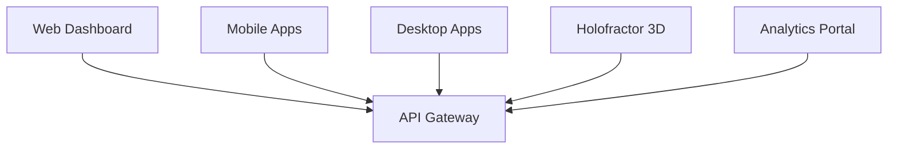
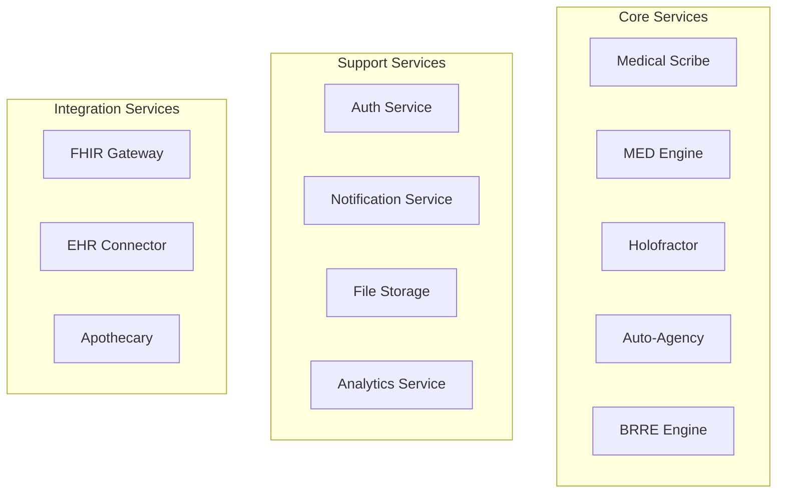
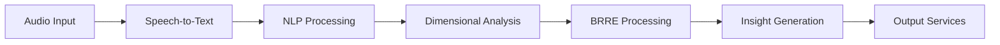
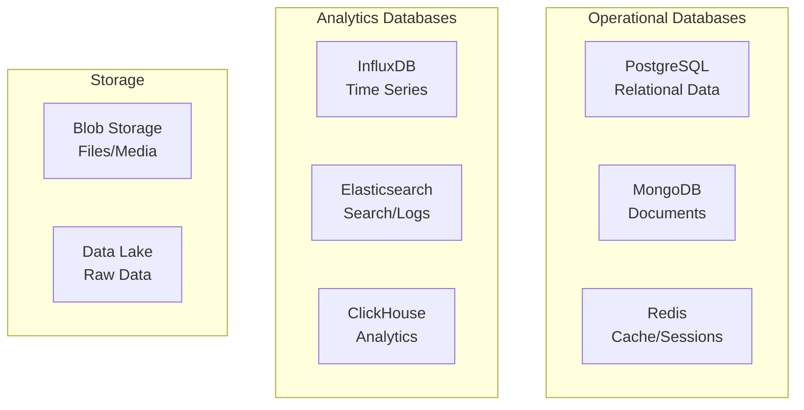
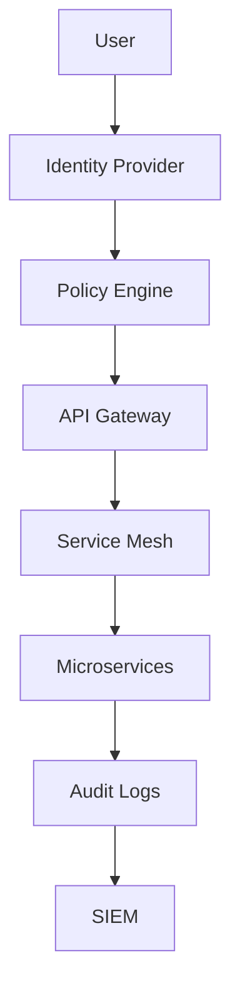
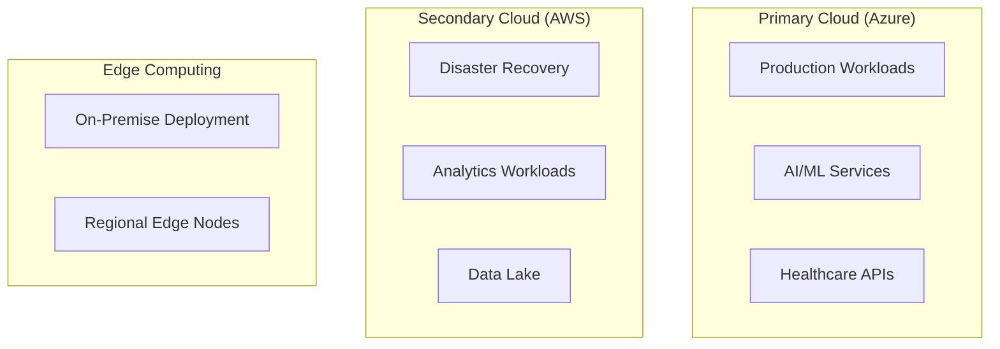

# Arquitetura do Sistema VOITHER

> **"Infraestrutura que Sustenta a Inovação"**
> 
> *Arquitetura técnica completa que integra todos os componentes do ecossistema VOITHER*

---

## 🏗️ Visão Arquitetural Geral

A arquitetura do VOITHER é projetada como um ecossistema modular, escalável e interoperável que combina microserviços, processamento em tempo real, e tecnologias de ponta para criar uma plataforma robusta de análise de saúde mental.

### **Princípios Arquiteturais**
- **Modularidade**: Componentes independentes e intercambiáveis
- **Escalabilidade**: Crescimento horizontal e vertical
- **Interoperabilidade**: Integração nativa com sistemas externos
- **Segurança**: Proteção em múltiplas camadas
- **Disponibilidade**: Alta disponibilidade e tolerância a falhas

---

## 🔧 Camadas Arquiteturais

### **1. 📱 Camada de Apresentação**

#### **Interfaces de Usuário**


#### **Tecnologias Frontend**
- **Web**: React 18 + TypeScript + Next.js 14
- **Mobile**: React Native + Expo 
- **Desktop**: Electron + React
- **3D Visualization**: Three.js + WebGL + NVIDIA Omniverse (roadmap)
- **Real-time**: WebSocket + Socket.io

#### **Design System**
- **UI Components**: Design system unificado baseado em Material Design 3
- **Responsividade**: Adaptação automática para diferentes dispositivos  
- **Acessibilidade**: Conformidade WCAG 2.1 AA
- **Internacionalização**: Suporte multi-idioma (pt, en, es)

### **2. 🚪 Camada de API Gateway**

#### **Gateway Principal**
```javascript
// Configuração do API Gateway
const gatewayConfig = {
  routes: [
    { path: '/api/scribe/*', service: 'medical-scribe' },
    { path: '/api/med/*', service: 'med-engine' },
    { path: '/api/holofractor/*', service: 'holofractor' },
    { path: '/api/agency/*', service: 'auto-agency' },
    { path: '/api/brre/*', service: 'brre-engine' }
  ],
  middleware: ['auth', 'rateLimit', 'cors', 'logging'],
  loadBalancing: 'roundRobin'
};
```

#### **Características**
- **Kong Gateway**: Gerenciamento de APIs e microserviços
- **Autenticação**: JWT + OAuth 2.0 + SAML
- **Rate Limiting**: Controle de taxa por usuário/aplicação
- **Monitoramento**: Métricas em tempo real de performance
- **Versionamento**: Suporte a múltiplas versões de API

### **3. ⚙️ Camada de Microserviços**

#### **Arquitetura de Microserviços**


#### **Tecnologias de Microserviços**
- **Runtime**: Node.js 20 + Python 3.11 + Go 1.21
- **Frameworks**: Express.js + FastAPI + Gin
- **Comunicação**: gRPC + REST + GraphQL
- **Service Mesh**: Istio para gerenciamento de comunicação
- **API Documentation**: OpenAPI 3.0 + Swagger

### **4. 🧠 Camada de Processamento de IA**

#### **Pipeline de IA**


#### **Tecnologias de IA**
- **Speech Recognition**: Azure Cognitive Services + Google Cloud Speech
- **NLP**: spaCy + transformers + NLTK + OpenAI GPT-4
- **Machine Learning**: TensorFlow + PyTorch + scikit-learn
- **GPU Acceleration**: NVIDIA CUDA + TensorRT
- **Model Serving**: TensorFlow Serving + MLflow

### **5. 💾 Camada de Dados**

#### **Arquitetura de Dados**


#### **Estratégias de Dados**
- **CQRS**: Separação entre commands e queries
- **Event Sourcing**: Log de eventos para auditoria
- **Data Partitioning**: Distribuição por tenant/região
- **Backup/Recovery**: Backup automático com RTO < 4h

---

## 🔄 Padrões de Integração

### **1. 📡 Comunicação Entre Serviços**

#### **Padrões Síncronos**
```python
# gRPC Service Definition
from grpc import insecure_channel
from med_engine_pb2_grpc import MEDEngineStub

class MEDEngineClient:
    def __init__(self, endpoint):
        self.channel = insecure_channel(endpoint)
        self.stub = MEDEngineStub(self.channel)
    
    def analyze_dimensions(self, transcript):
        request = AnalyzeDimensionsRequest(text=transcript)
        response = self.stub.AnalyzeDimensions(request)
        return response.dimensional_vector
```

#### **Padrões Assíncronos**
```python
# Event-Driven Architecture
import asyncio
from event_bus import EventBus

class SessionProcessor:
    def __init__(self):
        self.event_bus = EventBus()
        self.setup_handlers()
    
    def setup_handlers(self):
        self.event_bus.subscribe('session.started', self.on_session_start)
        self.event_bus.subscribe('transcript.ready', self.on_transcript_ready)
        
    async def on_transcript_ready(self, event):
        # Processa transcrição de forma assíncrona
        await self.process_transcript(event.data)
```

### **2. 🔌 Integração FHIR**

#### **FHIR Gateway**
```python
# FHIR Resource Generation
from fhir.resources.encounter import Encounter
from fhir.resources.observation import Observation

class FHIRIntegration:
    def create_encounter(self, session_data):
        encounter = Encounter(
            status="finished",
            class_={"code": "AMB", "display": "ambulatory"},
            type=[{
                "coding": [{
                    "system": "http://snomed.info/sct",
                    "code": "185349003",
                    "display": "Psychotherapy"
                }]
            }],
            subject={"reference": f"Patient/{session_data.patient_id}"},
            period={
                "start": session_data.start_time,
                "end": session_data.end_time
            }
        )
        return encounter
```

#### **Mapeamento de Dados**
- **Dimensional Values → FHIR Observations**: Conversão automática
- **Clinical Notes → FHIR DocumentReference**: Estruturação de documentos
- **Medications → FHIR MedicationRequest**: Prescrições estruturadas
- **Assessments → FHIR RiskAssessment**: Avaliações de risco

### **3. 🏥 Conectores EHR**

#### **Sistemas Suportados**
- **Epic**: Integração via APIs RESTful
- **Cerner**: Conexão através de HL7 FHIR
- **Allscripts**: Interface customizada
- **Sistemas Brasileiros**: PEP, Tasy, MV

---

## 🛡️ Segurança e Compliance

### **1. 🔐 Arquitetura de Segurança**

#### **Zero Trust Architecture**


#### **Camadas de Segurança**
- **Autenticação**: Multi-factor obrigatório para dados sensíveis
- **Autorização**: RBAC + ABAC granular
- **Criptografia**: TLS 1.3 em trânsito, AES-256 em repouso
- **Network Security**: VPC isoladas + WAF + DDoS protection

### **2. 📋 Compliance Regulatório**

#### **HIPAA Compliance**
```python
# Audit Trail Implementation
class AuditLogger:
    def __init__(self):
        self.audit_db = AuditDatabase()
    
    def log_access(self, user_id, resource, action, timestamp):
        audit_entry = {
            'user_id': user_id,
            'resource_type': resource.type,
            'resource_id': resource.id,
            'action': action,
            'timestamp': timestamp,
            'ip_address': self.get_client_ip(),
            'user_agent': self.get_user_agent()
        }
        self.audit_db.insert(audit_entry)
```

#### **Certificações**
- **ISO 27001**: Gestão de segurança da informação
- **SOC 2 Type II**: Controles de segurança operacional
- **HIPAA**: Proteção de informações de saúde
- **LGPD/GDPR**: Proteção de dados pessoais

---

## 📊 Monitoramento e Observabilidade

### **1. 📈 Stack de Monitoramento**

#### **Métricas e Logs**
```yaml
# Prometheus Configuration
global:
  scrape_interval: 15s
  
scrape_configs:
  - job_name: 'voither-services'
    static_configs:
      - targets: ['med-engine:8080', 'holofractor:8081']
    metrics_path: /metrics
    
  - job_name: 'infrastructure'
    static_configs:
      - targets: ['node-exporter:9100']
```

#### **Ferramentas**
- **Métricas**: Prometheus + Grafana
- **Logs**: ELK Stack (Elasticsearch + Logstash + Kibana)
- **Tracing**: Jaeger para distributed tracing
- **APM**: New Relic para monitoramento de aplicação
- **Alertas**: PagerDuty para notificações críticas

### **2. 🎯 KPIs e SLAs**

#### **Service Level Objectives**
- **Disponibilidade**: 99.9% uptime para serviços críticos
- **Latência**: P95 < 200ms para APIs REST
- **Throughput**: >1000 RPS para APIs principais
- **Error Rate**: <0.1% para operações críticas

#### **Métricas de Negócio**
- **Session Processing Time**: Tempo total de processamento
- **Accuracy Metrics**: Precisão da análise dimensional
- **User Satisfaction**: NPS > 8.5 para profissionais
- **Clinical Impact**: Melhoria em outcomes clínicos

---

## ☁️ Infraestrutura Cloud

### **1. 🌐 Multi-Cloud Strategy**

#### **Cloud Providers**


#### **Justificativa Multi-Cloud**
- **Azure**: Melhor para healthcare + compliance HIPAA
- **AWS**: Excelente para analytics + machine learning
- **GCP**: Alternativa para AI/ML workloads
- **On-Premise**: Para instituições com restrições regulatórias

### **2. 🐳 Containerização e Orquestração**

#### **Kubernetes Configuration**
```yaml
# VOITHER Deployment
apiVersion: apps/v1
kind: Deployment
metadata:
  name: med-engine
  namespace: voither
spec:
  replicas: 3
  selector:
    matchLabels:
      app: med-engine
  template:
    metadata:
      labels:
        app: med-engine
    spec:
      containers:
      - name: med-engine
        image: voither/med-engine:v1.2.0
        ports:
        - containerPort: 8080
        resources:
          requests:
            memory: "2Gi"
            cpu: "1000m"
          limits:
            memory: "4Gi"
            cpu: "2000m"
```

#### **Características da Orquestração**
- **Auto-scaling**: HPA baseado em CPU/Memória + VPA
- **Service Mesh**: Istio para comunicação segura
- **GitOps**: ArgoCD para deployment automatizado  
- **Backup**: Velero para backup de aplicações

---

## 🚀 Escalabilidade e Performance

### **1. 📈 Estratégias de Escalabilidade**

#### **Horizontal Scaling**
```python
# Auto-scaling Configuration
class AutoScaler:
    def __init__(self):
        self.metrics_collector = MetricsCollector()
        self.kubernetes_client = KubernetesClient()
    
    def check_scaling_needs(self):
        cpu_usage = self.metrics_collector.get_cpu_usage()
        memory_usage = self.metrics_collector.get_memory_usage()
        request_rate = self.metrics_collector.get_request_rate()
        
        if self.should_scale_up(cpu_usage, memory_usage, request_rate):
            self.kubernetes_client.scale_deployment('med-engine', replicas=5)
```

#### **Performance Optimization**
- **Caching**: Redis para cache distribuído
- **CDN**: CloudFlare para assets estáticos
- **Database Optimization**: Read replicas + connection pooling
- **API Optimization**: GraphQL para reduzir over-fetching

### **2. 🔄 Disaster Recovery**

#### **Backup Strategy**
- **Database Backups**: Snapshots diários + transaction logs
- **Application Backups**: Container images versionadas
- **Configuration Backups**: GitOps com versionamento
- **Cross-Region Replication**: Réplica em região secundária

#### **Recovery Procedures**
- **RTO**: Recovery Time Objective < 4 horas
- **RPO**: Recovery Point Objective < 15 minutos
- **Failover**: Automático para serviços críticos
- **Testing**: Disaster recovery drill trimestral

---

## 🔮 Roadmap Arquitetural

### **Versão 2.0 - Modernização**
- **Serverless**: Migração de componentes para Functions
- **Event Streaming**: Apache Kafka para event sourcing
- **Service Mesh**: Implementação completa do Istio
- **Observability**: OpenTelemetry para observabilidade unificada

### **Versão 3.0 - Edge Computing**
- **Edge Deployment**: Processamento local em clínicas
- **5G Integration**: Aproveitamento de baixa latência
- **IoT Integration**: Sensores biométricos integrados
- **Federated Learning**: ML distribuído preservando privacidade

### **Versão 4.0 - Quantum Ready**
- **Quantum Computing**: Preparação para computação quântica
- **AI/ML Advanced**: Modelos de linguagem especializada
- **Blockchain**: Auditoria imutável de dados de saúde
- **Extended Reality**: AR/VR para visualizações avançadas

---

*A arquitetura do VOITHER é construída para evoluir - combinando estabilidade para o presente com flexibilidade para o futuro da saúde mental digital.*