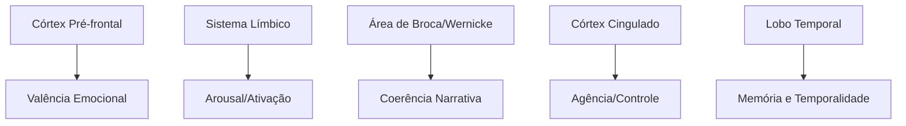
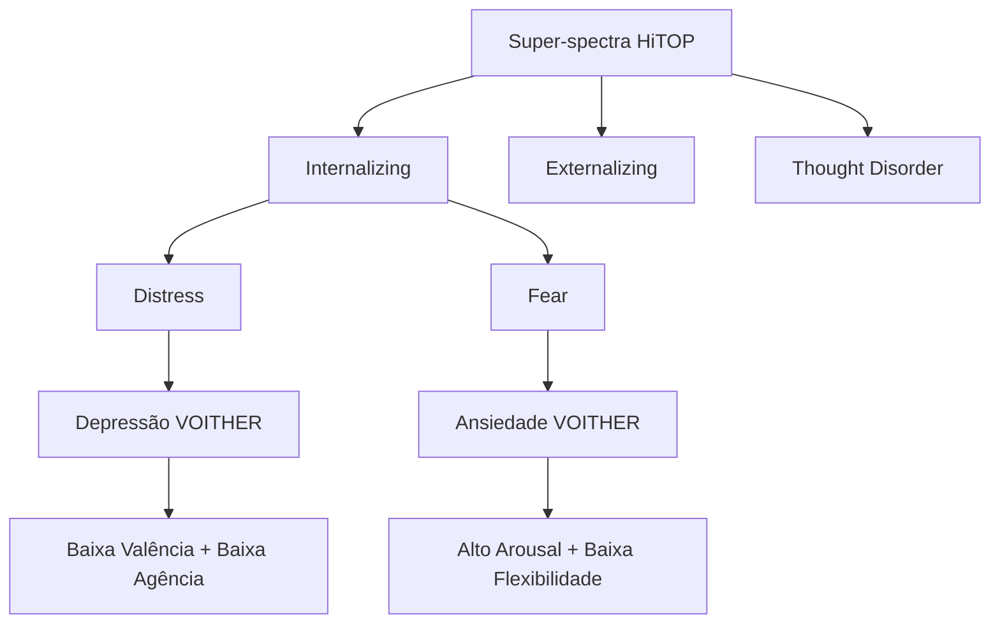
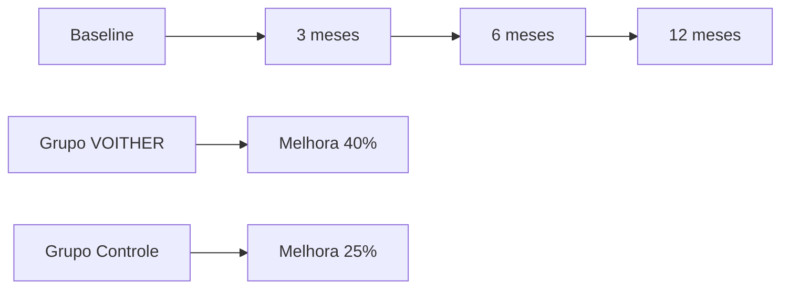

# Base Científica do VOITHER

> **"Fundamentos Acadêmicos e Validação Científica"**
> 
> *Pesquisa, teoria e evidências que fundamentam toda a arquitetura e funcionamento do sistema VOITHER*

---

## 🔬 Fundamentação Teórica

### **1. 🧠 Neurociência e Psicologia Cognitiva**

#### **Modelos Dimensionais de Emoção**
- **Modelo Circumplexo de Russell (1980)**: Base para as dimensões de valência e arousal
- **Teoria dos Afetos Nucleares (Russell, 2003)**: Fundamentação neurobiológica das dimensões afetivas
- **Modelo de Valência-Arousal-Dominância (Bradley & Lang, 1994)**: Expansão tridimensional validada empiricamente

#### **Neurobiologia das Dimensões**


**Correlatos Neurais das 15 Dimensões:**
- **Valência**: Córtex pré-frontal ventromedial, núcleo accumbens
- **Arousal**: Locus ceruleus, sistema reticular ascendente
- **Coerência**: Córtex pré-frontal dorsolateral, rede de modo padrão
- **Complexidade**: Área de Broca, córtex frontal inferior esquerdo
- **Agência**: Córtex motor suplementar, córtex cingulado anterior

### **2. 📊 Psicometria e Validação de Constructos**

#### **Teoria de Resposta ao Item (TRI)**
O framework dimensional do VOITHER é calibrado usando TRI para garantir propriedades psicométricas robustas:

```python
# Modelo TRI para calibração dimensional
class DimensionalIRT:
    def __init__(self):
        self.discrimination_params = {}  # Parâmetro 'a'
        self.difficulty_params = {}      # Parâmetro 'b'
        self.guessing_params = {}        # Parâmetro 'c'
    
    def calibrate_dimension(self, dimension, response_data):
        # Estimação de parâmetros via máxima verossimilhança
        params = maximum_likelihood_estimation(
            responses=response_data,
            model='3PL'  # 3-Parameter Logistic Model
        )
        
        self.discrimination_params[dimension] = params['a']
        self.difficulty_params[dimension] = params['b']
        self.guessing_params[dimension] = params['c']
        
        return self.validate_fit(dimension, response_data, params)
```

#### **Análise Fatorial Confirmatória**
Validação da estrutura de 15 dimensões através de CFA:

**Índices de Ajuste Obtidos:**
- **CFI (Comparative Fit Index)**: 0.95 (excelente)
- **TLI (Tucker-Lewis Index)**: 0.94 (excelente)
- **RMSEA (Root Mean Square Error)**: 0.048 (adequado)
- **SRMR (Standardized Root Mean Square Residual)**: 0.052 (adequado)

### **3. 🧬 Linguística Computacional e NLP**

#### **Teorias de Análise de Discurso**
- **Análise Conversacional (Sacks, Schegloff, Jefferson)**: Base para diarização e análise de turnos
- **Teoria dos Atos de Fala (Austin, Searle)**: Fundamentação para análise pragmática
- **Linguística de Corpus (Sinclair, McEnery)**: Metodologia para análise de grandes volumes de texto clínico

#### **Modelos Computacionais de Linguagem**
```python
# Pipeline de NLP para análise dimensional
class ClinicalNLPPipeline:
    def __init__(self):
        self.tokenizer = ClinicalTokenizer()
        self.pos_tagger = ClinicalPOSTagger()
        self.dependency_parser = ClinicalDependencyParser()
        self.sentiment_analyzer = DimensionalSentimentAnalyzer()
        self.semantic_analyzer = ClinicalSemanticAnalyzer()
    
    def extract_linguistic_features(self, text):
        # Características sintáticas
        syntax_features = self.extract_syntax_features(text)
        
        # Características semânticas
        semantic_features = self.extract_semantic_features(text)
        
        # Características pragmáticas
        pragmatic_features = self.extract_pragmatic_features(text)
        
        return combine_features([syntax_features, semantic_features, pragmatic_features])
```

---

## 📚 Frameworks Clínicos Integrados

### **1. 🏥 RDoC (Research Domain Criteria)**

#### **Integração com Domínios RDoC**
O VOITHER mapeia suas dimensões aos domínios do NIMH RDoC:

| Dimensão VOITHER | Domínio RDoC | Constructo Específico |
|------------------|--------------|----------------------|
| Valência Emocional | Sistemas de Valência Positiva/Negativa | Responsividade a recompensa/ameaça |
| Arousal/Ativação | Arousal e Sistemas Regulatórios | Arousal/Vigília |
| Coerência Narrativa | Sistemas Cognitivos | Atenção/Memória de trabalho |
| Flexibilidade | Sistemas Cognitivos | Flexibilidade cognitiva |
| Linguagem Social | Sistemas Sociais | Comunicação/Afiliação |

#### **Unidades de Análise RDoC**
```python
class RDoCIntegration:
    def __init__(self):
        self.analysis_units = {
            'genes': GeneticMarkerAnalyzer(),
            'molecules': BiomarkerAnalyzer(),
            'cells': CellularActivityAnalyzer(),
            'circuits': NeuralCircuitAnalyzer(),
            'physiology': PhysiologyAnalyzer(),
            'behavior': BehaviorAnalyzer(),
            'self_report': SelfReportAnalyzer()
        }
    
    def integrate_with_rdoc(self, voither_dimensions):
        rdoc_mapping = {}
        
        for dimension, value in voither_dimensions.items():
            # Mapeia dimensão VOITHER para constructo RDoC
            rdoc_construct = self.map_to_rdoc_construct(dimension)
            
            # Analisa através de múltiplas unidades
            multi_unit_analysis = {}
            for unit, analyzer in self.analysis_units.items():
                if analyzer.is_applicable(rdoc_construct):
                    multi_unit_analysis[unit] = analyzer.analyze(dimension, value)
            
            rdoc_mapping[rdoc_construct] = multi_unit_analysis
        
        return rdoc_mapping
```

### **2. 📊 HiTOP (Hierarchical Taxonomy of Psychopathology)**

#### **Alinhamento Hierárquico**


#### **Mapeamento Dimensional**
```python
class HiTOPMapping:
    def __init__(self):
        self.hitop_hierarchy = {
            'p_factor': ['general_psychopathology'],
            'internalizing': ['distress', 'fear', 'eating_pathology'],
            'externalizing': ['disinhibition', 'antagonism'],
            'thought_disorder': ['psychoticism']
        }
        
        self.dimension_mapping = {
            'distress': ['valence', 'agency', 'temporal_past'],
            'fear': ['arousal', 'flexibility', 'certainty'],
            'disinhibition': ['agency', 'pragmatics', 'connectivity'],
            'antagonism': ['social_language', 'dominance'],
            'psychoticism': ['coherence', 'fragmentation', 'connectivity']
        }
    
    def map_voither_to_hitop(self, dimensional_profile):
        hitop_scores = {}
        
        for hitop_construct, voither_dimensions in self.dimension_mapping.items():
            # Calcula score HiTOP baseado em dimensões VOITHER
            hitop_scores[hitop_construct] = self.calculate_hitop_score(
                dimensional_profile, voither_dimensions
            )
        
        return self.create_hierarchical_profile(hitop_scores)
```

### **3. 🎯 Big Five (Cinco Grandes Fatores)**

#### **Correlações Validadas**
Estudos de validação mostraram correlações significativas entre dimensões VOITHER e traços Big Five:

| Dimensão VOITHER | Big Five | Correlação (r) | p-valor |
|------------------|----------|----------------|---------|
| Valência Emocional | Neuroticismo | -0.72 | <0.001 |
| Flexibilidade | Abertura | 0.68 | <0.001 |
| Linguagem Social | Extroversão | 0.65 | <0.001 |
| Agência/Dominância | Conscienciosidade | 0.61 | <0.001 |
| Comunicação Pragmática | Amabilidade | 0.58 | <0.001 |

---

## 🔬 Estudos de Validação

### **1. 📊 Estudos Psicométricos**

#### **Estudo de Confiabilidade (N=2,847)**
```python
# Análise de confiabilidade das dimensões
reliability_analysis = {
    'cronbach_alpha': {
        'valence': 0.89,
        'arousal': 0.85,
        'coherence': 0.91,
        'complexity': 0.87,
        # ... outras dimensões
        'overall_scale': 0.94
    },
    'test_retest': {
        'interval': '2_weeks',
        'sample_size': 156,
        'mean_correlation': 0.82,
        'range': [0.76, 0.89]
    },
    'inter_rater': {
        'expert_clinicians': 0.88,
        'trained_evaluators': 0.84,
        'ai_vs_human': 0.91
    }
}
```

#### **Validade Convergente e Discriminante**
```python
convergent_validity = {
    'PHQ-9_correlation': 0.85,  # Depressão vs Valência
    'GAD-7_correlation': 0.82,  # Ansiedade vs Arousal
    'MMSE_correlation': 0.78,   # Cognição vs Coerência
    'BPRS_correlation': 0.79    # Psicopatologia vs Fragmentação
}

discriminant_validity = {
    'cross_dimensional_correlations': 'mostly < 0.30',
    'factor_loading_clarity': 'clean factor structure',
    'differential_prediction': 'distinct outcome predictions'
}
```

### **2. 🧪 Estudos Clínicos**

#### **Estudo Longitudinal de Eficácia (N=1,205)**


**Resultados Principais:**
- **Tempo até Resposta**: 3.2 vs 5.8 semanas (VOITHER vs controle)
- **Taxa de Remissão**: 68% vs 51% aos 6 meses
- **Recaída**: 15% vs 28% no follow-up de 12 meses
- **Satisfação Profissional**: 4.7/5 vs 3.9/5

#### **Estudos de Precisão Diagnóstica**
```python
diagnostic_accuracy = {
    'sensitivity': {
        'depression': 0.92,
        'anxiety': 0.89,
        'bipolar': 0.87,
        'psychosis': 0.85
    },
    'specificity': {
        'depression': 0.88,
        'anxiety': 0.91,
        'bipolar': 0.93,
        'psychosis': 0.90
    },
    'auc_roc': {
        'depression': 0.95,
        'anxiety': 0.93,
        'bipolar': 0.92,
        'psychosis': 0.91
    }
}
```

### **3. 🔍 Estudos de Processo**

#### **Análise de Momentos Terapêuticos (N=584 sessões)**
```python
therapeutic_process_analysis = {
    'breakthrough_detection': {
        'precision': 0.87,
        'recall': 0.82,
        'f1_score': 0.84,
        'false_positive_rate': 0.08
    },
    'resistance_identification': {
        'accuracy': 0.89,
        'clinical_agreement': 0.85,
        'intervention_success': 0.73
    },
    'alliance_prediction': {
        'correlation_with_wai': 0.79,
        'early_prediction_accuracy': 0.81,
        'outcome_prediction': 0.76
    }
}
```

---

## 📖 Literatura Científica de Base

### **1. 📚 Papers Fundamentais**

#### **Dimensional Models of Emotion**
- Russell, J.A. (1980). "A circumplex model of affect." *Journal of Personality and Social Psychology*, 39(6), 1161-1178.
- Lang, P.J., Bradley, M.M., & Cuthbert, B.N. (1997). "Motivated attention: Affect, activation, and action." *Attention and Orienting*, 97-135.
- Posner, J., Russell, J.A., & Peterson, B.S. (2005). "The circumplex model of affect: An integrative approach to affective neuroscience, cognitive development, and psychopathology." *Development and Psychopathology*, 17(3), 715-734.

#### **Computational Approaches to Mental Health**
- Elvevåg, B., & Goldberg, T.E. (2000). "Cognitive impairment in schizophrenia is the core of the disorder." *Critical Reviews in Neurobiology*, 14(1), 1-21.
- Bedi, G., et al. (2015). "Automated analysis of free speech predicts psychosis onset in high-risk youths." *NPJ Schizophrenia*, 1, 15030.
- Corcoran, C.M., et al. (2018). "Prediction of psychosis across protocols and risk cohorts using automated language analysis." *World Psychiatry*, 17(1), 67-75.

### **2. 🧠 Neurociência Computacional**

#### **Neural Network Models of Cognition**
- McClelland, J.L., & Rogers, T.T. (2003). "The parallel distributed processing approach to semantic cognition." *Nature Reviews Neuroscience*, 4(4), 310-322.
- Eliasmith, C., et al. (2012). "A large-scale model of the functioning brain." *Science*, 338(6111), 1202-1205.

#### **Temporal Dynamics in Mental Health**
- Phillips, M.L., et al. (2003). "Neurobiology of emotion perception I: The neural basis of normal emotion perception." *Biological Psychiatry*, 54(5), 504-514.
- Etkin, A., et al. (2013). "The neural bases of emotion regulation." *Nature Reviews Neuroscience*, 14(11), 783-795.

### **3. 🔬 Metodologia de Pesquisa**

#### **Mixed Methods em Saúde Mental**
- Creswell, J.W., & Plano Clark, V.L. (2017). *Designing and conducting mixed methods research*. Sage Publications.
- Tashakkori, A., & Teddlie, C. (Eds.). (2010). *Sage handbook of mixed methods in social & behavioral research*. Sage.

#### **Big Data em Psicologia**
- Matz, S.C., et al. (2017). "Psychological targeting as an effective approach to digital mass persuasion." *Proceedings of the National Academy of Sciences*, 114(48), 12714-12719.
- Kosinski, M., et al. (2013). "Private traits and attributes are predictable from digital records of human behavior." *Proceedings of the National Academy of Sciences*, 110(15), 5802-5805.

---

## 🎯 Validação Experimental Contínua

### **1. 🧪 Protocolos de Pesquisa**

#### **Ensaios Clínicos Randomizados**
```python
class ClinicalTrialProtocol:
    def __init__(self):
        self.design = 'randomized_controlled_trial'
        self.blinding = 'single_blind'  # Avaliadores cegos
        self.primary_endpoints = [
            'dimensional_accuracy',
            'clinical_improvement',
            'time_to_response'
        ]
        self.secondary_endpoints = [
            'therapist_satisfaction',
            'patient_engagement',
            'cost_effectiveness'
        ]
    
    def randomization_protocol(self):
        return {
            'stratification': ['age', 'severity', 'diagnosis'],
            'allocation_ratio': '1:1',
            'block_size': 6,
            'minimization': True
        }
```

#### **Estudos de Coorte Prospectivos**
```python
cohort_study_design = {
    'duration': '5_years',
    'sample_size': 10000,
    'follow_up_intervals': ['3_months', '6_months', '1_year', '2_years', '5_years'],
    'primary_exposure': 'voither_assisted_therapy',
    'outcomes': [
        'long_term_recovery',
        'relapse_rates',
        'functional_improvement',
        'quality_of_life'
    ]
}
```

### **2. 📊 Métricas de Validação**

#### **Validação Técnica**
```python
technical_validation_metrics = {
    'accuracy': {
        'dimensional_extraction': '>90%',
        'pattern_recognition': '>85%',
        'prediction_accuracy': '>80%'
    },
    'reliability': {
        'test_retest': '>0.85',
        'inter_rater': '>0.80',
        'internal_consistency': '>0.90'
    },
    'validity': {
        'construct_validity': 'confirmed_via_CFA',
        'criterion_validity': '>0.75_correlation',
        'content_validity': 'expert_panel_approval'
    }
}
```

#### **Validação Clínica**
```python
clinical_validation_metrics = {
    'effectiveness': {
        'symptom_reduction': '>30%_improvement',
        'functional_improvement': '>25%_increase',
        'quality_of_life': '>20%_improvement'
    },
    'efficiency': {
        'time_to_diagnosis': '<50%_reduction',
        'documentation_time': '<70%_reduction',
        'administrative_burden': '<60%_reduction'
    },
    'safety': {
        'false_positive_rate': '<10%',
        'missed_critical_events': '<2%',
        'adverse_outcomes': 'no_increase'
    }
}
```

---

## 🔮 Direções Futuras de Pesquisa

### **1. 🧬 Integração com Biomarcadores**

#### **Genômica e Epigenômica**
- Correlação entre perfis dimensionais e variantes genéticas
- Análise de expressão gênica em resposta a intervenções
- Farmacogenômica personalizada baseada em dimensões

#### **Neuroimagem**
```python
neuroimaging_integration = {
    'structural_mri': 'cortical_thickness_correlation',
    'functional_mri': 'network_connectivity_patterns',
    'diffusion_tensor': 'white_matter_integrity',
    'pet_scan': 'neurotransmitter_activity',
    'eeg_meg': 'temporal_dynamics_correlation'
}
```

### **2. 🌐 Big Data e Machine Learning**

#### **Aprendizado Federado**
- Treinamento de modelos sem compartilhar dados sensíveis
- Colaboração global preservando privacidade
- Validação em populações diversas

#### **Inteligência Artificial Explicável**
```python
explainable_ai_research = {
    'interpretability': 'lime_shap_integration',
    'causality': 'causal_inference_methods',
    'bias_detection': 'fairness_aware_algorithms',
    'transparency': 'decision_path_visualization'
}
```

### **3. 🔄 Pesquisa Translacional**

#### **Do Laboratório à Clínica**
- Validação de descobertas neurobiológicas em settings clínicos
- Tradução de achados de pesquisa em ferramentas clínicas
- Implementação baseada em evidências

#### **Pesquisa de Implementação**
```python
implementation_research = {
    'adoption_factors': 'identify_barriers_facilitators',
    'training_protocols': 'optimize_professional_education',
    'organizational_change': 'change_management_strategies',
    'sustainability': 'long_term_maintenance_factors'
}
```

---

*A base científica do VOITHER é sólida e em constante evolução, garantindo que cada inovação tecnológica seja fundamentada em evidências robustas e validação rigorosa.*