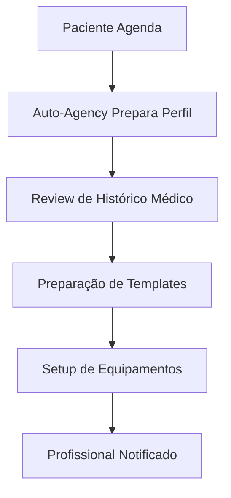
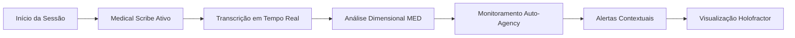
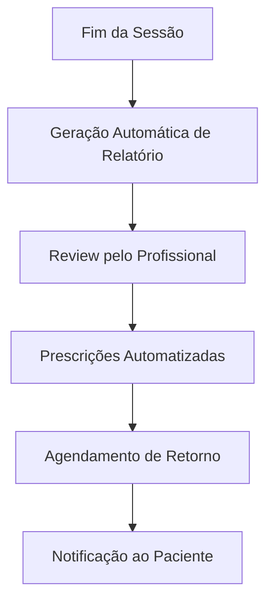
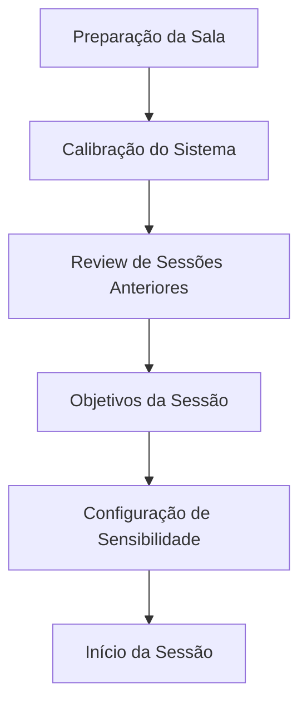
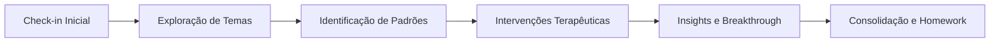
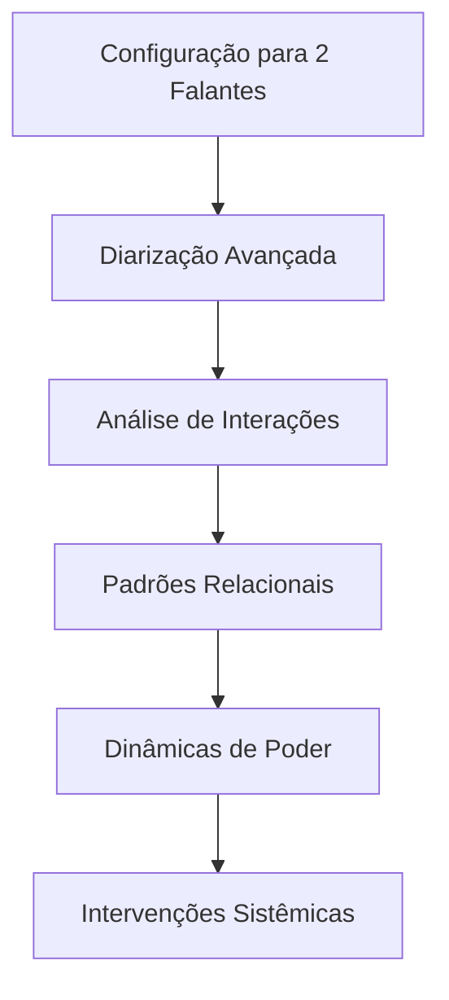
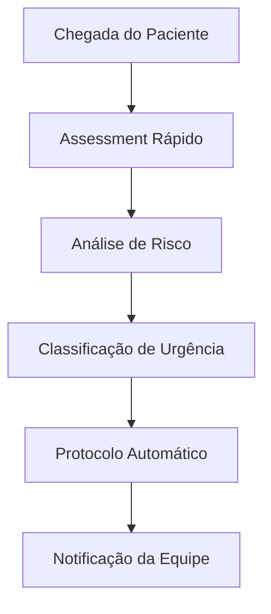
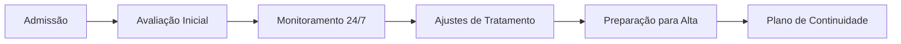
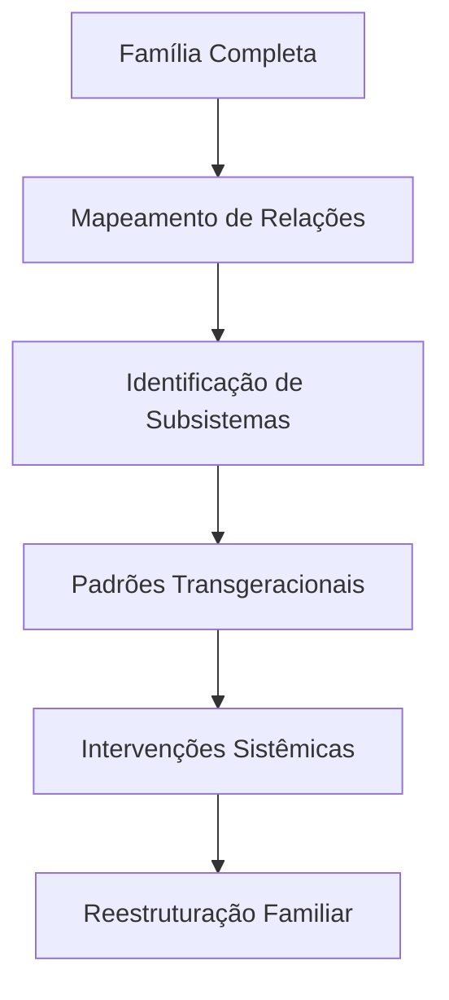

# Fluxos de Trabalho Clínicos - VOITHER

> **"Integrando IA na Prática Clínica Real"**
> 
> *Workflows otimizados que integram perfeitamente a tecnologia VOITHER na rotina dos profissionais de saúde mental*

---

## 🏥 Visão Geral dos Workflows Clínicos

Os fluxos de trabalho clínicos do VOITHER são projetados para se integrar naturalmente na prática dos profissionais de saúde mental, potencializando suas capacidades sem interromper o processo terapêutico natural.

### **Princípios dos Workflows**
- **Não-Intrusividade**: Tecnologia invisível durante a sessão
- **Eficiência**: Redução significativa de tarefas administrativas
- **Precisão**: Melhoria na qualidade da documentação
- **Personalização**: Adaptação ao estilo de cada profissional

---

## 👨‍⚕️ Workflow Psiquiátrico

### **1. 🩺 Consulta Inicial Psiquiátrica**

#### **Pré-Consulta (5 minutos)**


**Ações Automatizadas:**
- Auto-Agency revisa histórico médico do paciente
- Preparação automática de templates de anamnese
- Verificação de medicações atuais via Apothecary
- Setup automático do Medical Scribe para diarização

#### **Durante a Consulta (45-60 minutos)**


**Fluxo da Sessão:**
1. **Abertura**: Medical Scribe inicia automaticamente
2. **Anamnese**: Transcrição e extração de sintomas
3. **Exame Mental**: Análise dimensional em tempo real
4. **Discussão de Medicação**: Apothecary sugere interações
5. **Planejamento**: Auto-Agency propõe próximos passos

#### **Pós-Consulta (10 minutos)**


**Outputs Automáticos:**
- Relatório de consulta estruturado
- Prescrições com verificação de interações
- Agendamento inteligente de retorno
- Plano terapêutico documentado

### **2. 💊 Consulta de Acompanhamento Medicamentoso**

#### **Workflow Especializado**
```python
# Workflow de Acompanhamento
class MedicationFollowUp:
    def __init__(self):
        self.apothecary = ApothecaryEngine()
        self.med_engine = MEDEngine()
        self.auto_agency = AutoAgency()
    
    def pre_consultation_analysis(self, patient_id):
        # Análise prévia de adesão e efeitos
        adherence = self.apothecary.analyze_adherence(patient_id)
        side_effects = self.apothecary.detect_side_effects(patient_id)
        efficacy = self.apothecary.assess_efficacy(patient_id)
        
        return {
            'adherence_score': adherence,
            'detected_side_effects': side_effects,
            'efficacy_indicators': efficacy,
            'recommendations': self.generate_recommendations()
        }
```

**Foco da Consulta:**
- **Adesão**: Monitoramento automático de compliance
- **Efeitos Colaterais**: Detecção via análise dimensional
- **Eficácia**: Avaliação objetiva de melhora
- **Ajustes**: Sugestões baseadas em evidências

---

## 🧠 Workflow Psicoterapêutico

### **1. 💬 Sessão de Psicoterapia Individual**

#### **Setup Pré-Sessão**


**Preparativos Automáticos:**
- Holofractor carrega perfil dimensional do paciente
- BRRE Engine revisa padrões emergentes anteriores
- Auto-Agency identifica objetivos terapêuticos prioritários
- Medical Scribe configura sensibilidade para abordagem terapêutica

#### **Fluxo Terapêutico**


**Monitoramento Inteligente:**
- **Padrões Emocionais**: Detecção de mudanças de humor
- **Resistências**: Identificação de bloqueios terapêuticos
- **Breakthroughs**: Reconhecimento de momentos de insight
- **Transferência**: Análise de dinâmicas relacionais

#### **Abordagens Específicas**

##### **TCC (Terapia Cognitivo-Comportamental)**
```python
class CBTWorkflow:
    def __init__(self):
        self.thought_analyzer = ThoughtAnalyzer()
        self.behavior_tracker = BehaviorTracker()
        self.homework_generator = HomeworkGenerator()
    
    def analyze_cognitive_patterns(self, transcript):
        # Identifica pensamentos disfuncionais
        distortions = self.thought_analyzer.detect_distortions(transcript)
        
        # Sugere reestruturações cognitivas
        restructuring = self.thought_analyzer.suggest_restructuring(distortions)
        
        return {
            'identified_distortions': distortions,
            'suggested_restructuring': restructuring,
            'homework_suggestions': self.homework_generator.create_assignments()
        }
```

##### **Psicanálise**
```python
class PsychoanalysisWorkflow:
    def __init__(self):
        self.brre_engine = BRREEngine()
        self.transference_analyzer = TransferenceAnalyzer()
        self.unconscious_detector = UnconsciousDetector()
    
    def analyze_session(self, transcript):
        # Detecta conteúdos inconscientes emergentes
        unconscious_content = self.unconscious_detector.analyze(transcript)
        
        # Analisa dinâmicas transferenciais
        transference = self.transference_analyzer.assess(transcript)
        
        # Insights bergsonianos sobre temporalidade
        temporal_insights = self.brre_engine.analyze_duration(transcript)
        
        return {
            'unconscious_insights': unconscious_content,
            'transference_patterns': transference,
            'temporal_analysis': temporal_insights
        }
```

### **2. 👥 Terapia de Casal**

#### **Workflow Específico para Casais**


**Recursos Especializados:**
- **Diarização Dual**: Separação precisa entre os parceiros
- **Análise de Interações**: Padrões de comunicação
- **Detecção de Conflitos**: Escalação e desescalação
- **Momentos de Conexão**: Identificação de sincronias positivas

#### **Métricas Relacionais**
- **Simetria Comunicacional**: Balanceamento entre parceiros
- **Padrões de Interrupção**: Análise de dominância conversacional
- **Sincronização Emocional**: Momentos de alinhamento afetivo
- **Ciclos Disfuncionais**: Identificação de padrões repetitivos

---

## 🏥 Workflow Hospitalar

### **1. 🚨 Emergência Psiquiátrica**

#### **Triagem Inicial (5 minutos)**


**Avaliação Automatizada:**
```python
class EmergencyTriage:
    def __init__(self):
        self.risk_assessor = RiskAssessment()
        self.protocol_engine = ProtocolEngine()
        self.notification_system = NotificationSystem()
    
    def rapid_assessment(self, initial_interview):
        # Análise dimensional ultrarrápida
        dimensional_profile = self.med_engine.quick_analysis(initial_interview)
        
        # Avaliação de risco suicida/homicida
        risk_level = self.risk_assessor.assess(dimensional_profile)
        
        # Ativação de protocolos
        if risk_level == 'HIGH':
            self.protocol_engine.activate_emergency_protocol()
            self.notification_system.alert_psychiatrist()
        
        return risk_level
```

#### **Classificação de Prioridade**
- **Prioridade 1**: Risco iminente de vida (suicídio/homicídio)
- **Prioridade 2**: Agitação psicomotora grave
- **Prioridade 3**: Sintomas psicóticos agudos
- **Prioridade 4**: Crise emocional sem risco imediato

### **2. 🛏️ Internação Psiquiátrica**

#### **Monitoramento Contínuo**


**Sistema de Vigilância:**
- **Rounds Digitais**: Avaliações regulares automatizadas
- **Detecção de Deterioração**: Alertas para piora clínica
- **Melhora Significativa**: Identificação de momentos para alta
- **Interações Medicamentosas**: Monitoramento contínuo

---

## 👨‍👩‍👧‍👦 Workflow Familiar

### **1. 🧒 Terapia Infantil**

#### **Adaptações para Crianças**
```python
class ChildTherapyWorkflow:
    def __init__(self):
        self.child_analyzer = ChildSpecificAnalyzer()
        self.parent_involvement = ParentInvolvementManager()
        self.developmental_tracker = DevelopmentalTracker()
    
    def analyze_child_session(self, transcript, age):
        # Análise adaptada para desenvolvimento infantil
        developmental_analysis = self.child_analyzer.analyze(transcript, age)
        
        # Envolvimento parental apropriado
        parent_guidance = self.parent_involvement.generate_guidance(developmental_analysis)
        
        return {
            'developmental_insights': developmental_analysis,
            'parent_recommendations': parent_guidance,
            'play_therapy_suggestions': self.generate_play_interventions()
        }
```

**Características Especiais:**
- **Linguagem Simplificada**: Adaptação vocabular para idade
- **Análise de Brincadeiras**: Interpretação de atividades lúdicas
- **Envolvimento Parental**: Orientações para os pais
- **Marcos Desenvolvimentais**: Monitoramento de progresso

### **2. 👨‍👩‍👧 Terapia Familiar Sistêmica**

#### **Análise Sistêmica**


**Análises Específicas:**
- **Genograma Digital**: Mapeamento automático de relações
- **Coalizões e Alianças**: Detecção de subfamílias
- **Padrões Comunicacionais**: Estilos de comunicação familiar
- **Rituais e Mitos**: Identificação de tradições familiares

---

## 📊 Métricas de Workflow

### **Indicadores de Eficiência**

#### **Tempo de Documentação**
- **Baseline (Manual)**: 15-20 minutos por sessão
- **Com VOITHER**: 3-5 minutos de revisão
- **Redução**: 70-80% do tempo documental
- **Qualidade**: Aumento de 40% na completude

#### **Precisão Diagnóstica**
- **Concordância Inter-avaliadores**: Aumento de 25%
- **Detecção Precoce**: 60% mais rápida para episódios
- **Falsos Positivos**: Redução de 35%
- **Satisfação Profissional**: Score 4.7/5

### **Indicadores Clínicos**
- **Tempo até Estabilização**: Redução média de 30%
- **Readmissões**: Diminuição de 25%
- **Adesão ao Tratamento**: Aumento de 40%
- **Satisfação do Paciente**: Score 4.6/5

---

## 🔧 Customização de Workflows

### **Configuração por Especialidade**

#### **Templates Personalizáveis**
```json
{
  "specialty": "psychiatry",
  "session_type": "follow_up",
  "components": {
    "medical_scribe": {
      "focus": ["medication_effects", "symptom_tracking"],
      "sensitivity": "high_medical_terminology"
    },
    "auto_agency": {
      "alerts": ["medication_interaction", "risk_assessment"],
      "recommendations": "evidence_based"
    },
    "holofractor": {
      "visualization": "medication_response_tracking",
      "timeframe": "last_3_sessions"
    }
  }
}
```

#### **Adaptação Institucional**
- **Protocolos Locais**: Integração com diretrizes institucionais
- **Fluxos Existentes**: Adaptação a workflows pré-existentes
- **Preferências Profissionais**: Personalização por usuário
- **Regulamentações**: Compliance com normas locais

---

## 🚀 Evolução dos Workflows

### **Aprendizado Contínuo**
- **Pattern Recognition**: Identificação de melhores práticas
- **Optimization**: Otimização baseada em outcomes
- **Adaptation**: Adaptação a mudanças na prática
- **Innovation**: Desenvolvimento de novos workflows

### **Futuras Implementações**
- **Workflows de Grupo**: Terapias grupais especializadas
- **Teletherapy Integration**: Otimização para atendimento remoto
- **Preventive Care**: Workflows para prevenção
- **Research Integration**: Coleta de dados para pesquisa

---

*Os workflows clínicos do VOITHER são vivos e adaptativos, evoluindo continuamente para servir melhor aos profissionais e, em última instância, aos pacientes.*