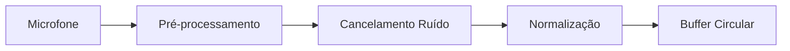
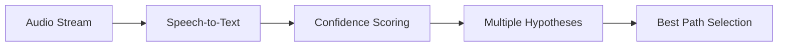
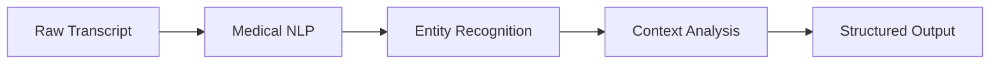

# Medical Scribe AI - Transcrição Médica Inteligente

> **"Transformando Voz em Conhecimento Clínico"**
> 
> *Sistema de transcrição médica automatizada com precisão clínica e inteligência contextual*

---

## 🎤 Visão Geral do Medical Scribe

O Medical Scribe AI é o componente de entrada de dados do ecossistema VOITHER, responsável por capturar, processar e converter consultas médicas faladas em documentação clínica estruturada. É a ponte entre a prática clínica natural e a análise dimensional automatizada.

### **Missão Principal**
Eliminar a barreira documental entre profissionais de saúde mental e seus pacientes, permitindo que terapeutas se concentrem completamente na interação humana enquanto toda a documentação é gerada automaticamente com precisão clínica.

---

## 🎯 Funcionalidades Principais

### **1. 🎙️ Transcrição em Tempo Real**

#### **Captura de Áudio de Alta Qualidade**
- **Múltiplos Microfones**: Suporte para configurações mono e estéreo
- **Cancelamento de Ruído**: Filtros avançados para ambientes clínicos
- **Normalização de Volume**: Ajuste automático para diferentes falantes
- **Backup de Segurança**: Gravação redundante para garantir dados

#### **Processamento de Voz Avançado**
- **Precisão >95%**: Taxa de acurácia superior a sistemas convencionais
- **Latência Mínima**: Processamento com delay <2 segundos
- **Múltiplos Idiomas**: Português, inglês, espanhol (expansível)
- **Dialetos Regionais**: Adaptação para variações linguísticas locais

#### **Tecnologias de Base**
- **Azure Speech Services**: Engine principal de reconhecimento
- **Google Cloud Speech-to-Text**: Sistema de backup e validação
- **Whisper OpenAI**: Processamento local para dados sensíveis
- **Modelos Customizados**: Treinamento específico para terminologia médica

### **2. 👥 Diarização de Falantes (Speaker Diarization)**

#### **Identificação Automática**
- **Separação Automática**: Distinção entre paciente e terapeuta
- **Múltiplos Participantes**: Suporte para sessões familiares/grupais
- **Treinamento Adaptativo**: Melhoria contínua por sessão
- **Perfis de Voz**: Criação de assinaturas vocais únicas

#### **Rotulação Inteligente**
- **Falante Principal**: Identificação automática do terapeuta
- **Contexto Hierárquico**: Reconhecimento de dinâmicas de poder
- **Marcadores Temporais**: Timestamps precisos para cada intervenção
- **Análise de Sobreposições**: Processamento de falas simultâneas

#### **Algoritmos de Diferenciação**
```python
# Exemplo de pipeline de diarização
def speaker_diarization(audio_stream):
    # 1. Segmentação de voz
    voice_segments = voice_activity_detection(audio_stream)
    
    # 2. Extração de características
    features = extract_mfcc_features(voice_segments)
    
    # 3. Clustering de falantes
    speaker_clusters = perform_clustering(features)
    
    # 4. Rotulação baseada em contexto
    labeled_segments = assign_speaker_labels(speaker_clusters)
    
    return labeled_segments
```

### **3. 🧠 Processamento de Linguagem Natural Médico**

#### **Terminologia Médica Especializada**
- **Dicionário Clínico**: Base de >50,000 termos médicos especializados
- **Siglas e Abreviações**: Reconhecimento automático de DSM-5, CID-11
- **Medicamentos**: Base atualizada de nomes comerciais e genéricos
- **Procedimentos**: Vocabulário de intervenções terapêuticas

#### **Correção Contextual**
- **Autocorreção Médica**: Ajustes baseados em contexto clínico
- **Desambiguação**: Resolução de homônimos médicos
- **Completação Inteligente**: Sugestões de termos técnicos
- **Validação Semântica**: Verificação de coerência médica

#### **Análise de Conteúdo Clínico**
- **Detecção de Sintomas**: Identificação automática de sinais/sintomas
- **Extração de Medicamentos**: Captura de prescrições e dosagens
- **Cronologia Médica**: Sequenciamento temporal de eventos
- **Gravidade Clínica**: Classificação automática de urgência

---

## 🔧 Arquitetura Técnica

### **Pipeline de Processamento**

#### **1. Camada de Captura**


#### **2. Camada de Reconhecimento**


#### **3. Camada de Inteligência**


### **Integração com Ecossistema VOITHER**

#### **Output para MED Engine**
- **Texto Limpo**: Transcrição formatada para análise dimensional
- **Metadados Temporais**: Timestamps para sincronização
- **Marcadores de Falante**: Identificação para análise contextual
- **Indicadores de Qualidade**: Scores de confiança por segmento

#### **Interface com Holofractor**
- **Eventos de Sessão**: Marcadores para visualização temporal
- **Pontos de Interesse**: Momentos significativos identificados
- **Correlação Visual**: Sincronização com representações 3D
- **Anotações Automáticas**: Geração de tags para navegação

---

## 📋 Geração de Documentação Clínica

### **1. 📄 Notas SOAP Automáticas**

#### **Estrutura SOAP**
- **Subjetivo**: Queixas e relatos do paciente
- **Objetivo**: Observações do profissional
- **Avaliação**: Interpretações e hipóteses diagnósticas
- **Plano**: Intervenções e próximos passos

#### **Extração Inteligente**
```python
def generate_soap_note(transcript, speaker_labels):
    soap_note = {
        'subjective': extract_patient_complaints(transcript),
        'objective': extract_therapist_observations(transcript),
        'assessment': generate_clinical_assessment(transcript),
        'plan': extract_treatment_plans(transcript)
    }
    return soap_note
```

### **2. 📊 Relatórios DAP (Data, Assessment, Plan)**

#### **Formato DAP**
- **Data**: Informações objetivas da sessão
- **Assessment**: Avaliação clínica profissional
- **Plan**: Planejamento terapêutico

#### **Geração Automática**
- **Extração de Dados**: Automatização da seção de dados
- **Sugestões de Avaliação**: IA auxiliando interpretação
- **Recomendações de Plano**: Sugestões baseadas em evidências
- **Template Customizável**: Adaptação para diferentes abordagens

### **3. 🏥 Integração FHIR**

#### **Recursos FHIR Gerados**
- **Encounter**: Registro do encontro clínico
- **Observation**: Observações clínicas estruturadas
- **Condition**: Condições identificadas
- **MedicationRequest**: Prescrições geradas

#### **Mapeamento Automático**
```json
{
  "resourceType": "Encounter",
  "status": "finished",
  "class": {
    "system": "http://terminology.hl7.org/CodeSystem/v3-ActCode",
    "code": "AMB",
    "display": "ambulatory"
  },
  "type": [{
    "coding": [{
      "system": "http://snomed.info/sct",
      "code": "185349003",
      "display": "Encounter for 'psychotherapy'"
    }]
  }]
}
```

---

## 🛡️ Segurança e Privacidade

### **Proteção de Dados**

#### **Criptografia End-to-End**
- **Transmissão**: TLS 1.3 para dados em trânsito
- **Armazenamento**: AES-256 para dados em repouso
- **Processamento**: Ambientes seguros e isolados
- **Backup**: Criptografia multicamada para backups

#### **Compliance Regulatório**
- **HIPAA**: Conformidade total com regulamentações americanas
- **LGPD**: Adequação à Lei Geral de Proteção de Dados
- **GDPR**: Conformidade com regulamentação europeia
- **ISO 27001**: Certificação de segurança da informação

### **Controle de Acesso**

#### **Autenticação Multifator**
- **Biometria**: Reconhecimento facial/impressão digital
- **Tokens**: Autenticação baseada em hardware
- **Certificados**: PKI para identificação institucional
- **SAML/OAuth**: Integração com sistemas corporativos

#### **Auditoria Completa**
- **Logs de Acesso**: Registro de todas as interações
- **Trilha de Auditoria**: Rastreamento de modificações
- **Alertas de Segurança**: Notificação de acessos anômalos
- **Compliance Reporting**: Relatórios automáticos de conformidade

---

## 📊 Métricas e Qualidade

### **Indicadores de Performance**

#### **Precisão de Transcrição**
- **Word Error Rate (WER)**: <5% para fala clara
- **Medical Term Accuracy**: >98% para terminologia médica
- **Speaker Attribution**: >95% de acurácia na diarização
- **Real-time Factor**: <0.3 (processamento mais rápido que fala)

#### **Qualidade de Documentação**
- **Completude**: >90% de informações clínicas capturadas
- **Estruturação**: >95% de notas corretamente formatadas
- **Relevância Clínica**: Score médio 4.8/5 por profissionais
- **Tempo de Revisão**: Redução de 70% vs documentação manual

### **Monitoramento Contínuo**

#### **Feedback Loop**
- **Correções Profissionais**: Aprendizado com ajustes manuais
- **Validação Cruzada**: Comparação com múltiplos engines
- **A/B Testing**: Experimentação contínua de melhorias
- **Update Automático**: Deployment contínuo de melhorias

---

## 🎯 Casos de Uso Específicos

### **1. 👨‍⚕️ Psiquiatria**

#### **Consultas de Acompanhamento**
- **Monitoramento de Medicação**: Captura de efeitos e reações
- **Avaliação de Sintomas**: Documentação de mudanças clínicas
- **Risco Suicida**: Detecção automática de indicadores
- **Compliance**: Monitoramento de adesão ao tratamento

#### **Especializações**
- **Psicogeriatria**: Adaptação para déficits cognitivos
- **Psiquiatria Infantil**: Linguagem apropriada para crianças
- **Emergências**: Protocolos para situações de crise
- **Forense**: Documentação para contextos legais

### **2. 🧠 Psicoterapia**

#### **Diferentes Abordagens**
- **TCC**: Identificação de pensamentos disfuncionais
- **Psicanálise**: Captura de associações livres
- **Humanística**: Foco em experiências subjetivas
- **Sistêmica**: Dinâmicas familiares e relacionais

#### **Modalidades**
- **Individual**: Foco na relação terapêutica bilateral
- **Casal**: Captura de dinâmicas relacionais
- **Família**: Múltiplos falantes e hierarquias
- **Grupo**: Interações complexas multi-participante

### **3. 🏥 Contextos Institucionais**

#### **Hospitais**
- **Urgência/Emergência**: Triagem psiquiátrica rápida
- **Enfermaria**: Acompanhamento de internação
- **CTI**: Suporte para delirium e confusão
- **Interconsulta**: Avaliações especializadas

#### **Ambulatorial**
- **Primeira Consulta**: Anamnese estruturada completa
- **Retornos**: Acompanhamento evolutivo
- **Grupos Terapêuticos**: Dinâmicas de grupo
- **Supervisão**: Ensino e orientação profissional

---

## 🚀 Inovações Futuras

### **Versão 2.0 - IA Conversacional**
- **Chatbot Integrado**: Assistente IA para profissionais
- **Sugestões Contextuais**: Perguntas sugeridas em tempo real
- **Auto-completar**: Antecipação de documentação
- **Síntese Inteligente**: Resumos automáticos de sessões

### **Versão 3.0 - Análise Multimodal**
- **Processamento de Vídeo**: Análise de expressões faciais
- **Biosinais**: Integração com sensores de ansiedade
- **Ambiente Contextual**: Análise do setting terapêutico
- **Realidade Aumentada**: Informações sobrepostas em tempo real

### **Integração IoT**
- **Smartwatches**: Monitoramento contínuo de sinais vitais
- **Sensores Ambientais**: Qualidade do ar, luminosidade
- **Dispositivos Móveis**: Análise de padrões de uso
- **Casa Conectada**: Monitoramento de rotinas domésticas

---

## 🎓 Treinamento e Implementação

### **Onboarding Profissional**
- **Tutorial Interativo**: Guia passo-a-passo personalizado
- **Simulação de Casos**: Prática em ambiente controlado
- **Certificação**: Programa de competência certificada
- **Suporte Contínuo**: Help desk especializado 24/7

### **Customização Institucional**
- **Templates Personalizados**: Adaptação para fluxos específicos
- **Integração EHR**: Conexão com sistemas existentes
- **Workflows Customizados**: Adaptação para processos únicos
- **Treinamento em Local**: Implementação assistida

---

*O Medical Scribe AI liberta profissionais da documentação mecânica, permitindo foco total na arte de curar mentes.*