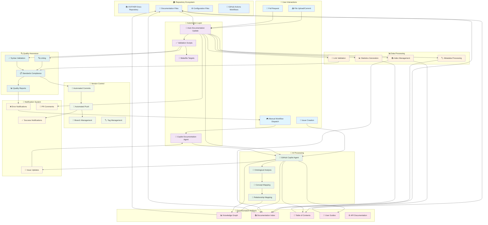
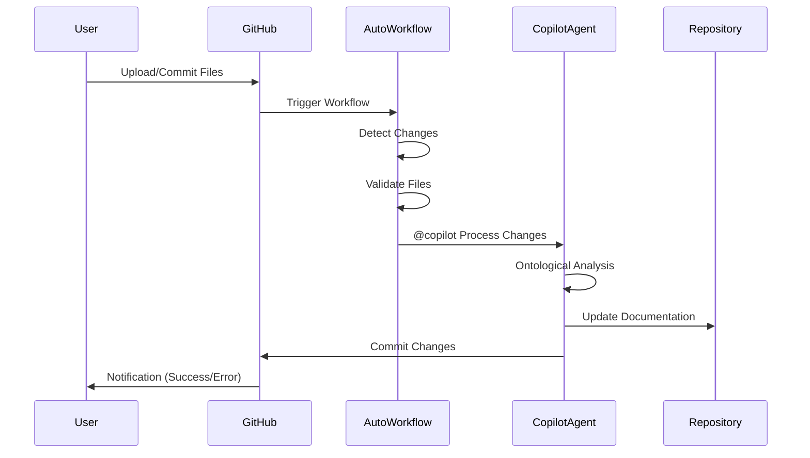
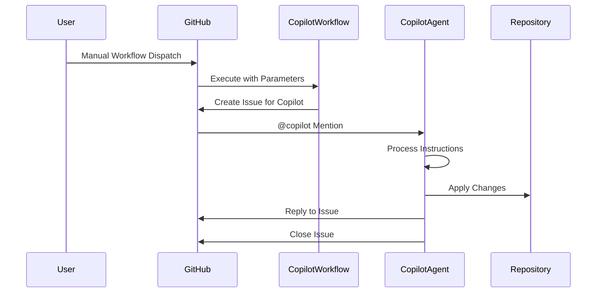
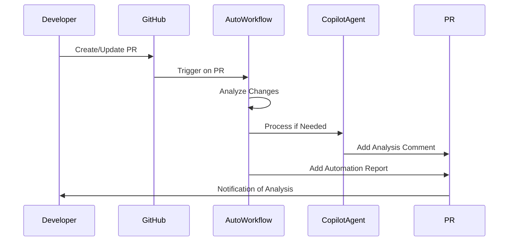
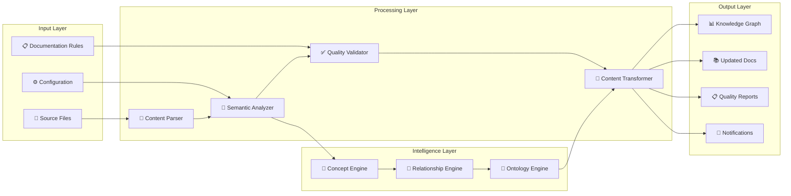
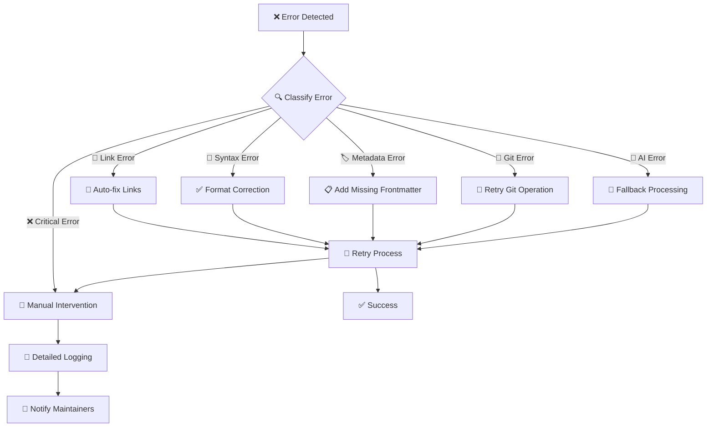

# 🌐 Complete System Flow

## Visão Sistêmica Completa da Automação VOITHER

Este diagrama mostra a **arquitetura completa** do sistema de automação, desde o upload até a manutenção contínua.



## 🔄 Fluxos de Execução Detalhados

### **1. Fluxo de Upload/Commit Padrão**



### **2. Fluxo de Manual Dispatch**



### **3. Fluxo de Pull Request**



## 🏗️ Arquitetura de Componentes

### **🔧 Core Processing Components**

#### **1. Detection Engine**
```python
# Pseudo-código do mecanismo de detecção
class ChangeDetectionEngine:
    def detect_changes(self, commit_sha):
        changed_files = git.diff(commit_sha, "HEAD~1")
        relevant_files = filter_by_extensions(changed_files, MONITORED_EXTENSIONS)
        change_types = classify_changes(relevant_files)
        return ChangeAnalysis(files=relevant_files, types=change_types)
```

#### **2. Ontological Processor**
```python
# Pseudo-código do processador ontológico
class OntologicalProcessor:
    def analyze_concepts(self, content):
        concepts = extract_concepts(content)
        equivalent_concepts = find_equivalencies(concepts)
        relationships = map_relationships(concepts)
        return ConceptualAnalysis(concepts, equivalent_concepts, relationships)
```

#### **3. Knowledge Graph Updater**
```python
# Pseudo-código do atualizador de knowledge graph
class KnowledgeGraphUpdater:
    def update_graph(self, conceptual_analysis):
        existing_graph = load_knowledge_graph()
        updated_graph = merge_concepts(existing_graph, conceptual_analysis)
        validate_consistency(updated_graph)
        save_knowledge_graph(updated_graph)
        return UpdateResult(success=True, changes=get_changes())
```

### **📊 Data Flow Architecture**



## ⚡ Performance e Escalabilidade

### **📊 Métricas de Performance**

| Componente | Tempo Médio | Throughput | Escalabilidade |
|------------|-------------|------------|---------------|
| **Change Detection** | < 10s | 100+ files/s | Linear |
| **Content Parsing** | 1-2s/file | 50 files/min | Linear |
| **Ontological Analysis** | 30s-2min | 10-20 concepts/min | Logarítmica |
| **Knowledge Graph Update** | 10-30s | 5-10 updates/min | Constante |
| **Quality Validation** | 5-15s | 20-50 files/min | Linear |

### **🔄 Scaling Strategy**

#### **Horizontal Scaling**
- **Parallel Processing**: Múltiplos runners para diferentes tipos de arquivo
- **Distributed Analysis**: Análise ontológica distribuída por conceitos
- **Caching Layer**: Redis para resultados de análise frequentes

#### **Vertical Scaling**
- **Resource Optimization**: Algoritmos otimizados para análise semântica
- **Memory Management**: Processamento incremental para grandes repositórios
- **CPU Utilization**: Multi-threading para operações independentes

## 🛡️ Error Handling & Resilience

### **🔧 Error Recovery Mechanisms**



### **📋 Error Classification and Response**

| Tipo de Erro | Severidade | Resposta Automática | Intervenção Manual |
|--------------|------------|-------------------|-------------------|
| **Links Quebrados** | ⚠️ Warning | Auto-correção quando possível | Complexos apenas |
| **Frontmatter Faltante** | ⚠️ Warning | Adição automática | Nunca |
| **Sintaxe Markdown** | ⚠️ Warning | Correção automática | Casos complexos |
| **Erro de Git** | 🚨 Error | Retry automático 3x | Após falhas |
| **Falha de AI** | 🚨 Error | Fallback para regras simples | Análise complexa |
| **Erro de Permissão** | 🚨 Critical | Log detalhado | Sempre |

---

**Resultado**: Um sistema robusto, inteligente e autossustentável que mantém a documentação sempre atualizada e de alta qualidade! 🌟