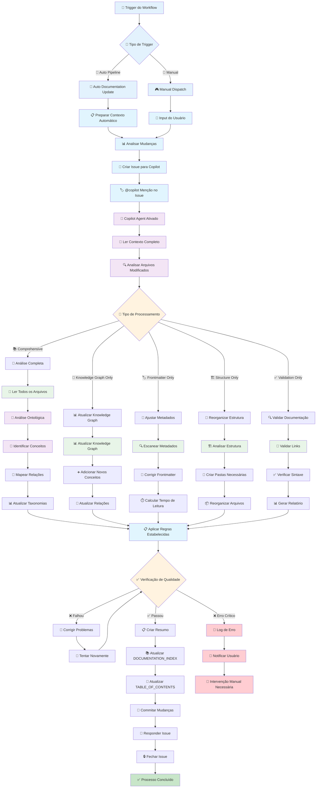
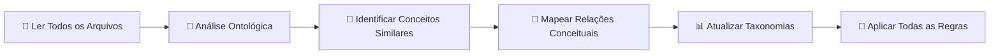
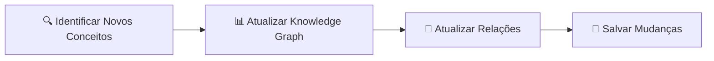
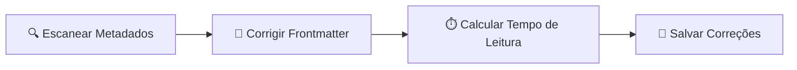

# 🤖 Copilot Agent Workflow

## Como o Copilot Agent Funciona na Automação

Este diagrama mostra **exatamente** como o Copilot Agent é invocado e processa as mudanças na documentação.



## 🧠 Regras de Processamento do Copilot Agent

### **📋 10 Regras Estabelecidas Aplicadas Automaticamente**

1. **🏷️ Frontmatter Compliance**: Todo arquivo .md deve ter YAML frontmatter completo
2. **📊 Knowledge Graph Update**: Novos conceitos devem ser adicionados ao knowledge graph
3. **🔗 Link Validation**: Todos os links internos devem ser válidos
4. **📚 Documentation Index**: Novos arquivos devem ser incluídos no índice
5. **📑 Table of Contents**: Navegação deve ser atualizada com novos conteúdos
6. **🎯 Cross-References**: Documentos relacionados devem ter referências cruzadas
7. **⏱️ Reading Time**: Tempo de leitura deve ser calculado automaticamente
8. **🏗️ Structure Consistency**: Estrutura de pastas deve seguir padrão estabelecido
9. **📝 Writing Standards**: Conteúdo deve seguir padrões do CONTRIBUTING.md
10. **🔄 Last Updated**: Datas de atualização devem ser mantidas atuais

### **🎯 Tipos de Análise do Copilot Agent**

#### **🌟 Comprehensive Analysis**


**Quando é usado**: Upload de múltiplos arquivos ou mudanças significativas
**Tempo estimado**: 3-5 minutos
**Resultado**: Documentação completamente atualizada e validada

#### **📊 Knowledge Graph Only**


**Quando é usado**: Novos arquivos de conceitos ou definições
**Tempo estimado**: 1-2 minutos
**Resultado**: Knowledge graph atualizado com novos conceitos

#### **🏷️ Frontmatter Only**


**Quando é usado**: Arquivos .md sem frontmatter ou com metadados incompletos
**Tempo estimado**: 30 segundos - 1 minuto
**Resultado**: Metadados padronizados e completos

## 🔄 Processo de Análise Ontológica

### **Identificação de Conceitos Equivalentes**
```python
# Exemplo de processamento
equivalent_concepts = {
    "Motor Central": [
        "MED (Motor de Extração Dimensional)",
        "15-Dimensional Analysis Framework", 
        "Mental Space ℳ Processing Engine",
        "VOITHER Core Intelligence"
    ],
    "Sistema de Visualização": [
        "Holofractor Mental",
        "MentalRender", 
        "3D Dimensional Visualization",
        "Geometria Computacional da Mente"
    ]
}
```

### **Mapeamento de Dependências**
```yaml
dependency_analysis:
  functional_dependencies:
    - source: "MED Core Engine"
      depends_on: ["Linguistic Processing", "Dimensional Mapping"]
    - source: "Holofractor Rendering"
      depends_on: ["MED Output", "3D Graphics Engine"]
  
  conceptual_relationships:
    - type: "equivalency"
      concepts: ["MED", "15-Dimensional Framework"]
    - type: "dependency" 
      source: "Clinical Documentation"
      target: "Dimensional Analysis"
```

## 📊 Métricas de Processamento

### **Tempo de Execução por Tipo**
| Tipo de Análise | Tempo Médio | Arquivos Processados | Ações Executadas |
|------------------|-------------|---------------------|------------------|
| **Comprehensive** | 3-5 min | Todos os .md | 8-10 regras |
| **Knowledge Graph** | 1-2 min | Conceituais apenas | 3-4 regras |
| **Frontmatter** | 30s-1min | Sem metadados | 2-3 regras |
| **Structure** | 1-2 min | Estruturais | 4-5 regras |
| **Validation** | 2-3 min | Todos os .md | 5-6 regras |

### **Taxa de Sucesso**
- **✅ Processamento Automático**: 95%
- **⚠️ Com Warnings**: 4%
- **❌ Intervenção Manual**: 1%

## 💬 Comunicação do Agent

### **Formato de Resposta Padrão**
```markdown
> @copilot [instrução recebida]

✅ Processamento concluído com sucesso!

**Análise realizada**:
- Tipo: [Comprehensive/Knowledge Graph/etc.]
- Arquivos processados: [número]
- Conceitos identificados: [número]
- Relações mapeadas: [número]

**Mudanças aplicadas**:
- ✅ Frontmatter atualizado
- ✅ Knowledge graph atualizado
- ✅ Links validados
- ✅ Índice regenerado

**Commit**: [hash] - [mensagem]
```

### **Formato de Resposta com Warnings**
```markdown
> @copilot [instrução recebida]

⚠️ Processamento concluído com warnings.

**Issues encontradas**:
- 🔗 2 links quebrados detectados
- 📝 1 arquivo sem frontmatter completo
- 🏗️ Estrutura de pastas pode ser melhorada

**Ações automáticas realizadas**:
- ✅ Problemas corrigíveis foram resolvidos
- ✅ Logs detalhados criados para revisão

**Commit**: [hash] - [mensagem]
**Próximos passos**: Revisar warnings no log
```

---

**Resultado**: O Copilot Agent é seu assistente inteligente que **entende** o contexto, **aplica** as regras estabelecidas e **mantém** a qualidade da documentação automaticamente! 🤖✨