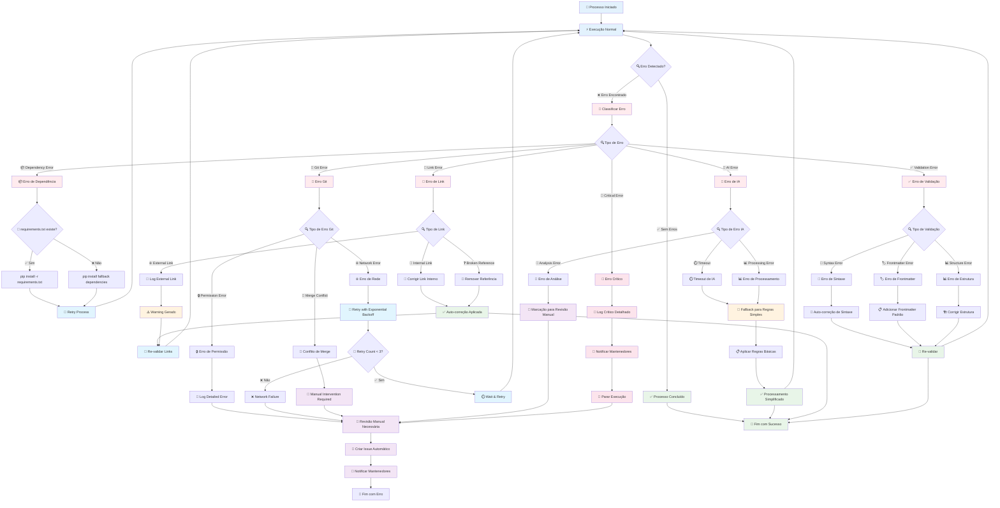
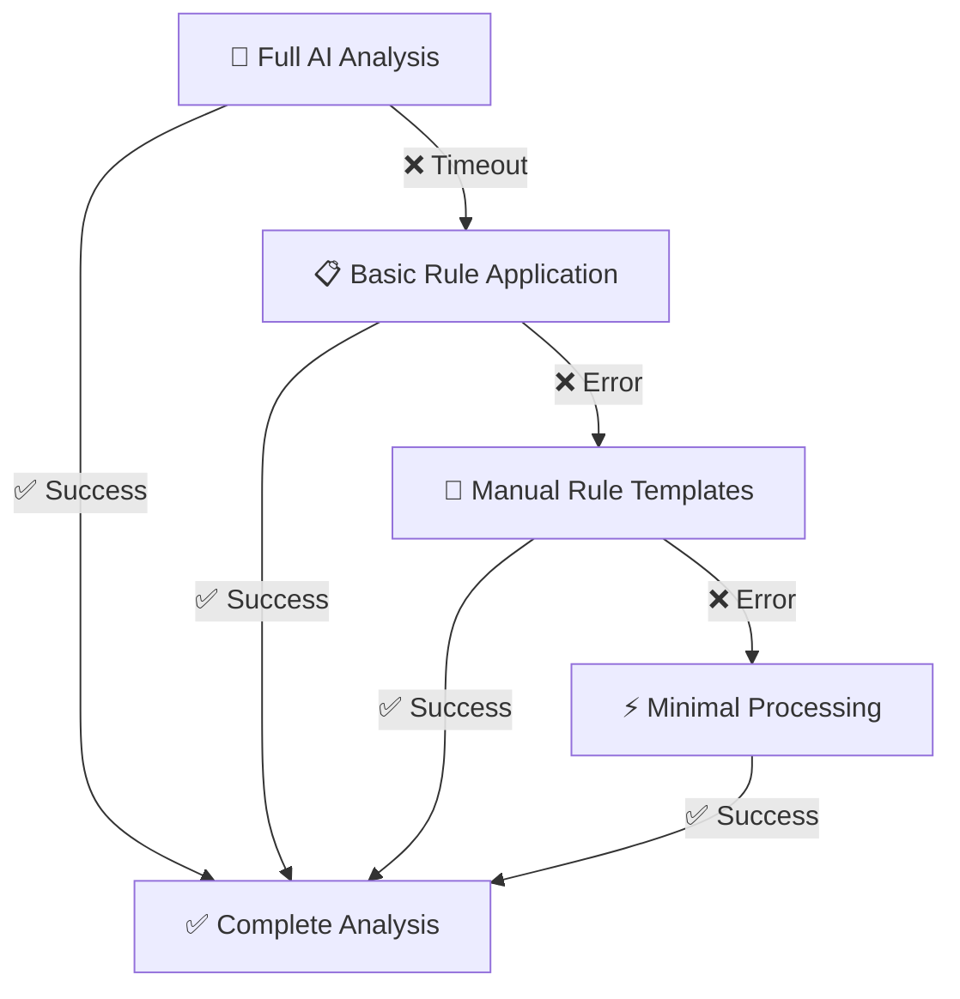

# 🛡️ Error Handling & Fallbacks

## Sistema de Tratamento de Erros e Recuperação

Este diagrama mostra como o sistema lida com diferentes tipos de erros e implementa mecanismos de fallback.



## 🎯 Estratégias de Recuperação por Tipo de Erro

### **📦 Dependency Errors**

#### **Cenário**: requirements.txt não encontrado
```bash
# Fallback automático implementado
if [ ! -f requirements.txt ]; then
    echo "Installing fallback dependencies..."
    pip install requests pyyaml python-frontmatter markdownify beautifulsoup4
else
    pip install -r requirements.txt
fi
```

#### **Ações de Recuperação**:
1. ✅ **Verificação automática** da existência do arquivo
2. 🔄 **Instalação de fallback** com dependências essenciais
3. 📝 **Log detalhado** da estratégia utilizada
4. ⚡ **Continuação** do processo normalmente

### **🔗 Link Validation Errors**

#### **Matrix de Tratamento de Links**:

| Tipo de Link | Ação Automática | Fallback | Log Level |
|--------------|----------------|----------|-----------|
| **Link interno quebrado** | Corrigir automaticamente | Remover link | Warning |
| **Referência a arquivo movido** | Atualizar caminho | Criar redirect | Info |
| **Link externo morto** | Marcar como warning | Manter link | Warning |
| **Ancor inexistente** | Criar ancor ou remover | Remover link | Warning |

#### **Exemplo de Auto-correção**:
```python
# Pseudo-código de correção automática
def fix_broken_link(broken_link, available_files):
    # Tentar correspondência fuzzy
    best_match = find_fuzzy_match(broken_link, available_files)
    if similarity_score(broken_link, best_match) > 0.8:
        return update_link(broken_link, best_match)
    else:
        return mark_for_manual_review(broken_link)
```

### **💾 Git Operation Errors**

#### **🔒 Permission Errors**
```bash
# Estratégia de fallback para permissões
if ! git push; then
    echo "Permission denied - creating detailed log"
    git status > git_error_log.txt
    git diff --cached >> git_error_log.txt
    echo "Manual intervention required - see git_error_log.txt"
fi
```

#### **🌐 Network Errors com Exponential Backoff**
```python
# Estratégia de retry com backoff
def retry_git_operation(operation, max_retries=3):
    for attempt in range(max_retries):
        try:
            return operation()
        except NetworkError:
            wait_time = (2 ** attempt) * 5  # 5s, 10s, 20s
            time.sleep(wait_time)
    raise GitOperationFailed("Max retries exceeded")
```

### **🤖 AI Processing Errors**

#### **Fallback Hierarchy**:


#### **Implementação de Fallback**:
```python
# Estratégia de fallback em cascata
async def process_with_fallback(content):
    try:
        return await full_ai_analysis(content, timeout=300)
    except TimeoutError:
        return await basic_rule_application(content)
    except AIProcessingError:
        return apply_manual_templates(content)
    except Exception:
        return minimal_processing(content)
```

## 📊 Monitoramento e Alertas

### **🔔 Notification Matrix**

| Severidade | Trigger | Destinatário | Método | Frequência |
|------------|---------|--------------|--------|------------|
| **🟢 Info** | Processo completo | Logs apenas | Log file | Sempre |
| **🟡 Warning** | Links quebrados | Issue automático | GitHub Issue | Por batch |
| **🟠 Error** | Falha de componente | Mantenedores | Email + Issue | Imediato |
| **🔴 Critical** | Sistema indisponível | Admin + Dev Team | Slack + Email | Imediato |

### **📈 Error Tracking Dashboard**

#### **Métricas Coletadas**:
- **Taxa de Sucesso**: % de execuções sem erro
- **Tempo de Recuperação**: Tempo médio para resolver erros
- **Tipos de Erro Mais Comuns**: Ranking de frequência
- **Efetividade de Fallbacks**: % de recuperação automática

#### **Exemplo de Relatório**:
```yaml
error_report:
  period: "last_7_days"
  total_executions: 156
  success_rate: 94.2%
  errors:
    - type: "dependency_error"
      count: 3
      recovery_rate: 100%
      avg_recovery_time: "45s"
    - type: "link_validation_error" 
      count: 6
      recovery_rate: 83.3%
      avg_recovery_time: "2m 15s"
    - type: "ai_timeout"
      count: 2
      recovery_rate: 100%
      avg_recovery_time: "1m 30s"
```

## 🔧 Debugging e Troubleshooting

### **📝 Logs Estruturados**

#### **Formato de Log Padrão**:
```json
{
  "timestamp": "2025-01-19T10:30:00Z",
  "level": "ERROR",
  "component": "link_validator",
  "error_type": "broken_internal_link",
  "details": {
    "file": "docs/guide.md",
    "line": 42,
    "broken_link": "./missing-file.md",
    "suggested_fix": "./existing-file.md"
  },
  "recovery_action": "auto_fix_attempted",
  "recovery_success": true
}
```

### **🔍 Debug Mode**

#### **Ativação de Debug**:
```yaml
# .github/workflows/auto-documentation-update.yml
env:
  DEBUG_MODE: true
  VERBOSE_LOGGING: true
  ERROR_DETAIL_LEVEL: "maximum"
```

#### **Debug Output Exemplo**:
```bash
🔍 DEBUG: Starting documentation update process
📁 DEBUG: Found 23 changed files
🔍 DEBUG: Filtering by extensions: .md, .py, .js, .ts, .json, .yml, .yaml
📝 DEBUG: 18 files match monitoring criteria
🔧 DEBUG: Executing validation pipeline...
✅ DEBUG: Validation completed - 2 warnings, 0 errors
🤖 DEBUG: Invoking Copilot Agent with context...
📊 DEBUG: Knowledge graph updated with 5 new concepts
💾 DEBUG: Committing 12 modified files...
✅ DEBUG: Process completed successfully in 2m 34s
```

### **🚨 Emergency Procedures**

#### **Rollback Automático**:
```bash
# Script de rollback de emergência
#!/bin/bash
echo "🚨 EMERGENCY ROLLBACK INITIATED"
git log --oneline -n 5  # Mostrar últimos commits
git revert HEAD --no-edit  # Reverter último commit
git push origin main
echo "✅ Rollback completed - system restored to previous state"
```

#### **Modo Seguro (Safe Mode)**:
```yaml
# Configuração de modo seguro
safe_mode:
  enabled: true
  actions:
    - disable_auto_push
    - enable_manual_review
    - create_backup_branch
    - require_approval_for_changes
```

---

**Resultado**: Um sistema robusto que se recupera automaticamente da maioria dos erros e escala graciosamente quando intervenção manual é necessária! 🛡️✨