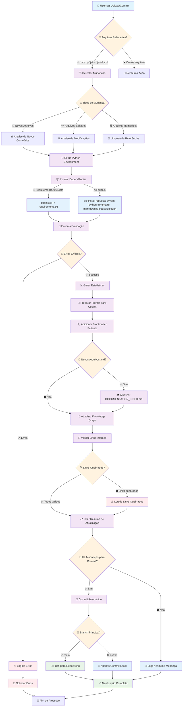

# 🔄 Main Automation Pipeline Flow

## Fluxo Principal de Automação de Documentação

Este diagrama mostra **exatamente** o que acontece quando você faz upload ou commit de arquivos no repositório.



## 🎯 Detalhamento das Etapas

### **🔍 1. Detecção de Mudanças**
```bash
# Arquivos monitorados
MONITORED_EXTENSIONS = ['.md', '.py', '.js', '.ts', '.json', '.yml', '.yaml']

# Comando de detecção
git diff --name-only HEAD~1 HEAD | grep -E '\.(md|py|js|ts|json|yml|yaml)$'
```

### **🏷️ 2. Adição de Frontmatter Automático**
```yaml
# Template automático aplicado
---
title: "Título Gerado Automaticamente"
description: "Descrição baseada no conteúdo"
version: "1.0"
last_updated: "2025-01-19"
audience: ["general"]
priority: "important"
reading_time: "X minutes"  # Calculado automaticamente
tags: ["documentation"]
---
```

### **📊 3. Atualização de Estatísticas**
```python
# Estatísticas calculadas automaticamente
total_md_files = count_markdown_files()
total_lines = count_total_lines()
files_with_frontmatter = count_frontmatter_compliance()
broken_links = validate_internal_links()
```

### **🔄 4. Atualização do Knowledge Graph**
```python
# Entrada automática adicionada
automation_entry = f'''
### **AUTOMATED DOCUMENTATION UPDATE** 🤖
*Atualização automática executada em {timestamp}*

#### **Arquivos Processados**
- Changed files: {changed_files_list}
- Validation: ✅ Executada
- Frontmatter: ✅ Atualizado
- Index: ✅ Regenerado
- Links: ✅ Validados
'''
```

## 🚨 Tratamento de Erros e Fallbacks

### **Erro: requirements.txt não encontrado**
```bash
# Fallback automático
if [ ! -f requirements.txt ]; then
    echo "Installing fallback dependencies..."
    pip install requests pyyaml python-frontmatter markdownify beautifulsoup4
fi
```

### **Erro: Validação de links falhando**
```bash
# Continua mesmo com warnings
make validate || echo "Validation completed with warnings"
python scripts/validate-docs.py || echo "Link validation completed with warnings"
```

### **Erro: Sem permissões de push**
```bash
# Commit local apenas
if [[ "${{ github.ref_name }}" != "main" ]]; then
    echo "Documentation updates committed (push skipped for non-main branch)"
fi
```

## ⚡ Frequência de Execução

| Trigger | Frequência | Ação |
|---------|------------|------|
| **Push para main** | Imediato | Execução completa + Push |
| **Push para outras branches** | Imediato | Execução completa + Commit local |
| **Pull Request** | Imediato | Execução + Comentário no PR |
| **Manual Dispatch** | On-demand | Execução personalizada |

## 📝 Logs e Monitoramento

### **Exemplo de Log de Sucesso**
```
✅ Documentation automation workflow completed
📊 Total Documents: 42
📏 Total Lines: 27,118
🔗 Links Validated: 253 (0 broken)
⏱️ Execution Time: 2m 34s
🎯 Files Updated: 5
```

### **Exemplo de Log com Warnings**
```
⚠️ Documentation automation completed with warnings
🔍 Validation: 3 warnings found
🔗 Links: 2 broken links detected
📝 Frontmatter: 1 file missing metadata
🔧 Action: Issues logged for manual review
```

---

**Resultado**: Toda vez que você faz upload/commit, este fluxo **executa automaticamente** e mantém a documentação sempre atualizada e validada! ✨